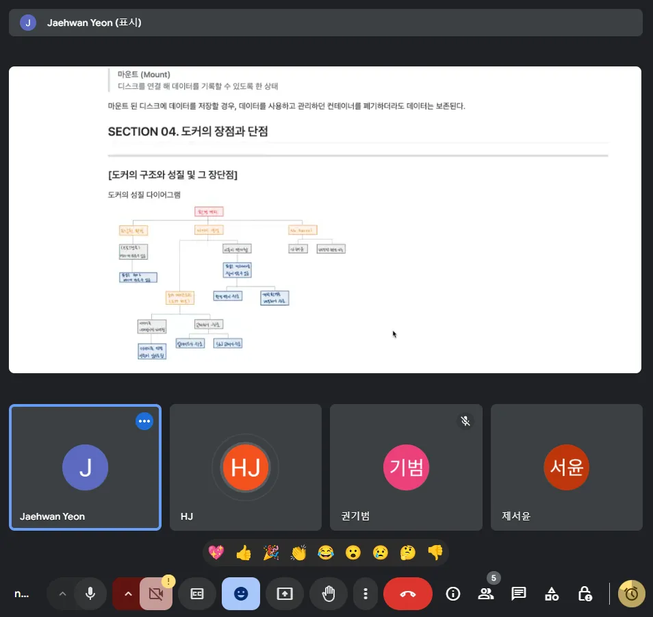
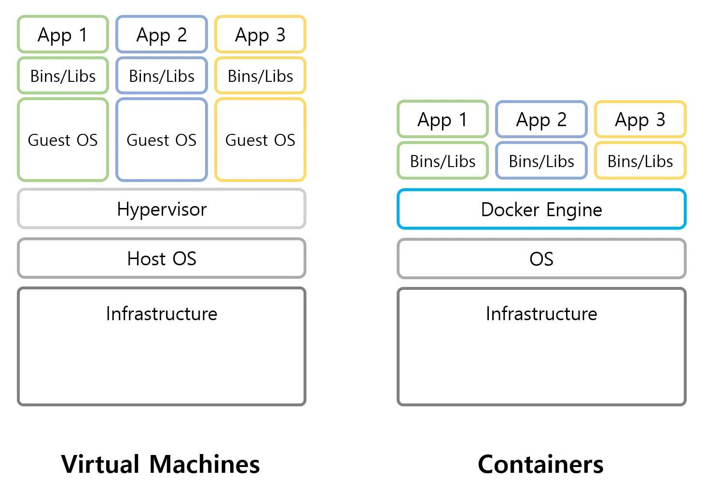

# 2024.11.07(목)



## 논의 내용

### CH1. 도커란 무엇인가

- 가상화 환경 vs. 도커 차이?
    
    
    
    - 가상화 환경
        - 하드웨어 수준에서 OS를 격리
        - 하이퍼파이저가 물리 서버 위에서 여러 OS를 각각의 VM으로 실행
        - 각 VM은 자신만의 OS를 갖고 CPU, 메모리, 저장소 등을 가상화하여 할당받음
    - 도커 컨테이너
        - 호스트의 커널을 공유하면서 독립적인 컨테이너로 애플리케이션을 격리
        - 도커 엔진이 각 컨테이너를 구동시켜줌
- “하나의 물리 서버에 여러 개의 웹 서버를 띄울 수 있다” 의 의미?
    - 일반적으로는 한 대의 컴퓨터 서버에 웹 서버 한 벌(아파치 한 벌)밖에 실행하지 못함
    - 그러나 컨테이너 기술을 이용하면 여러 개의 웹 서버를 올릴 수 있다
- Apache란?
    - HTTP 프로토콜을 통해 웹 페이지를 클라이언트에 제공하는 오픈 소스 웹 서버
    - NGINX와 같은 역할
        - Nginx는 처리 속도가 빠르고 성능이 좋음. 아파치는 유연성과 확장성이 좋음

### CH2. 도커의 동작 원리

- 서버용 os로 리눅스를 많이 사용하는 이유?
    - 오픈소스임(무료이다)
    - (Ubuntu 제외하면) GUI가 없어서 가벼움. 성능적 측면에서 유리
- 도커를 사용할 때 원칙 중 하나로, '하나의 컨테이너에 하나의 프로그램' 이라는 암묵적인 규칙이 존재 → 꼭 지켜야만 하는가?
    - '하나의 컨테이너에 하나의 프로그램' 규칙은 컨테이너의 목적에 따라 꼭 지킬 필요는 없다
    
    ```
    1. 작은 애플리케이션의 경우
    경량 애플리케이션이나 보조 프로그램(예: 로깅 서비스와 애플리케이션)처럼 서로 밀접하게 연결된 프로그램들은 하나의 컨테이너에서 함께 실행될 수 있습니다. 
    이러한 경우 두 프로그램이 항상 함께 동작하며, 개별 컨테이너로 나누는 것이 오히려 복잡성을 초래할 수 있습니다.
    
    2. 독립 배포가 필요 없는 경우
    프로그램이 상호 의존적이며 함께 배포되거나 버전 업데이트가 필요한 경우 하나의 컨테이너에 두거나 여러 프로그램을 포함할 수 있습니다. 
    예를 들어, 데이터 처리 파이프라인을 실행하는 스크립트와 필요한 도구들이 포함된 컨테이너가 있다면 이를 분리할 필요가 없을 수 있습니다.
    
    3. 리소스 절약을 위해
    여러 컨테이너를 사용하면 시스템 리소스가 더 많이 필요할 수 있습니다. 
    만약 리소스가 제한적인 환경에서 운영해야 한다면 하나의 컨테이너에 여러 프로그램을 통합하여 실행하는 것이 리소스 효율적일 수 있습니다.
    
    4. 도커 사용 목적에 따른 융통성
    도커는 격리와 재현성을 위해 사용될 때가 많지만, 반드시 하나의 프로그램에 국한되지 않습니다. 
    컨테이너 내부에서 여러 서비스를 함께 실행하고 필요한 경우 각 서비스의 시작 스크립트나 프로세스 관리 도구(Supervisord 등)를 사용해 관리할 수 있습니다. 다만, 이런 경우 로그 관리와 장애 대응이 복잡해질 수 있어 신중하게 설계해야 합니다.
    ```
    
- 도커를 사용하면 서버 고수가 아니어도 다루기가 쉽다? 진짜?
    - 버전 맞춰주고 하는 작업이 쉽지많은 않다…
    - 옵션에 오타 하나라도 나면 다시 만들어야 한다…
    - 하지만 처음부터 새로 구축하는 것보다는 쉽지 않을까😒

## 다음 회의

- 17일 일요일 저녁 8시