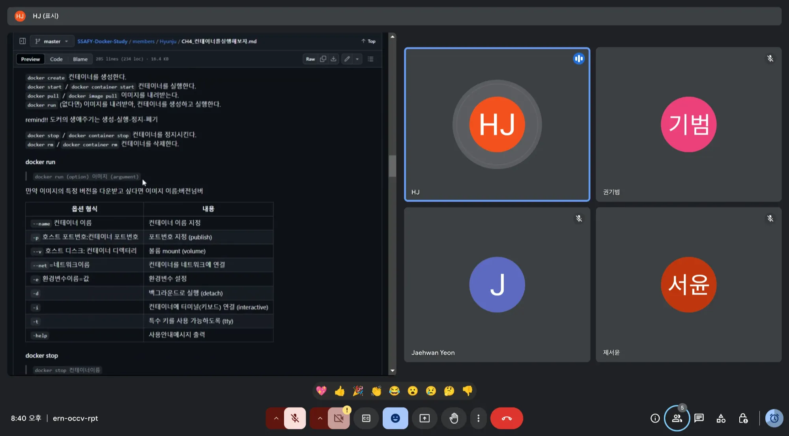

# 2024.11.17(일)

## 논의 내용

### CH3. 도커를 사용해보자

- WSL과 Docker를 함께 사용했을 때 충돌이 난 이유?
    - 높은 가능성으로 docker desktop에서 사용하는 리눅스 엔진과 wsl에서 사용하는 리눅스 엔진이 달라서
- WSL vs. Hyper-V
    - Hyper-V
        - 고정된 리소스 할당 방식이 기본이지만, 동적 메모리 기능도 지원
        - Windows Home에서 사용 불가능
    - WSL (Windows Subsystem for Linux)
        - 리눅스 배포판 전용
        - 하드웨어 가상화 없이 동작 → 경량화된 성능 제공
        - 리소스(메모리, CPU 등) 동적으로 관리
        - Windows 10 Home 및 이후 버전에서도 지원
        - Windows와 리눅스 간 파일 시스템 및 네트워크 통합 최적화
    - Windows Home에서 Hyper-V와 WSL의 관계
        - Windows Home은 Hyper-V Manager를 통한 가상 머신 관리 기능이 제한적이지만, WSL 2는 Hyper-V 기반 경량 가상화 기술을 활용하여 실행
        - 따라서 Windows Home에서 Hyper-V를 완전히 사용할 수 없더라도 WSL 2는 정상적으로 작동함
        
    | **항목**                  | **Hyper-V**                                                                 | **WSL (Windows Subsystem for Linux)**                                             |
    |---------------------------|-----------------------------------------------------------------------------|----------------------------------------------------------------------------------|
    | **설명**                  | Microsoft의 하이퍼바이저로 가상 머신(VM)을 실행하여 OS를 설치 및 관리        | Windows에서 리눅스 배포판을 실행하기 위한 서브시스템                              |
    | **설치 가능 OS**          | Windows, Linux 등 다양한 운영 체제                                           | 리눅스 배포판 전용                                                               |
    | **리소스 관리**           | 기본적으로 고정 리소스 할당 (동적 메모리 지원 가능)                          | 리소스를 동적으로 할당                                                          |
    | **가상화 기술**           | 하드웨어 기반 가상화                                                         | Hyper-V 기반 경량 가상화                                                         |
    | **운영 환경**            | Windows Pro, Enterprise, Education 에디션 이상                               | Windows 10 Home 및 이후 버전 지원                                               |
    | **주요 사용 목적**       | 전체 OS 환경의 완전한 가상화 및 테스트                                         | Windows와 통합된 리눅스 환경 제공                                               |
    | **파일 시스템 통합**      | 제한적 (가상 머신 내부에서만 파일 시스템 사용)                                | Windows와 리눅스 간 파일 시스템 및 네트워크 통합 최적화                          |
    | **설정 및 관리**          | 별도 도구 (Hyper-V Manager) 필요                                            | Windows 터미널 또는 명령어로 간단히 설정 및 사용 가능                            |
    | **특징**                  | - 고정된 리소스 할당 - 다양한 OS 실행 가능 - 별도 관리 인터페이스 제공 | - 경량화된 환경 - 리소스 효율적 관리 - 리눅스 환경에 최적화 - 가볍고 빠름 |
    | **Windows Home 지원 여부**| 지원하지 않음                                                                | 지원함                                                                          |

### CH4. 컨테이너를 실행해보자

- Docker swarm과 Kubernetes 모두 오케스트레이션 도구인데 어떤 차이가 있는지?
    - Docker Swarm
        - 소규모 환경이나 Docker에 익숙한 사용자가 간단한 컨테이너 관리를 원할 때 적합
    - Kubernetes
        - 복잡한 워크로드와 대규모 분산 시스템에서 강력한 확장성과 기능을 제공
        - 엔터프라이즈급 요구 사항을 충족
      
    | **항목**              | **Docker Swarm**                                                                                      | **Kubernetes**                                                                                   |
    |-----------------------|-----------------------------------------------------------------------------------------------------|-----------------------------------------------------------------------------------------------|
    | **설계 철학**         | Docker 생태계에 최적화된 단순하고 직관적인 오케스트레이션. 설정이 간단하고 빠르게 시작 가능.                       | 대규모 분산 시스템에 적합한 강력하고 유연한 오케스트레이션. 복잡한 시스템을 관리하는 데 중점.                                      |
    | **통합성**            | Docker CLI와 긴밀히 통합되어 Docker 사용자에게 친숙한 인터페이스 제공.                                              | 독립적인 도구로, 다양한 컨테이너 런타임(CRI)와 연동 가능하며 벤더 중립적.                                                         |
    | **배포 모델**         | 단순하고 자동화된 설정. Swarm 모드로 클러스터 생성.                                                   | YAML 파일 기반의 선언적 배포 및 관리.                                                            |
    | **네트워킹**          | 기본 제공되는 **오버레이 네트워크** 사용. 자동으로 노드 간 네트워크 설정.                                   | **CNI (Container Network Interface)**를 지원하여 네트워크 플러그인을 자유롭게 선택 가능.                                          |
    | **확장성**            | 소규모 클러스터에 적합하며 대규모 클러스터에 한계.                                                       | 대규모 클러스터(수천 노드, 수만 컨테이너)에 적합하며 높은 확장성 제공.                                                      |
    | **로드 밸런싱**        | 서비스 기반의 내장 로드 밸런싱 지원.                                                                     | **Ingress 컨트롤러**를 통해 로드 밸런싱 및 트래픽 관리.                                                      |
    | **상태 관리**          | 상태 유지(Stateful) 워크로드 지원 제한.                                                                  | **StatefulSet** 등을 통해 상태 유지 워크로드 관리 가능.                                              |
    | **고가용성**           | 기본 제공. 마스터 노드 장애 시 자동 복구.                                                                | 마스터 및 워커 노드 모두에서 고가용성을 보장하며, 다중 마스터 구성 가능.                                              |
    | **업데이트 전략**      | 롤링 업데이트와 재시작 지원.                                                                            | 롤링 업데이트, 카나리 배포, 블루-그린 배포 등 다양한 업데이트 전략 지원.                                          |
    | **모니터링 및 로깅**   | 기본 제공 도구가 부족하며 추가 설정 필요.                                                                 | **Prometheus**, **Grafana** 등의 통합을 통해 강력한 모니터링 및 로깅 제공.                                  |
    | **커뮤니티 및 지원**   | Docker 생태계의 일부로 소규모 커뮤니티와 Docker 중심 지원.                                                | 광범위한 커뮤니티 및 클라우드 벤더(예: AWS, Google Cloud, Azure)에서 공식 지원.                             |
    | **사용 사례**          | 소규모 프로젝트, 간단한 설정과 빠른 시작이 필요한 환경.                                                     | 대규모 분산 시스템, 확장성과 복잡한 요구 사항을 가진 엔터프라이즈 환경.                                                 |
    | **장점**              | 간단한 설정 및 운영, Docker와 긴밀 통합, 빠른 학습 곡선                                                    | 강력한 확장성, 다양한 기능 지원, 넓은 커뮤니티와 도구 지원.                                                |
    | **단점**              | 대규모 클러스터에서 제한적, 상태 유지 워크로드 등 기능 부족                                                   | 초기 설정과 학습이 복잡, 관리 오버헤드 큼.                                                     |

- Docker 이미지 생성 시 랜덤으로 주어지는 ID가 어떤 알고리즘을 이용해 랜덤으로 주어지는지
    - SHA-256 해시 암호화 방법을 이용
        - 이미지 정보, 컨테이너 정보를 입력값으로 하여 고정된 길이의 256비트(=32바이트) 해시 값으로 변환
            - 이미지 정보
                - 이미지 레이어 정보
                - 파일 및 디렉터리 해시 값
                - Dockerfile 명령과 빌드 옵션
            - 컨테이너 정보
                - 랜덤시드, 시간, 호스트 정보
                - 생성 시 옵션과 환경 변수
    - 기범 정리 자료 참고!
        - https://qja1998.github.io/posts/dockerCH4/

## 다음 회의

- 21일 목요일 점심 식사 후 12시 45분 ~