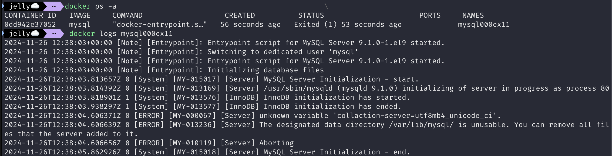
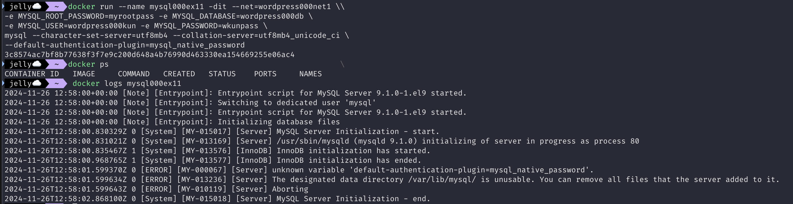
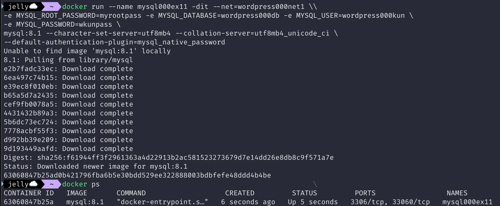
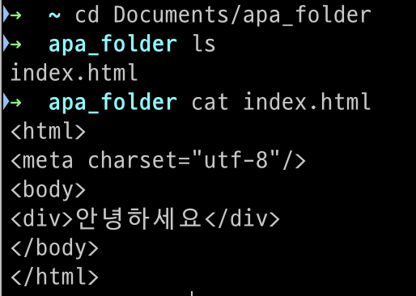
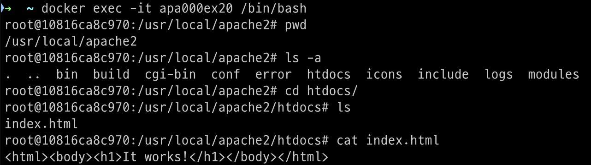

# 2024.11.28(목)

## 논의 사항

### CH5. 컨테이너를 연동해보자

- 제서윤
  - TroubleShooting
    - 계속 mysql 컨테이너가 Exited 상태임
    - DB 로그를 확인할 수 있는 명령어로 로그를 출력해 문제 원인 분석
    - `docker logs <mysql_컨테이너_이름>`

      
    
      - 문제 원인
          1. 오타: `collaction-server`를 `collation-server`로 수정
        
          
        
          2. 버전 문제: MySQL 9.x는 아직 일부 설정이나 플러그인을 완전히 지원하지 않을 수 있다고 함. 
             8.1버전으로 다시 실행
        
          
        
          - 해결 완료

### CH6. 실전에 활용 가능한 컨테이너 사용법을 익히자

- 연재환 
    - Issues
      - 바인드 마운트 실습 과정에서 연결한 로컬 디렉터리가 컨테이너 내부에서 잡히지 않음 
        - 로컬 스토리지 (Users/jaehwan/Documents/apa_folder) 내부의 index.html에는 '안녕하세요'가 작성되어 있으나, 아파치 컨테이너를 웹 브라우저로 접속 (localhost:8090) 해보면 It Works! 메시지가 출력 됨.
        
        

        - 컨테이너 내부 (/usr/local/apache2/htdocs) 에도 index.html 존재 확인 
        
        

        - 컨테이너 내부의 index.html 파일 삭제 `rm index.html` 
        - 그러나, 마운트한 로컬 스토리지 내부의 index.html 이 잡히지 않음.
        - 해당 컨테이너와 로컬 스토리지 간의 바인드 마운트가 제대로 되지 않음을 인식.
        - 최후의 수단으로 컨테이너 중지 -> 컨테이너 삭제 -> 컨테이너 재실행 절차로 인식 성공 

        

      - 문제는 해결 했으나, 원인 파악이 되지 않음. 
  

- 성현주
  - Section 2 실습을 하면서 든 궁금증
  - Q. 아파치 도커 컨테이너 안의 파일 구조를 어떻게 들여다볼 수 있지??  
    - 도커 컨테이너 내부의 파일 구조를 확인하려면, 컨테이너 안으로 접근해서 파일 시스템을 탐색해야 합니다. 이를 위해 다음 단계를 따르면 됩니다:

---

  #### 1. **도커 컨테이너 내부로 들어가기**
  컨테이너에 들어가서 파일 구조를 확인하려면, `docker exec` 명령어를 사용하면 됩니다.

  ```bash
  docker exec -it [컨테이너 이름 또는 ID] /bin/bash
  ```

  - `-it`: 인터랙티브 모드와 터미널 모드로 실행.
  - `/bin/bash`: 컨테이너 내부에서 Bash 셸을 실행.

  예를 들어, 네 컨테이너 이름이 `apa000ex19`라면:

  ```bash
  docker exec -it apa000ex19 /bin/bash
  ```

  ---

  #### 2. **파일 구조 확인**
  컨테이너 안으로 들어가면 일반적인 리눅스 명령어를 사용할 수 있습니다.

  - 현재 디렉토리 확인:
    ```bash
    pwd
    ```

  - 디렉토리 내 파일 목록 확인:
    ```bash
    ls -l
    ```

  - 특정 디렉토리로 이동:
    ```bash
    cd [디렉토리 경로]
    ```

  - 아파치 컨테이너의 경우, 일반적으로 웹 파일은 `/usr/local/apache2/htdocs/` 디렉토리에 저장됩니다.

  ---

  #### 3. **빠져나오기**
  컨테이너에서 작업이 끝났다면 `exit` 명령어로 빠져나올 수 있습니다.

  ```bash
  exit
  ```

  ---

  #### 추가 팁
  만약 특정 파일 구조만 빠르게 확인하고 싶다면, `docker exec`로 한 번의 명령을 실행할 수도 있습니다.

  ```bash
  docker exec apa000ex19 ls -l /usr/local/apache2/htdocs/
  ```

  이 명령은 컨테이너 안의 `/usr/local/apache2/htdocs/` 디렉토리에 있는 파일 목록을 직접 출력합니다. 

  이 방법으로 파일이 올바른 위치에 복사되었는지, 디렉토리가 존재하는지도 확인 가능합니다.