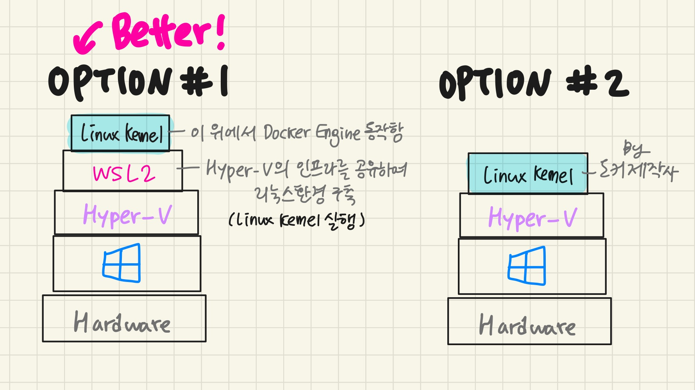
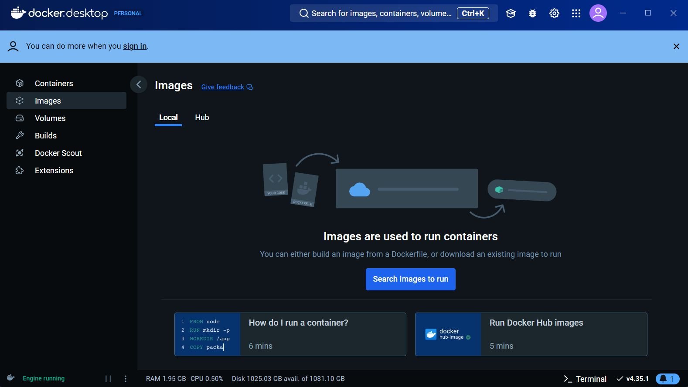

### 도커를 사용하려면

도커 환경 구축하는 세 가지 방법
1. 리눅스 컴퓨터에서
2. 윈도우나 macOS에서, 가상 머신이나 렌탈 환경에 도커를 설치
3. 윈도우/macOS용 도커 사용

Windows에서:\
Windows에 포함되어 있는 Hyper-V를 사용, 윈도우용 도커 데스크톱은 리눅스 + 도커 엔진을 제공한다.

macOS에서:\
macOS용 도커 데스크톱은 가상환경인 Hyper-Kit + 리눅스 + 도커 엔진을 제공한다.

---
11.08 관통pjt때 했던 것은\
wsl2가 동작할 수 있는 환경 구축 - (wsl2은 윈도우 내에서 네이티브에 가까운 리눅스 환경을 사용할 수 있도록 해 준다.)
>WSL 2는 하이퍼바이저를 사용하기 때문에 경량 가상화 환경에 가깝지만, 전통적인 가상 머신처럼 완전히 격리된 환경을 제공하지는 않고 Windows와의 파일 시스템 및 네트워크 공유가 쉽게 이루어지도록 설계되었습니다. 

Hyper-V, WSL, 가상 머신 플랫폼 활성화
&rarr;\
최신 리눅스 커널 설치 (x64머신용 최신 wsl2 linux 커널 업데이트 패키지)
&rarr;\
`wsl --install` 명령어를 통해 wsl2를 설치하고, ubuntu 리눅스 배포판을 설치함
&rarr;\
`sudo apt-get update`를 통해 리눅스 배포판의 패키지 목록을 최신 상태로 업데이트

### WSL vs Docker
> WSL은 주로 **Windows에서 리눅스 환경을 개발하기 위한** 도구이고, Docker는 **애플리케이션을 경량 컨테이너로 배포하고 관리하기 위한** 도구이다. 
---

본 교재에서는 일반적인 소프트웨어처럼 사용 가능한, Docker Desktop을 사용할 예정이다.
Docker Desktop을 사용하기 위해서 `Hyper-V(윈도우용 가상환경)`가 활성 상태여야 한다.

### Docker Desktop (new) vs Docker Toolbox (old)
Docker Desktop은 Hyper-V(windows)나 HyperKit(macOS)을 사용하는데 toolbox에서는 VirtualBox를 사용했다. 

### Install Docker Manual (windows)

Control Panel > Programs > Programs and Features > Turn Windows features on or off

+ [x] Windows Subsystem for Linux
+ [x] Virtual Machine Platform

컴퓨터 재시작하기

[Download linux kernel](https://wslstorestorage.blob.core.windows.net/wslblob/wsl_update_x64.msi) \
이후 다운로드 받은 파일을 실행해 리눅스 커널을 업데이트한다.

[Download Docker Desktop for Windows](https://docs.docker.com/docker-for-windows/install) \
내려받은 설치 파일을 실행한다.

모든 항목에 체크한 다음 OK

설치 끝난 후 [Close and log out] 버튼을 클릭해 윈도우에 재로그인

* WSL2에서 동작하는지 여부 확인
Settings > General > 
+ [x] Use the WSL2 based engine

Q. 책에서 '이 항목의 체크를 해제하면 도커 엔진이 Hyper-V를 통해 동작한다' 라고 써 있는데, 
WSL2가 제공하는 리눅스를 쓰던 도커제작사에서 만든 리눅스를 쓰던
Hyper-V의 기능이 필요하지 않나

#### Error Handling
* Cannot enable Hyper-V service' 
+ [x] Hyper-V 활성상태인지 쳌
+ [x] BIOS 화면에서 Virtualization Technology가 활성상태인지 쳌

* 'Not enough memory to start Docker Desktop'\
컴퓨터 메모리 충분한지 확인\
OR 기존 버전 사용 (OPTION 2)\
기존버전에서도 오류가 뜬다면\
Settings > Resources > ADVANCED > Memory 설정값 낮추기

### 도커의 조작 방법과 명령 프롬프트 및 터미널 실행

'penguin'라는 이름의 컨테이너 실행 : 
`docker run penguin` \
컨테이너 정지 :
`docker stop penguin`

* 서버에서 도커를 사용 중일 때 도커 엔진을 종료하면 도커 엔진과 함께 모든 컨테이너가 종료된다.

---

COLUMN #1 SSH란? 원격으로 컴퓨터에 접속하기

터미널과 비슷하지만 원격지에 있는 컴퓨털ㄹ 다루기 위한 것으로, 처음에 사용자명이나 패스워드를 입력하거나 
통신을 암호화하는 등 원격 조작에 필요한 기능을 갖추고 있다. EX) Tera Team, PuTTy

COLUMN #2 리눅스 컴퓨터나 가상 머신, 렌탈 환경에서 도커 구축하기

맨 위에, 도커를 사용하는 3가지 방법에 대한 구체적인 설명

1. 리눅스 컴퓨터에서

    가장 간단한 방법으로, 서버처럼 실제 도커를 운용하는 환경에 가장 가깝다.
    도커나 리눅스 이외의 지식을 필요로 하지 않는다.\
    준비물: 리눅스가 깔려 있는 컴퓨터 + 리눅스 운영체제 + 설치에 사용할 DVD-R 또는 USB

2. 윈도우나 macOS에서, 가상 머신이나 렌탈 환경에 도커를 설치
   
    1. VirtualBox나 VMWare같은 가상화 소프트웨어를 깔고,
    그 위에 리눅스 운영체제를 사용하는 가상머신을 만들고 도커 엔진을 설치하는 방식.\
    장점 - 가상 머신을 켜고 끄기가 쉬우며 공간도 차지하지 않는다. 필요가 없어지면 가상 머신 자체를 삭제할 수 있다.\
    단점 - 가상 머신도 따로 네트워크 설정을 해주어야 하고 리눅스도 깔아야 한다. 컴퓨터의 리소스를 차지한다.\
    준비물: VirtualBox / VMWare같은 가상화 소프트웨어 + 리눅스 운영체제 + 설치에 사용할 DVD-R 또는 USB
    2. 렌탈 환경은 클라우드 또는 VPS 같은 걸 의미한다. (VPS: Virtual Private Server; 호스팅 서비스 중 하나로, 물리적인 
    서버를 가상화 기술을 이용해 여러 개의 독립된 가상 서버로 분할하여 제공하는 서비스)\
    장점 - 컴퓨터 사양이 빠듯할 때도 사용 가능. VPS의 경우 이미 리눅스가 설치된 서버를 선택할 수도 있고 클라우드의 경우
    클릭 한번으로 설치할 수도 있다.\
    단점 - 일반적으로 도커 설치 권한이 없을 확률이 크다. 사용을 위해 인터넷 환경이 필요하고 사용하는 만큼 비용이 청구된다.\
    준비물: 렌탈 환경 + 금전

Q. 2-1번 방식에서, 가상화 소프트웨어로 생성한 가상 머신이 공간을 차지하지 않는다고?

---
