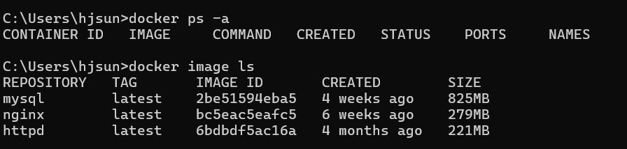

### Section 1 도커 엔진 시작하기/종료하기
도커 데스크톱 사용 시 컴퓨터가 부팅될 때마다 도커 엔진이 자동으로 실행된다.
컨테이너는 별개이다.

### Section 2 컨테이너의 기본적인 사용 방법
컨테이너를 다루는 모든 명령은 `docker` 명령어로 시작한다. `docker` 명령어 뒤에 '무엇을', '어떻게'에 해당하는 부분을 명시하는 커맨드가 붙는다. 그 뒤에는 '대상'인 컨테이너명 또는 이미지명을 지정한다. 추가적으로 옵션과 인자라는 추가 정보를 붙일 수 있다.

> docker [상위 커맨드] [하위 커맨드] [옵션] [대상] [인자]
> 
```
docker container run penguin
docker image pull penguin
docker container start penguin
docker container -d penguin --mode=1
```

#### command(커맨드)
`start`, `run`의 경우 `container`를 붙이지 않아도 실행 가능
```
docker container run
docker run
```
#### option(옵션)
백그라운드로 실행 `-d`
키보드 조작 `-i` / `-t`
```
-d
-all
--name penguin
-dit -d + -i + -t
```
#### object(대상) 구체적인 이름
#### argument(인자)
대상에 전달할 값. (예-문자 코드 또는 포트 번호)
```
--mode=1
--style nankyoku
```
#### 도커의 버전을 확인하기
```
docker version
```


#### 상위 커맨드는 **단 12종류** 뿐이다.
1. `container`
   컨테이너를 실행하거나 종료하고, 컨테이너 목록을 확인하는 등 컨테이너를 다루기 위해 사용한다. 컨테이너를 대상으로 어떤 일을 할지는 하위 커맨드를 통해 지정한다.
   |subcommand|내용|container 생략가능|주요옵션|
   |----------|---|--------|-------|
   |start|컨테이너를 실행|&check;|-i|
   |stop|컨테이너를 정지|&check;|거의사용x|
   |create|도커 이미지로부터 컨테이너 생성|&check;|--name, -e, -p, -v|
   |run|도커 이미지를 내려받고 컨테이너를 생성해 실행|&check;|--name, -e, -p, -v, -d, -i, -t|
   |rm|정지 상태의 컨테이너 삭제|&check;|-f, -v|
   |exec|실행 중인 컨테이너 속에서 프로그램 실행|&check;|-i, -t|
   |ls|컨테이너 목록 출력|docker ps|-a|
   |cp|도커 컨테이너와 도커 호스트 간에 파일 복사|&check;|거의사용x|
   |commit|도커 컨테이너를 이미지로 변환|&check;|거의사용x|
   
   run은 `docker image pull` + `docker container create` + `docker container start`라는 세 개의 명령어를 합친 것과 같다.
2. `image`
   이미지를 내려받거나 검색하는 등 이미지와 관련된 기능을 실행하는 커맨드다. 이미지를 대상으로 어떤 일을 할지 하위 커맨드를 통해 지정한다.
   |subcommand|내용|container 생략가능|주요옵션|
   |----------|---|--------|-------|
   |pull|도커 허브 등의 레포지토리에서 이미지를 내려받음|&check;|거의사용x|
   |rm|도커 이미지 삭제|docker rmi|거의사용x|
   |ls|내려 받은 이미지 목록 출력|X|거의사용x|
   |build|도커 이미지를 생성|&check;|-t|
3. `volume`
   볼륨 생성, 목록 확인, 삭제 등 볼륨(컨테이너에 마운트 가능한 스토리지)과 관련된 기능을 실행하는 커맨드다. 볼륨을 대상으로 어떤 일을 할지 하위 커맨드를 통해 지정한다.
   |subcommand|내용|container 생략가능|주요옵션|
   |----------|---|--------|-------|
   |create|볼륨 생성|X|--name|
   |inspect|볼륨 상세정보 출력|X|X|
   |ls|볼륨 목록 출력|X|=a|
   |prune|현재 마운트되지 않은 볼륨들 모두 삭제|X|X|
   |rm|지정한 볼륨 삭제|X|X|
4. `network`
   도커 네트워크의 생성, 삭제, 컨테이너의 네트워크 접속 및 접속 해제 등 도커 네트워크와 관련된 기능을 실행하는 커맨드다. 도커 네트워크란 도커 요소 간의 통신에 사용하는 가상 네트워크를 가리킨다.
   |subcommand|내용|container 생략가능|주요옵션|
   |----------|---|--------|-------|
   |connect|컨테이너를 도커 네트워크에 연결|X|X|
   |disconnect|컨테이너의 도커 네트워크 연결 해제|X|X|
   |create|도커 네트워크 생성|X|X|
   |inspect|도커 네트워크의 상세정보 출력|X|X|
   |ls|도커 네트워크 목록 출력|X|X|
   |prune|현재 컨테이너가 접속하지 않은 네트워크 모두 삭제|X|X|
   |rm|지정한 네트워크 삭제|X|X|
5. `checkpoint` - 현재 상태를 일시적으로 저장한 후, 나중에 해당 시점의 상태로 되돌릴 수 있다. 현재 실험적 기능이다.
6. `node` - 도커 스웜의 노드를 관리하는 기능
7. `plugin` - 플러그인을 관리하는 기능
8. `secret` - 도커 스웜의 비밀값 정보를 관리하는 기능
9.  `service` - 도커 스웜의 서비스를 관리하는 기능
10. `stack` - 도커 스웜 또는 쿠버네티스에서 여러 개의 서비스를 합쳐 구성한 스택을 관리하는 기능
11. `swarm` - 도커 스웜을 관리하는 기능
12. `system` - 도커 엔진의 정보를 확인하는 기능

기타 단독으로 쓰이는 커맨드
`login`(도커 레지스트리에 로그인, -u, -p), `logout`(도커 레지스트리에 로그아웃), `search`(도커 레지스트리 검색), `version`(도커 엔진 및 명령행 도구의 버전 출력)

- What is volume
볼륨(volume)은 컨테이너와 호스트 시스템 간에 데이터를 영구적으로 저장하고 공유할 수 있는
매커니즘이다. 볼륨을 사용하면 컨테이너가 삭제되더라도 데이터의 지속성을 보장할 수 있고, 여러
컨테이너 간에 공유도 가능하다.
- What is docker swarm
Docker swarm은 도커 플랫폼에서 제공하는 네이티브 오케스트레이션 도구로, 여러 대의 도커 호스트를
클러스터링하여 하나의 가상 호스트처럼 관리할 수 있게 해준다. 이를 통해 컨테이너화된 애플리케이션을
효율적으로 배포, 관리, 확장할 수 있다. Docker swarm은 도커 엔진에 통합되어 있어 설정과 사용이 비교적
간단하며, 도커의 기본 기능과 자연스럽게 연동된다. 


### Section 3 컨테이너의 생성과 삭제, 실행, 정지

`docker create` 
   컨테이너를 생성한다.\
`docker start` / `docker container start`
   컨테이너를 실행한다.\
`docker pull` / `docker image pull`
   이미지를 내려받는다.\
`docker run`
   (없다면) 이미지를 내려받아, 컨테이너를 생성하고 실행한다.

remind!! 도커의 생애주기는 생성-실행-정지-폐기

`docker stop` / `docker container stop`
   컨테이너를 정지시킨다.\
`docker rm` / `docker container rm`
   컨테이너를 삭제한다.

#### docker run
> `docker run (option) 이미지 (argument)`
> 
만약 이미지의 특정 버전을 다운받고 싶다면 이미지 이름:버전넘버

|옵션 형식|내용|
|----------|---|
|`--name` 컨테이너 이름| 컨테이너 이름 지정|
|`-p` 호스트 포트번호:컨테이너 포트번호| 포트번호 지정 (publish)|
|`--v` 호스트 디스크: 컨테이너 디렉터리| 볼륨 mount (volume)|
|`--net`=네트워크이름| 컨테이너를 네트워크에 연결|
|`-e` 환경변수이름=값| 환경변수 설정|
|`-d`| 백그라운드로 실행 (detach)|
|`-i`| 컨테이너에 터미널(키보드) 연결 (interactive)|
|`-t`| 특수 키를 사용 가능하도록 (tty)|
|`-help`| 사용안내메시지 출력|

#### docker stop
>`docker stop 컨테이너이름`
#### docker rm
>`docker rm 컨테이너이름`

컨테이너 두 종류
- 한 번만 실행되는 컨테이너
- 데몬 형태로 동작하는 컨테이너
  
#### docker ps (docker container ls)
컨테이너의 목록을 출력한다. `docker ps`는 현재 실행 중인 컨테이너의 목록을 출력하며,
`docker ps -a` 옵션을 추가하면 현재 존재하는 컨테이너 (정지 상태 포함)의 목록을 출력한다.
>`docker ps (option)`


CONTAINER ID: 컨테이너 식별자(무작위 문자열) - 원래 64글자이지만 앞에 12글자만 출력된다\
IMAGE: 컨테이너를 만들 때 사용한 이미지의 이름\
COMMAND: 컨테이너 실행 시에 실행하도록 설정된 프로그램의 이름\
CREATED: 컨테이너 생성 후 경과된 시간\
STATUS: 컨테이너의 형재 상태. 실행중이라면 'Up', 종료된 상태라면 'Exited'가 출력된다.\
PORTS: 컨테이너에 할당된 포트 번호, 호스트 포트번호 &rarr; 컨테이너 포트번호 형식으로 출력된다.\
NAMES: 컨테이너 이름

#### 실습 :whale: - 컨테이너를 생성하고, 실행, 상태 확인, 종료해 보자

해석: 아파치 이미지(httpd)를 사용해 apa000ex1라는 이름의 컨테이너를 생성하고 실행
Unable to find image 'httpd:latest' locally 로컬에서 해당 이미지를 찾지 못했다는 뜻
&rarr; 이미지를 다운로드 받는다.


컨테이너가 생성된 것을 확인. status 항목의 값이 Up이므로 컨테이너가 실행 중이다.


apa000ex1 컨테이너를 종료한 후, `docker ps`, `docker ps -a` 명령어를 입력해본다.
`docker ps -a`를 입력했을 때만 apa000ex1 컨테이너가 목록에 나타남을 확인할 수 있다. (상태값은 Exited)


apa000ex1 컨테이너를 삭제 후, `docker ps -a` 명령어를 입력했을 때 해당 컨테이너가 나타나지 않음을 확인한다.
  
-stop이나 rm처럼 이미 생성된 컨테이너의 이름을 지정해야 하는 커맨드는 컨테이너 ID와 
그 생략형으로도 실행할 수 있다. (앞에 두글자)

### Section 4 컨테이너의 통신

앞서 실습에서 아파치 이미지를 내려받아 컨테이너를 생성했었다. 아파치(Apache)는, 
**웹 서버 기능을 제공하는 소프트웨어**이다. 즉 아파치가 동작 중인 서버에 파일 (html파일, 이미지나 프로그램 파일 등)을 두면 이 파일을 **웹 사이트 형태**로 볼 수 있다.

웹 브라우저를 통해 컨테이너에 접근이 가능하게 하려면 컨테이너를 실행할 때 **설정**이 필요하다.
이 설정은 컨테이너 생성 후 기본적으로 변경할 수 없으므로, `docker run` 커맨드에 옵션 형태로 명시해주어야 한다.

여기서 이 "설정"은 무엇인가?\
컨테이너가 외부(웹 브라우저를 실행하는)와 접속하기 위한 포트 설정이다.\
port란 통신 내용이 드나드는 통로를 의미한다. 예를 들어 웹은 포트 **80번**, 메일은 포트 **25번**이다.

Apache는 서버에서 정해 둔 80번 포트에서 웹 사이트에 대한 접근을 기다리다가 
사용자가 이 포트를 통해 접근해 오면 요청에 따라 웹 사이트의 페이지를 제공한다. 
컨테이너 속에서 실행 중인 아파치는 외부와 직접 연결되지 않았기 때문에 외부에서 접근 불가하다. 그래서 컨테이너를 실행 중인 **물리적 컴퓨터**가 
외부의 접근을 **대신 받아** 전달해주도록 한다.


#### 실습 :whale: - 통신이 가능한 컨테이너 생성

아파치 이미지(httpd)를 사용해 apa000ex2라는 이름의 컨테이너를 생성하고 실행한다. \
`ps` 커맨드를 사용해 이름이 apa000ex2인 컨테이너가 실행 중임을 확인한다.\
앞선 실습과의 차이점은 PORT 항목이다. 80/tcp &rarr; 0.0.0.0:8000&rarr;80/tcp


localhost의 8080번 포트로 접속했을 때 apa000ex2 컨테이너에 의해서
(로컬컴퓨터의 8080번 포트와 컨테이너의 80번 포트와의 연결) 웹 페이지를 받아볼 수 있다!


컨테이너 종료 후 삭제, 확인

### Section 5 컨테이너 생성에 익숙해지기
앞서 아파치 컨테이너를 만들었던 것처럼, 다양한 소프트웨어가 담긴 컨테이너를 생성할 수 있다.
각 컨테이너의 내용인 소프트웨어에 상응하는 이미지 이름을 찾아서 컨테이너를 실행하면 된다.

리눅스 운영체제만 담긴 컨테이너도 만들 수 있다. 이들은 -d 없이 `-it` 옵션만 사용한다. 인자로는
`/bin/bash` 등 셸 명령어를 지정한다.

- ubuntu / centos / debian / fedora / busybox / alpine

웹 서버 소프트웨어로는 아파치와 nginx가 유명하다. 웹 서버는 통신이 전제가 되므로 옵션을 통해(`-p`) 포트 번호를 지정해야 한다.

- Apache: httpd / Nginx: nginx

데이터베이스 서버는 MySQL, PostgreSQL, MariaDB가 유명하다. 
DB관리 소프트웨어는 기본적으로 root password를 반드시 지정해야 한다. (MySQL의 경우 `MYSQL_ROOT_PASSWORD`, PostgreSQL의 경우 `POSTGRES_ROOT_PASSWORD`)

- mysql / postgres / mariadb

프로그램을 실행하려면 해당 언어의 실행 환경인 **런타임**이 필요하다. 런타임 역시 컨테이너 형태로 제공된다. 

- openjdk(Java) / python / php / ruby / perl / gcc(C,C++) / node(Node.js) / 
  registry(도커 레지스트리) / wordpress / nextcloud / redmine

#### 실습 :whale: - 아파치 컨테이너를 여러 개 실행하기

아파치 이미지(httpd)를 사용해 컨테이너 3개를 만들고 각각의 컨테이너 포트 80번에 연결할 호스트 컴퓨터의 포트 번호를 다르게 지정해 주었다. 8081-8082-8083

컨테이너 3개가 모두 정상적으로 실행되고 있고, localhost:8001 ~ localhost:8003 접속 가능 확인

정지 후 삭제 확인

#### 실습 :whale: - Nginx 컨테이너 실행하기
nginx도 apache와 마찬가지로 웹 서버 소프트웨어이다. 이미지 이름은 nginx

6번컨테이너 생성. 아파치 컨테이너를 만들 때와 마찬가지로 호스트 컴퓨터의 포트와 컨테이너 포트(80번)을 연결해주었다.

localhost:8084에 접속하여 보이는 nginx의 기본 화면


#### 실습 :whale: - MySQL 컨테이너 실행하기
WordPress와 함께 쓰이는 것으로 유명한 RDBMS인 MySQL 컨테이너 생성\
특이사항: **루트 패스워드**를 옵션으로 반드시 지정해주어야 한다.

7번 컨테이너 생성. 백그라운드 + 키보드를 통한 내부 파일시스템 조작(dit)\
`-e` 옵션으로 환경변수인 루트 패스워드를 지정했다.


### Section 6 이미지 삭제
앞서 이미지&rarr;컨테이너 실습을 했다. 그러나 컨테이너를 삭제해도 사용했던 이미지는 그대로 남아 쌓인다. 이는 같은 종류의 이미지로 새로운 컨테이너를 만들 때 금방 만들 수 있었던 이유! (다운로드를 다시 받을 필요가 없었으니까)

이미지가 늘어나면 스토리지 용량을 압박하게 되므로, 필요없어진 이미지는 그때그때 삭제하는것이 좋다. 이미지를 삭제할 때도 컨테이너 삭제 시와 마찬가지로, 이미지 ID 또는 이미지 이름으로 지정한다. 해당 이미지로 실행한 컨테이너가 남아 있으면 이미지 삭제가 불가능하다. `docker ps -a` 먼저 확인 필수

`docker image ls`: 이미지 목록을 출력한다. 이미지는 컨테이너와 달리 '실행 중'/'종료'등의 상태를 갖지 않으므로 `-a` 옵션은 필요가 없다.

`docker image rm`: 이미지를 삭제한다. 앞서 컨테이너를 삭제했을 때는 `docker rm` 처럼 앞에 'container'를 생략해도 무방했지만 이미지를 삭제할 때는 생략하면 안 된다. (컨테이너가 삭제되므로) 


먼저 실행중인 컨테이너가 있는지를 확인하고, `docker image ls`로 이미지 목록을 확인한다.


아파치 이미지를 삭제한다. ('untagged' &rarr; 'deleted')


nginx 이미지와 mysql 이미지를 삭제한다. 위는 `docker image rm {images}`에서 'image'를 실수로 생략했을 때 나온 에러이다. (No such container) - 이미지가 아닌 컨테이너를 삭제하려 했기 때문에 발생