### Section 1 워드프레스 구축
워드프레스 = **웹 사이트를 만들기 위한 소프트웨어**. 웹 사이트 작성자가 작성한 내용을 DB에 저장하고, 웹사이트 열람자의 요청에 따라 웹 페이지를 보여준다.

워드프레스 = 
- 워드프레스 컨테이너(워드프레스 본체 + apache + php runtime) + 
- MySQL 컨테이너 (두 컨테이너가 연결돼 있어야 한다)

서로 다른 컨테이너의 연결 = 가상 네트워크
#### MySQL 컨테이너 실행 시에 필요한 옵션과 인자
```
docker run
--name 컨테이너 이름
--dit
--net=네트워크 이름
-e MYSQL_ROOT_PASSWORD=MySQL 루트 패스워드 
-e MYSQL_DATABASE=데이터베이스 이름
-e MYSQL_USER=사용자 이름
-e MYSQL_PASSWORD=MySQL 패스워드
mysql
--character-set-server=문자 인코딩
--collation-server=정렬순서
--default-authentication-plugin=인증 방식
```
문자 인코딩: utf8mb4
정렬 순서: utfmb4_unicode_ci
인증 방식: mysql_native_password
#### WordPress 컨테이너 실행 시에 필요한 옵션과 인자
```
docker run
--name 컨테이너 이름
--dit
--net=네트워크 이름(mysql 컨테이너가 연결하는 네트워크와 동일한 네트워크)
-p 포트 설정
-e WORDPRESS_DB_HOST=데이터베이스 컨테이너 이름(만들었던 mysql 컨테이너이름)
-e WORDPRESS_DB_NAME=데이터베이스 이름(맞추기)
-e WORDPRESS_DB_USER=데이터베이스 사용자 이름(맞추기)
-e WORDPRESS_DB_PASSWORD=데이터베이스 패스워드(맞추기)
wordpress
```
### Section 2 워드프레스 및 MYSQL 컨테이너 생성과 연동
만들 것들
- network between two
- WordPress container x 1
- MySQL container x 1

네트워크 생성하기\
`docker network ls`
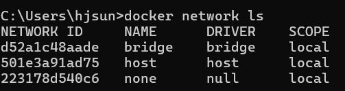
`docker network create wordpress000net1`
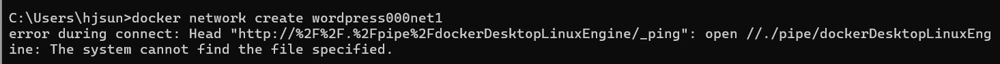
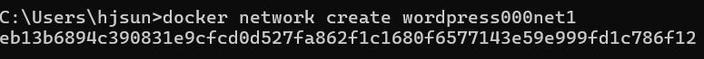
도커 명령어 실행 전 도커 데스크탑을 꼭 키고 태스크 트레이에서 확인합니다^^..

MySQL 컨테이너 생성하기\
`docker run --name mysql000ex11 ...`
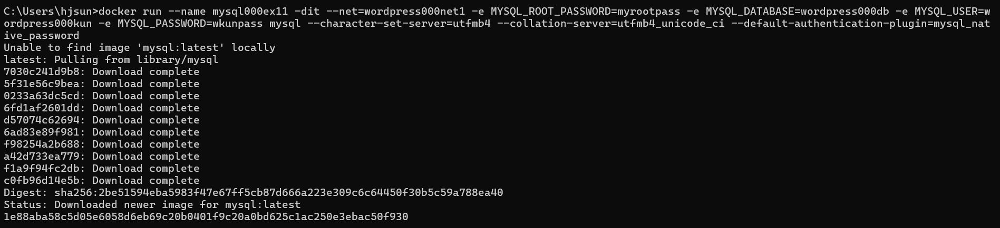

WP 컨테이너 생성하기\
`docker run --name wordpress000ex12 ...`
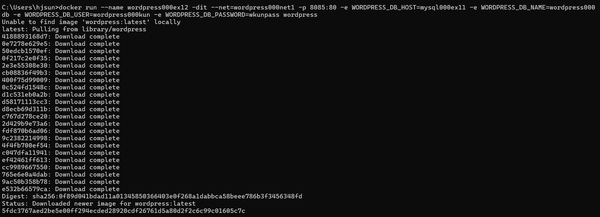

**error** MySQL컨테이너가 중지됨 (실행되지 않음) &rarr; docker ps에서 보이지 않고 docker ps -a 시에만 보임.
docker container start mysql000ex11 을 해 봐도 실행되지 않음\
이유: 오타
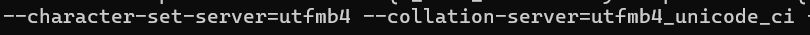
컨테이너 지우고 다시 생성함.

**error**
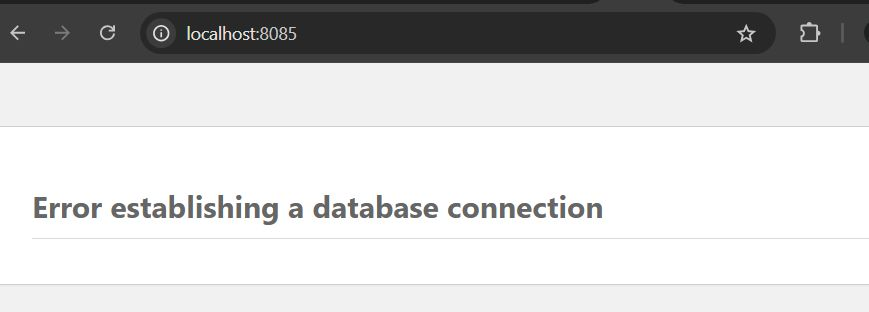
버전을 mysql8, wordpress 5.5로 맞추고 컨테이너 다시 생성 &rarr; 그래도 안 됨
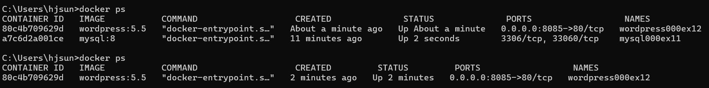
컨테이너를 명시적으로 중지시키지 않았는데도 컨테이너가 자꾸 중지된다.

**문제해결**\
mysql 8.1로 설정했더니 문제 해결됨
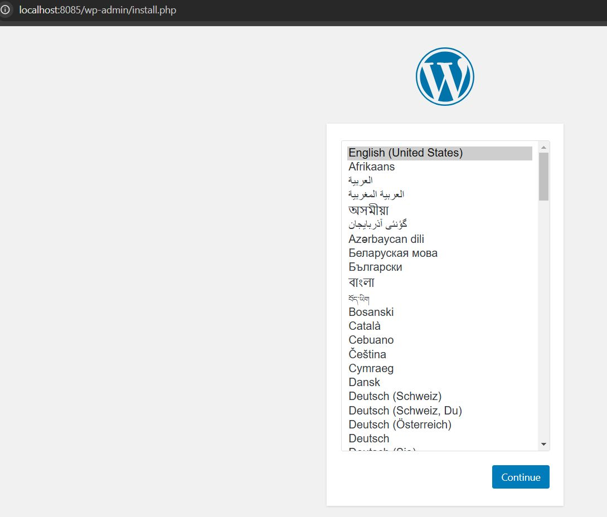

이미지 버전을 명시하여 설치했던 경우에는 삭제 시에도 버전을 명시해야 한다.\
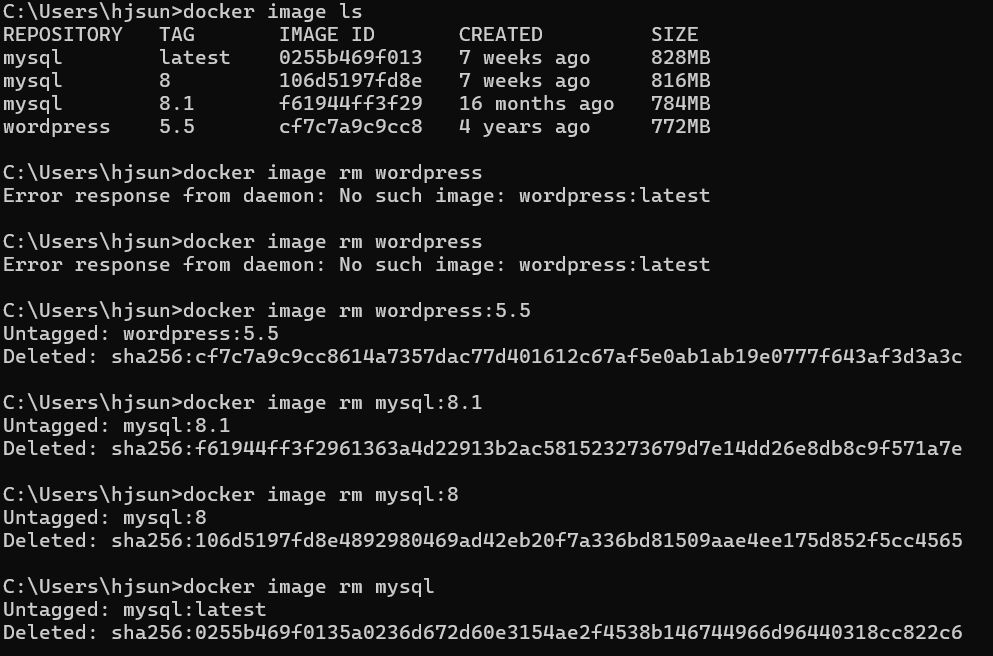

### Section 3 명령어를 직접 작성하자 
연습\
LAMP stack: Apache(nginx) + PHP + MySQL(MariaDB/PostgreSQL) + Linux\
핵심은 **웹 서버 + 프로그래밍 언어 런타임 + 데이터베이스 + 리눅스** 조합이라는 점

### Section 4 레드마인 및 MariaDB 컨테이너를 대상으로 연습하자
연습
1. Redmine + MySQL
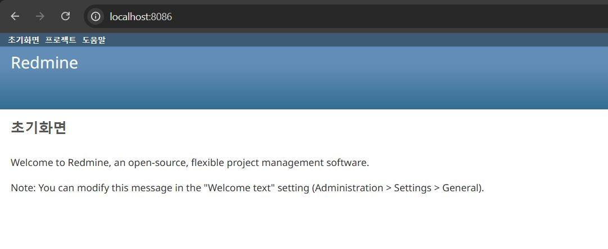
2. Redmine + MariaDB
오류발생 (MariaDB문제로 추정)
3. Wordpress + MariaDB