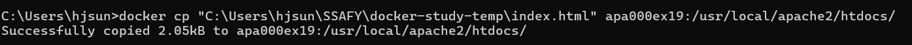

### Section 1 내게 필요한 지식이 무엇인지 정리하기
### Section 2 컨테이너와 호스트 간에 파일 복사하기
호스트 &rarr; 컨테이너
```
docker cp [host_path] [container_name]:[container_path]
```
컨테이너 &rarr; 호스트
```
docker cp [container_name]:[container_path] [host_path]
```
#### 실습 :whale: - 호스트의 파일을 컨테이너 속으로 복사


Q - 아파치 도커 컨테이너 안의 파일 구조를 어떻게 들여다볼 수 있지??


위와 같이 `exec` 명령어를 통해 직접 컨테이너를 실행시켜서, (리눅스 bash실행) 디렉터리를 확인할 수 있다. 
#### 실습 :whale: - 컨테이너의 파일을 호스트로 복사


### Section 3 볼륨 마운트
볼륨을 마우트하면 컨테이너의 일부를 호스트 컴퓨터의 일부와 같이 다룰 수 있어 편리하다.\
볼륨이란, **스토리지의 한 영역을 분할한 것**을 말한다. 간단히 말하면 하드디스크나 SSD를 분할한 하나의 영역이다.

**data persistency** 컨테이너 내부의 데이터는 컨테이너 삭제 시 같이 소멸된다. 컨테이너를 폐기할 때 데이터를
외부로 대피시키는 대신, 처음부터 데이터를 외부에 두는 방식으로 사용

#### 스토리지 마운트의 종류
1. 볼륨 마운트
    볼륨 마운트는 **도커 엔진이 관리하는 영역 내에 만들어진 볼륨**을 컨테이너에 디스크 형태로 마운트한다.\
    임시 목적의 사용이나 자주 쓰지는 않지만 지우면 안 되는 파일을 두는 목적으로 많이 사용한다.
2. 바인드 마운트
    바인드 마운트는 도커가 설치된 컴퓨터의 문서 폴더 또는 바탕화면 폴더 등 **도커 엔진에서 관리하지 않는 영역의
    기존 디렉터리**를 컨테이너에 마운트하는 방식이다.\
    자주 사용하는 파일을 두는 데 사용한다.

    볼륨 마운트 vs 바인드 마운트

    |항목|볼륨 마운트|바인드 마운트|
    |----|------|------------|
    |스토리지 영역|volume| directory or file|
    |물리적 위치|도커엔진 관리영역|anywhere|
    |마운트 절차|볼륨 생성 후 마운트|기존 파일 또는 폴더를 마운트|
    |내용 편집|도커 컨테이너를 통해서|일반적인 파일과 같이|
    |백업|절차 복잡|일반적인 파일과 같이|

#### command
볼륨 마운트 시 마운트와 동시에 볼륨을 생성할 수도 있지만, 볼륨 먼저 생성한 후 마운트 하는 것을 권장한다.

볼륨 생성
```
docker volume create 볼륨_이름
```

볼륨 삭제
```
docker volume rm 볼륨_이름
```
기타 하위 커맨드: chapter 4 참조

바인드 마운트 예시
```
docker run -v 스토리지_실제경로:컨테이너_마운트경로
```
볼륨 마운트 예시 - 이름만으로 관리 가능
```
docker run -v 볼륨_이름:컨테이너_마운트경로
```

#### 실습 :whale: - 바인드 마운트해보기
`run` 커맨드의 옵션 형태로 지정함으로써 바인드 마운트


마운트된 폴더/디렉터리에 index.html파일을 추가하여 페이지 바뀌는 것 확인


#### 실습 :whale: - 볼륨 마운트해보기
순서:\
볼륨 생성 &rarr; 아파치 컨테이너 생성


볼륨 inspect (볼륨의 상세 정보 - Mountpoint, name)


컨테이너 inspect (마운트된 볼륨이름 확인 - Mounts-name, source, destination)
```
docker container inspect apa000ex21
```


컬럼 2-볼륨 백업

컨테이너 생성 시 볼륨 마운트 + 바인드 마운트를 혼합한 것과 같은 형태의 명령어를 구성
```
docker run --rm -v apa000vol1/source -v C:\Users\사용자명\Documents:/target busybox tar czvf /target/backup_apa.tar.gz -C /source
```

여기서 `-v apa000vol1/source` 부분은 볼륨명:컨테이너마운트경로 &rarr; 볼륨 마운트 방식\
`-v C:\Users\사용자명\Documents:/target` 은 로컬스토리지경로:컨테이너마운트경로 &rarr; 바인드 마운트 방식 (백업)

/source에 마운트된 볼륨의 내용을 /target에 복사해 컨테이너 외부에 데이터를 저장하기 위함.

### Section 4 컨테이너로 이미지 만들기

#### 실습 :whale: - commit 커맨드로 컨테이너를 이미지로 변환

```
docker commit 컨테이너_이름 새로운_이미지_이름
```


#### 실습 :whale: - Dockerfile 스크립트로 이미지 만들기
```
docker build =t 생성할_이미지_이름 재료_폴더_경로
```

도커파일 스크립트 예
```
FROM 이미지_이름 (토대가 되는 이미지를 지정)
COPY 원본경로 대상경로 (이미지에 파일이나 폴더를 추가)
RUN 리눅스명령어 (이미지를 빌드할 때 실행할 명령어를 지정)
...
```


#### 이미지를 옮기는 방법
이미지를 이미지 상태 그대로 옮기거나 복사할 수 없으므로, 도커 레지스트리 `save` 커맨드를 사용해
tar 포맷으로 도커 엔진의 관리 영역 밖으로 내보내야 한다. 파일은 호스트 컴퓨터의 파일 시스템에 생성된다.
파일을 다시 도커 엔진에 가져오려면 `load` 커맨드를 사용한다.

```
docker save -o 파일이름.tar 이미지이름
```

### Section 5 컨테이너 개조

`docker exec`: 컨테이너 속에서 명령어를 실행하는 커맨드 - 초기 설정이 없어 동작하지
않는 경우도 있어 기본적으로 셸을 통해 명령을 실행한다.

```
docker exec (option) container_name /bin/bash
docker run (option) image_name /bin/bash 
```
run 명령 사용 시 다시 docker start 커맨드로 컨테이너를 재시작해야함

도커 명령 &rarr; 도커 엔진에 컨테이너를 이렇게 저렇게 해달라고 명령\
    - 도커 엔진의 시작/종료\
    - 컨테이너의 시작/종료\
    - 컨테이너 안팎의 파일을 복사
  
bash 명령 &rarr; 컨테이너에게 명령\
    - 소프트웨어 설치\
    - 소프트웨어 실행/종료\
    - 소프트웨어 설정 변경\
    - 파일 작업

`exit`으로 도커 명령을 내릴 수 있도록 컨테이너에서 빠져나온다.


### Section 6 도커 허브 등록 및 로그인
도커 레지스트리 = 이미지를 배포하는 장소 (개인도 운영 가능)

도커 허브 = 도커 제작사에서 운영하는 공식 도커 레지스트리 

리포지토리 - 레지스트리를 구성하는 단위. 레지스트리는 회사나 부서 단위로 만들지만
리포지토리는 소프트웨어를 단위로 한다.