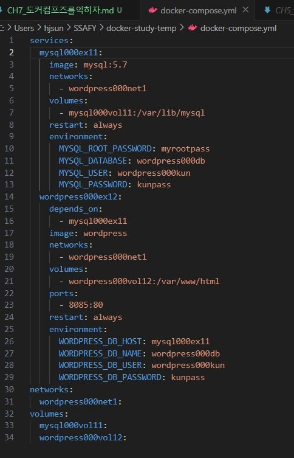
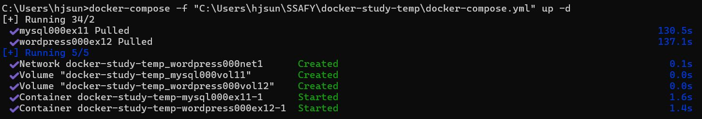
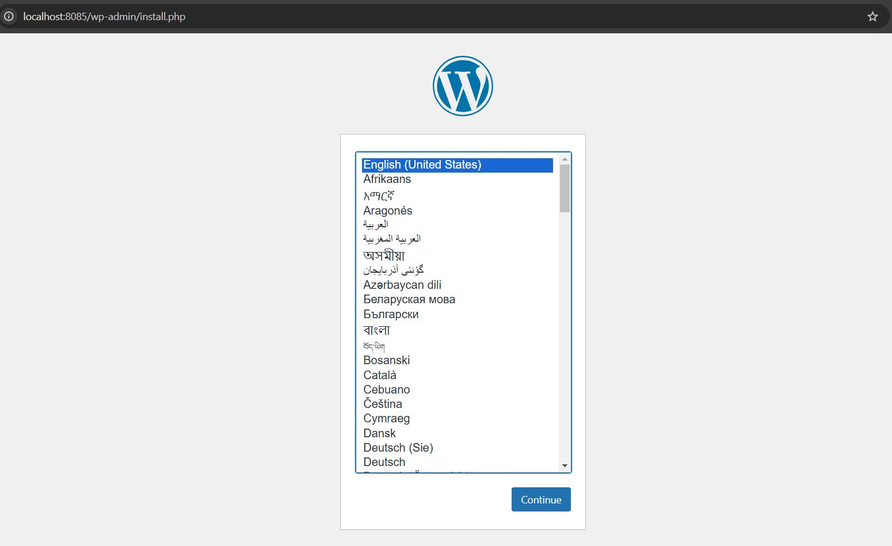
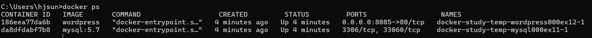
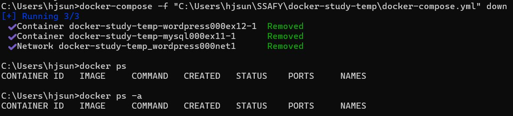

### Section 1 도커 컴포즈란?

도커 컴포즈는 도커 명령어를 정의 파일에 기술해 실행하는 도구다.\
시스템 구축에 필요한 설정을 YAML포맷으로 기재한 정의 파일을 이용해 전체 시스템을 일괄 실행(run) 또는 일괄 종료 및 삭제(down)할 수 있는 도구다.

정의 파일에는 컨테이너나 볼륨을 '어떠한 설정으로 만들지'에 대한 항목이 기재되어 있다. 작성 내용늗 도커 명령어와 비슷하지만 도커 명령어는 아니다.

`up` 커맨드는 `docker run` 커맨드와 비슷하다. 정의 파일에 기재된 내용대로 **이미지를 내려받고 컨테이너를 생성 및 실행**한다. 정의 파일에는 네트워크나 볼륨에 대한 정의도 기재할 수 있어 주변 환경을 한꺼번에 생성할 수 있다.

`down` 커맨드는 **컨테이너와 네트워크를** 정지 및 삭제한다. 볼륨과 이미지는 삭제하지 않는다. 컨테이너와 네트워크 삭제 없이 종료만 하고 싶다면 `stop` 커맨드를 사용한다.

**도커 컴포즈 VS Dockerfile script**

도커 컴포즈는 컨테이너와 주변 환경(+네트워크, 볼륨)을 생성한다.\
반면 Dockerfile 스크립트는 이미지를 만들기 위한 것으로 **네트워크나 볼륨은 만들 수 없다.**

### Section 2 도커 컴포즈의 설치와 사용법

윈도우의 경우 도커 컴포즈가 도커 데스크탑 설치 시 같이 설치된다.

도커 컴포즈를 사용하려면 호스트 컴퓨터에 폴더를 만들고, 이 폴더에 정의 파일(YAML)을 배치한다. (정의 파일은 한 폴더에 하나만 있어야 한다)\
정의 파일의 이름은 docker-compose.yml 이라는 이름을 사용해야 한다. 파일은 호스트 컴퓨터에 배치되지만 명령어는 똑같이 도커 엔진에 전달되며, 만들어진 컨테이너도 도커 엔진 위에서 동작한다.

### Section 3 도커 컴포즈 파일을 작성하는 법
앞전 챕터들에서 아파치 컨테이너, 워드프레스 컨테이너를 직접 cmd에서 명령어로 생성하는 방법은
오타 위험도 크고 불편했다. &rarr; 도커 컴포즈 정의 파일에 컨테이너 생성에 필요한 모든 정보를 담을 수 있다.

#### 실습 :whale: - 컴포즈 파일 작성 (Wordpress + MySQL)


### Section 4 도커 컴포즈 실행

`docker-compose up`: 컨테이너와 주변 환경을 생성\
컴포즈 파일의 내용을 따라 컨테이너와 볼륨, 네트워크를 생성하고 실행한다.

```
docker-compose -f 정의_파일_경로 up 옵션
```

`docker-compose down`: 컨테이너와 네트워크를 삭제\
볼륨과 이미지는 삭제되지 않는다. 
```
docker-compose -f 컴포즈_파일_경로 down 옵션
```

`docker-compose stop`: 컨테이너를 종료한다.

**주의** 우리가 도커컴포즈 파일에 정의한 컨테이너이름(services에 기재)과 실제 생성된 컨테이너 이름이 같지 않다. 실제 생성된 컨테이너 이름은 `컴포즈파일이 있던 폴더명_파일에 정의된 컨테이너명_1` 이런식이 된다.

#### 실습 :whale: - 도커 컴포즈 실행



실제 컨테이너명 확인


삭제
