### Section 1 쿠버네티스란?
쿠버네티스는 **컨테이너 오케스트레이션 도구**의 일종이다. 컨테이너 오케스트레이션이란 시스템 전체를 통괄하고 **여러 개의 컨테이너를 관리**하는 일을 말한다. 쿠버네티스는 여러 대의 물리적 서버가 존재하는 것을 전제로 한다.

즉 여러 대의 물리 서버, 각 서버마다 여러 개의 컨테이너 (대규모 시스템) 총괄

### Section 2 마스터 노드와 워커 노드
클러스터의 구성 &rarr; 마스터 노드와 워커 노드 

**Master node** 마스터 노드에서는 컨테이너를 실행하지 않으며, **워커 노드에서 실행되는 컨테이너를 관리**하는 역할을 한다.

**Worker node** 실제 서버에 해당하는 부분으로, 컨테이너가 동작한다. 

쿠버네티스는 도커 엔진 등의 컨테이너 엔진과는 별개의 소프트웨어이다. 

필요한 설치들
|설치|마스터노드|워커노드|
|---|----------|-------|
|쿠버네티스|O|O|
|CNI|O|O|
|etcd|O|X|
|Container engine|X|O|

- CNI: 가상 네트워크 드라이버 (ex. flannel, Calico, AWS VPC CNI)
- 마스터 노드를 조정하는 관리자의 컴퓨터 &larr; kubectl 설치.

마스터 노드 측 control plane
- kube-apiserver
- kube-controller-manager
- kube-scheduler
- cloud-controller-manager
- etcd
  
워커 노드의 구성
- kube-let
- kube-proxy

**쿠버네티스는 항상 '바람직한' 상태를 유지한다.**\
도커 컴포즈의 경우 사용자가 시키는 대로 컨테이너를 만들고 끝이라면 쿠버네티스는 컨테이너들을 만들고, 모니터링하고, 이를 유지한다. 원하는 변경이 있다면 사용자가 이를 직접 실행하는 대신 마스터 노드가 유지해야 하는 상태를 '수정' 함으로써 이를 행한다.

### Section 3 쿠버네티스의 구성과 관련 용어

1. pod (파드) = {컨테이너 + 볼륨} &rarr; 여러 개의 파드가 모여 **서비스**를 이룬다. 이 파드들이 각기 다른 워커 노드에 걸쳐 실행되더라도 같은 서비스에 속할 수 있다. 서비스는 쉽게 말해 **로드 밸런서(부하 분산장치)**의 역할을 한다. 각 서비스는 자동적으로 고정된 IP 주소를 부여받으며(Cluaster IP), 이 주소로 들어오는 통신을 처리한다(파드에 요청을 배분). 그러나 서비스가 분배하는 통신은 한 워커 노드 안으로 국한된다. 여러 워커 노드 간 분배는 실제 로드밸런서/인그레스가 담당한다. 

2. depolyment (디플로이먼트): 파드의 디플로이(배포)를 관리하는 요소로, 파드가 사용하는 이미지 등 파드에 대한 정보를 갖고 있다. 
   
3. ReplicaSet (레플리카세트): 파드의 수를 관리한다. 장애 등의 이유로 파드가 종료됐을 때, 모자라는 파드를 보충하거나 정의 파일에 정의된 파드의 수가 감소하면 그만큼 파드의 수를 실제로 감소시킨다. 

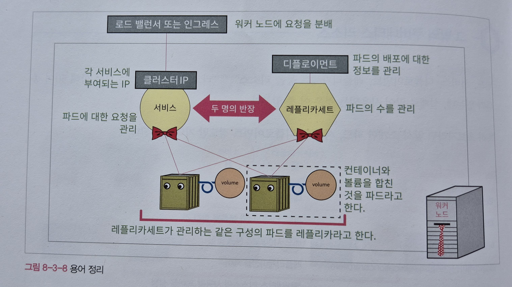

### Section 4 쿠버네티스 설치 및 사용법
여러가지 쿠버네티스 버전이 있다.\
도커 데스크톱에는 쿠버네티스가 포함되어 있다!
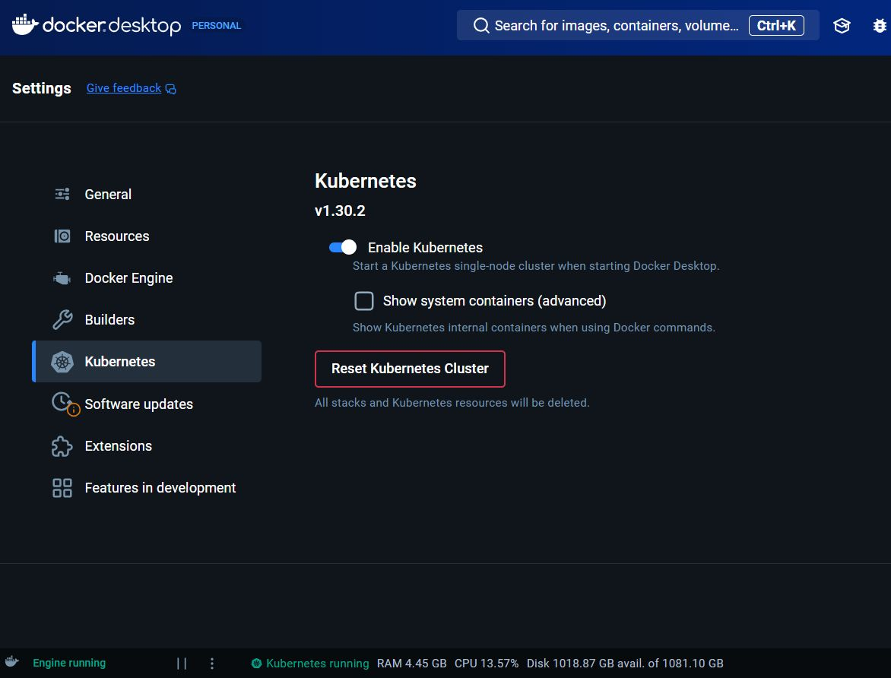

### Section 5 매니페스트 파일(정의 파일) 작성
쿠버네티스는 매니페스트 파일에 기재된 내용에 따라 파드를 생성한다.
매니페스트 파일의 내용을 쿠버네티스에 업로드하면 그 내용이 데이터베이스(etcd)에 
'바람직한 상태'로 등록되며, 서버 환경을 이 바람직한 상태로 유지한다.

- 매니페스트 파일은 파드나 서비스에 대한 설정
내용을 담고 있어야 하고, YAML 또는 JSON 형식으로 기재한다.
- 매니페스트 파일은 리소스 단위로 작성한다. (서비스/디플로이먼트)
- deployment > replicaset > pod


#### bottom - up
#### 메타데이터와 스펙 작성 (1) pod
```
|── apiVersion
|── kind
|── metadata 파드의 정보
|    |── name
|    └── labels
|── spec
|    |── containers 파드에 포함될 컨테이너 정보
|        |── name
|        |── image
|        └── ports
```

#### 실습 :whale: - 매니페스트 파일 작성 (1) pod
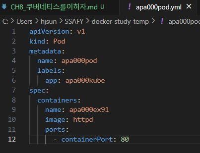

#### 메타데이터와 스펙 작성(2) deployment
```
|──apiVersion
|──kind
|──metadata 디플로이먼트의 이름
|    |── name
|    └── selector 특정한 레이블이 부여된 파드 관리
|       └── matchLabels
|──spec
|    |── replicas 파드 수를 몇 개로 유지할 것인지
|    └── template 생성할 파드의 메타데이터 & 스펙 (1) -- 다만 파드 이름은 보통 설정X 
|        |── metadata
|        └── spec
|
```

#### 실습 :whale: - 매니페스트 파일 작성 (2) deployment
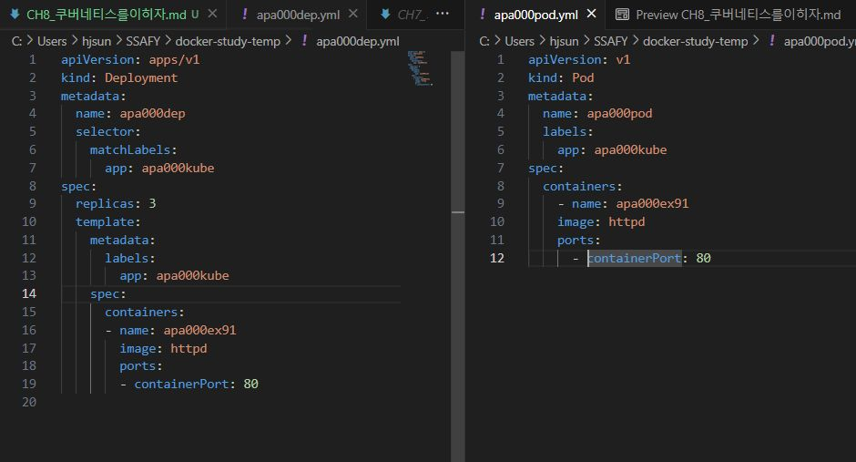

#### 메타데이터와 스펙 작성(3) service

**유형(type) 설정**\
ClusterIP / NodePort(개발목적) / LoadBalancer(대부분의 웹사이트 실무) / ExternalName

**포트(port) 설정**\
port(서비스의 포트), nodePort(워커노드의 포트), targetPort(컨테이너 포트)

**셀렉터(selector) 설정**\
matchLabels: 사용 X

#### 실습 :whale: - 매니페스트 파일 작성 (3) service
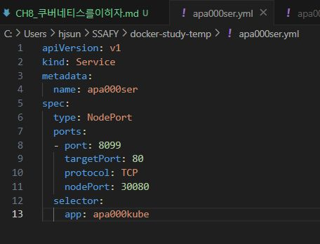

### Section 6 쿠버네티스 명령어

kubectl 명령어의 형식
```
kubectl 커맨드 옵션
```

#### 실습 :whale: - 매니페스트 파일로 파드 생성(1) - deployment

매니페스트 파일을 읽어 실제 리소스에 반영 &rarr; 파드의 생성 여부 확인
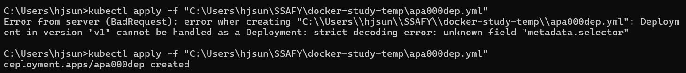

오류: selector 항목이 metadata가 아니라 spec 밑에 있어야 함

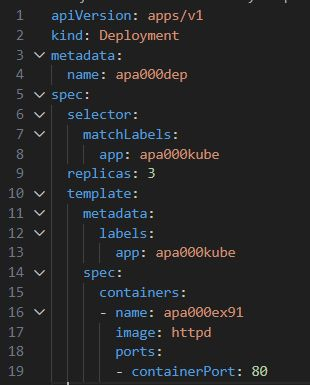
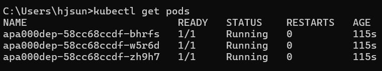

#### 실습 :whale: - 매니페스트 파일로 파드 생성(2) - service

매니페스트 파일을 읽어 들여 실제 리소스에 반영 &rarr; 파드의 생성 여부,
접근 가능 확인

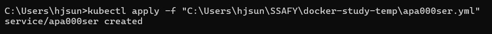
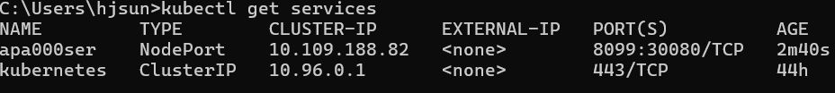
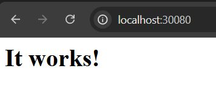

### Section 7 쿠버네티스를 연습하자

#### 실습 :whale: - 매니페스트 파일로 파드의 개수 늘리기
apa000dep.yml 파일에서 spec > replicas 갑 수정 후에
다시 apply &rarr; `kubectl get pods`

#### 실습 :whale: - 매니페스트 파일로 아파치를 nginx로 바꾸기
apa000dep.yml 파일에서 spec > spec > containers > image를
수정한 후에 다시 apply
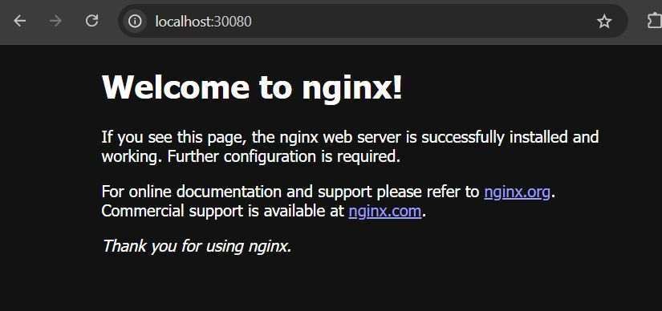
살짝 시간이 걸릴 수 있다.

#### 실습 :whale: - 수동으로 파드를 삭제한 후 자동복구되는지 확인
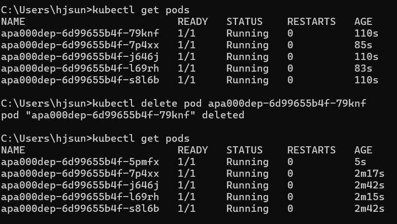
'바람직한 상태'를 유지하려고 하는 쿠버네티스의 특성

#### 실습 :whale: - 생성했던 디플로이먼트와 서비스 삭제
파드는 레플리카 수를 0으로 수정하면 모두 삭제되지만 이것만으로는 디플로이먼트와 서비스가 남아있게 된다.

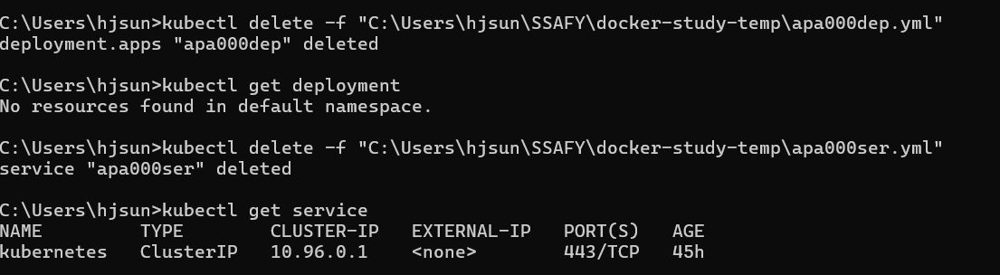