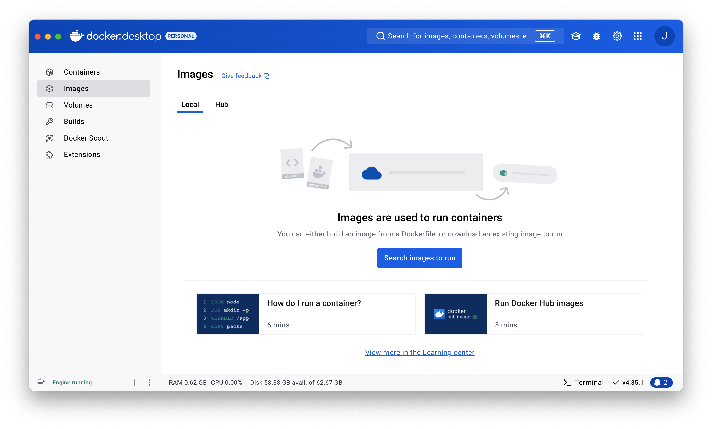

> Released: Docker Desktop for Mac [Apple Silicon]  21.04.15  
> https://www.docker.com/blog/released-docker-desktop-for-mac-apple-silicon/ 
>
# CH3. 도커를 사용해보자
---
## SECTION 01. 도커를 사용하려면

### 도커는 기본적으로 리눅스용이지만 윈도우와 macOS에서도 사용할 수 있다.

#### 도커 환경을 구축하는 세 가지 방법
1. 리눅스 컴퓨터에서 도커 사용하기 
2. 가상 머신이나 렌탈 환경에 도커를 설치하고 윈도우나 macOS를 통해 사용하기 
3. 윈도우용/macOS용 도커 사용하기 

세 가지 중 어떠한 방법을 사용하더라도, 준비 과정에서 차이가 있을 뿐 명령어는 공통적으로 사용할 수 있다. 

### 윈도우용/macOS용 도커 사용하기 

#### 윈도우와 macOS에서는 리눅스 운영체제가 들어있는 패키지(도커 데스크톱)를 사용한다.

리눅스 컴퓨터에 도커를 설치하려면 도커 엔진만 있으면 되지만  
윈도우나 macOS에서는 리눅스 운영체제 등의 실행환경이 추가적으로 필요하기 때문에 이들을 함께 패키지로 묶어 배포한다.

도커 환경을 구축하는 세 가지 방법 중 2번 방법 '가상머신이나 렌탈 환경에 도커를 설치하고 윈도우나 maxOS를 통해 사용하기'는  
사용자가 명시적으로 '가상화 소프트웨어(vmware or virtual box 등)'를 설치하고, 그 위에 리눅스 운영체제를 설치한 다음 그 위에 도커 엔진을 설치한다.  
그에 반해, 도커 데스크톱은 사용자가 가상 환경이나 리눅스 운영체제를 신경쓰지 않아도 도커를 사용할 수 있다.

또한 내부적으로 사용하는 가상화 SW에도 차이가 존재한다. 
vmware 혹은 virtuabox와 같은 가상화 SW를 사용하는 2번 방식과 다르게, 도커 데스크톱은 Hyper-V(윈도우, 윈도우 내부 포함), HyperKit(macOS, 도커 데스크톱 패키지에 포함)이라는 가상화 기술을 사용한다.

#### 도커 데스크톱은 일반적인 소프트웨어처럼 사용한다.

도커 데스크톱을 이용하면 가상화 소프트웨어나 리눅스 운영체제의 존재를 신경 쓰지 않아도 되며, 일반적인 소프트웨어와 동일하게 조작이 가능하다는 장점이 있다.
다만, 실제 도커 엔진을 다룰 때에는 GUI를 이용한 조작이 불가능하며 CLI를 통해 조작해야 한다. 

> GUI vs. CLI 
> - Graphic User Interface, GUI
> - Command Line Interface, CLI

> 도커 데스크톱 vs. 툴박스 버전
> - 툴박스?  
> 도커 데스크톱이 나오기 전까지 사용하던 패키지로, 현재는 레거시로 넘어갔기 때문에 사용은 지양.
> - 도커 데스크톱과의 차이  
> 가상화 소프트웨어의 차이, 도커 데스크톱에서는 Hyper-V(윈도우), HyperKit(maxOS)을 사용하는 반면,  
> toolbox는 가상 환경 구축을 위해 virtual box를 사용한다.

### 도커 실행 조건 

- 64비트 운영체제 only
- 윈도우 버전의 사용조건
  - 운영체제 요구사항
    - 윈도우 10 64비트 버전: 프로, 엔터프라이즈, 에듀케이션 중 Build 16299 이후 버전 
    - 윈도우 10 64비트 버전 : 홈 에디션일 경우 WSL2를 사용 가능 (2004 버전 이후)
  - 하드웨어 요구사항 
    - CPU: *SLAT* 기능을 지원하느 64비트 프로세서 
    - 메모리: 4GB 이상 
    - BIOS에서 virtualization 활성화 

- macOS의 사용조건 
  - 운영체제 요구사항
    - 2010년 이후 발매 모델 
    - macOS 13.0 이후 버전 
    - 메모리: 4GB 이상 
    -  
- 리눅스 버전의 사용조건
  - 매포판 및 버전이 다음 표에 표신된 것 이상이어야 함 
    | 배포본 | 버전 |
    |-----------|-----------|
    | CentOS  | CentOS 7 이후  |
    | Ubuntu  | Ubuntu 16.04 이후  |
    | Debian  | Debian 9 이후  |
    | Pedora  | Pedora 30 이후  |

  - 리눅스 커널: 3.10 이후 버전 
  - iptables: 1.4 이후 버전 
  - Git: 1.7 이후 버전
  - XZ Utils: 4.9 이후 버전 
  - procp cgruops 계층을 준수
  
## SECTION 02. 도커 설치 (macOS 기준)

> **설치 환경**
> - chip: Apple M1 Pro
> - os: macOS Sequoia 15.1
> - mem: 16GB 

> ### macOS용 도커 데스크톱 설치
> 
> #### step 01. macOS용 도커 데스크톱 다운로드
> - Download for Mac: Apple Silicon 
> 

> 
> 

> #### step 02. 도커 데스크톱 설치 
> 

> 
>

> #### step 03. 도커 데스크톱 설치 완료 
>

>    
>

>### 도커 데스크톱 첫 실행 및 화면 확인 
>
>#### step 05. 도커 데스크톱 첫 실행 
>

>    
>

>
>#### step 06. 메뉴 바 확인 
>
>

>   
>

>### 도커 데스크톱 화면 확인 
>
>#### Containers 탭 화면
>
>- Containers 탭에서는 실행 중인 컨테이너의 목록을 확인할 수 있다. 
>

>
>

>#### Images 탭 화면
>
>- Images 탭에서는 내려받은 도커 이미지의 목록을 확인할 수 있다. 
>

>
>

>#### 도커 실행 중 여부 확인
>
>- 화면 좌측 하단에 표시되는 status를 통해 도커의 실행 여부를 확인할 수 있다. 
>- 도커 엔진이 실행 중이라면 'Engine running'이라는 상태가 표시되고, 
>

>    
>

>- 도커 엔진이 실행 중이 아니라면 'Resource Saver mode' 혹은 'Engine paused' 상태를 확인할 수 있다.
>

>      
>

>

>    
>

## SECTION 03. 도커의 조작 방법과 명령 프롬프트 및 터미널 실행

### 도커는 명령 프롬프트 또는 터미널에서 다룬다.

- 도커는 소프트웨어가 실행 중이라도 전용 입력 화면이 없기 때문에 도커에 명령을 전달할 별도의 소프트웨어를 사용한다. 
- 터미널 소프트웨어 : 컴퓨터에 명령을 전달하는 소프트웨어 
  - 윈도우 -> 명령 프롬프트 
  - macOS -> 터미널

- 터미널을 종료한다고 해서 도커가 종료되는 것은 아니다. 

