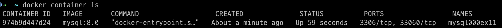
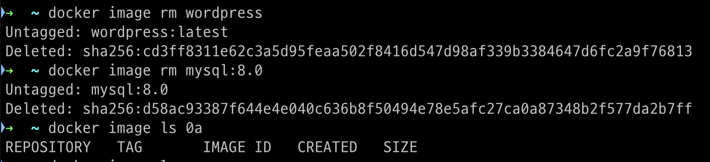

## SECTION 01. 워드프레스 구축

<aside>

    ❗ **워드프레스?**

    웹 사이트를 제작 및 관리하기 위한 오픈소스 콘텐츠 관리 시스템(CMS) 이다.

    **PHP**로 개발되었으며, **MySQL**이나 **MariaDB** 데이터베이스를 사용한다. (MySQL 사용 예정)

    사용자는 프로그래밍 지식 없이도 쉽게 웹사이트를 구축하고 관리할 수 있어 전 세계적으로 가장 인기 있는 CMS 중 하나이다.

</aside>

### 워드프레스 사이트 구성 및 구축

- 워드프레스 공식 이미지를 사용해서 컨테이너 구축
    - 워드프레스 프로그램 본체
    - 아파치
    - PHP 런타임
    
    → 위 SW를 모두 포함하고 있어 매우 편함.
    
    → MySQL 컨테이너만 추가적으로 존재하면 바아로 워드프레스 사용가능.
    
    (DB 서버를 도커 외부에 두는 방식도 가능하나, 지금은 동일하게 컨테이너로 구성)
    

### 도커 네트워크 생성/삭제

- 워드프레스는 워드프레스 컨테이너와 MySQL 컨테이너로 구성된다.
- 워드프레스 likes 블로그 생성 도구
    - 작성자가 생성한 내용을 DB에 저장
    - 열람자의 요청에 따라 웹페이지를 출력
    
    → 프로그램이 DB에 저장된 데이터를 읽고 쓸 수 있어야 하기 때문에 두 컨테이너가 **연결**되어있어야 한다.
    
- 두 컨테이너를 연결하기 위해 가상 네트워크를 만들고, 컨테이너를 가상 네트워크에 소속시킨다.
- 가상 네트워크를 만들기 위한 커맨드 → `docker network create`
- 도커 네트워크 주요 커맨드
    
    ```bash
    # 도커 네트워크 생성
    docker network create 네트워크_이름 
    
    # 도커 네트워크 삭제 
    docker network rm 네트워크_이름
    
    # 도커 네트워크 목록 출력
    docker network ls
    ```
    
- 이외 네트워크 관련 커맨드
    
    ```bash
    # 네트워크에 컨테이너를 새로이 접속
    docker network connect 
    
    # 네트워크에서 컨테이너의 접속을 끊음
    docker network disconnect 
    
    # 네트워크 상세 정보 확인 
    docker network inspect 
    
    # 현재 아무 컨테이너도 접속하지 않은 도커 네트워크를 모두 삭제 
    docker network prune
    ```
    

### MySQL 컨테이너 실행 시에 필요한 옵션과 인자

```bash
docker run --name 컨테이너_이름  # MySQL 컨테이너 이름:mysql000ex11
	-dit 
	--net=네트워크_이름  # 컨테이너를 연결할 네트워크 이름: wordpress000net1
	-E MYSQL_ROOT_PASSWORD=MySQL_루트_패스워드  # MySQL 루트 패스워드: myrootpass
	-e MYSQL_DATABASE=데이터베이스_이름  # MySQL 데이터베이스 이름: wordpress000db
	-e MYSQL_USER=MySQL_사용자이름  # MySQL 사용자 이름: wordpressuser
	-e MYSQL_PASSWORD=MySQL_패스워드  # MySQL 패스워드: wuserpass
	ㅡmysql --character-set-server=문자_인코딩  # 문자 인코딩: utf8mb4 (문자 인코딩을 utf8을 사용)
	--collation-server=정렬_순서  # 정렬 순서: utf8mb4_unicode_ci (정렬 순서로 utf8을 따름)
	--default-authentication-plugin=인증_방식  # 인증 방식: mysql_native_password (인증 방식을 예전 방식(native)으로 변경)
```

- **root**: 모든 권한을 가진 사용자
    - 매번 루트 사용자로 접속할 경우 보안 측면에서 문제가 생기기 때문에 제한된 권한을 가진 일반 사용자로 전환해서 사용하는 것이 일반적이다.
- MySQL5 → MySQL8 로 넘어오면서 외부 SW가 MySQL에 접속하기 위한 인증 방식을 
native → SHA2로 변경
    
    <aside>
    ❗
    
    **mysql_native_password vs. caching_sha2_password**
    
    - mysql_native_password
        - SHA-1 기반 해싱 알고리즘 사용
        - 사용자 비밀 번호를 해시 값으로 저장하고 인증 시 클라이언트가 전송한 값을 비교
        - SHA-1은 과거에는 안전했으나, 현재는 취약점이 발견되어 강력한 보안 요구를 충족하지 못함
        - 암호 캐싱 기능이 없어 빈번한 인증 요청 시 성능 저하
    - caching_sha2_password
        - SHA-256 기반 해싱 알고리즘 사용
        - SHA-256 은 현재 강력한 암호화 수준을 제공하며, 최신 보안 표준을 따름
        - 암호화 수준이 높아 데이터 탈취 시 복호화가 어려움
        - 암호 캐싱을 통해 동일 세션에서 반복적인 인증 시 성능 저하 x
    
    | 특징 | `mysql_native_password` | `caching_sha2_password` |
    | --- | --- | --- |
    | **암호화 알고리즘** | SHA-1 | SHA-256 |
    | **보안 수준** | 보통 | 높음 |
    | **암호 전송 방식** | 간단한 해시 비교 | RSA 암호화 및 SHA-256 사용 |
    | **성능 최적화** | 없음 | 암호 캐싱 및 비동기 인증 지원 |
    | **TLS/SSL 필요 여부** | 필요할 수 있음 | 필요 없음 (기본적으로 안전함) |
    | **호환성** | 기존 MySQL 클라이언트와 호환성 높음 | 최신 클라이언트에서만 지원 |
    </aside>
    
- 워드프레스는 MySQL8.0이 지원하는 인증 방식을 사용할 수 없기 때문에 **이전 인증방식을 사용하도록 설정**

### 워드프레스 컨테이너 실행 시 필요한 옵션과 인자

```bash
docker run 
	--name 컨테이너_이름  # 워드프레스 컨테이너 이름: wordpress000ex12
	-dit  # 실행 옵션
	--net=네트워크_이름  # 네트워크 이름: wordpress000net1
	-p 포트_설정  # 포트 번호 설정: 8085:80
	-e WORDPRESS_DB_HOST=데이터베이스_컨테이너_이름  # DB 컨테이너 이름: mysql000ex11 
	-e WORDPRESS_DB_NAME=데이터베이스_이름  # DB 이름: wordpress000db
	-e WRODPRESS_DB_USER=데이터베이스_사용자_이름  # DB 사용자 이름: wordpressuser
	-e WORDPRESS_DB_PASSWORD=데이터베이스_패스워드  # DB 사용자 패스워드: wuserpass
	wordpress
```

## SECTION 02. 워드프레스 및 MySQL 컨테이너 생성과 연동

### 이번 절의 실습 내용과 사용할 커맨드

- 실습 내용
    1. 네트워크 생성
    2. MySQL 컨테이너 생성
    3. 워드프레스 컨테이너 생성
    4. 컨테이너 및 네트워크 확인 
    5. 뒷정리 
- 생성한 네트워크 및 컨테이너 정보
    - 네트워크 이름: `wordpress000net1`
    - MySQL 컨테이너 이름: `mysql000ex11`
    - MySQL 이미지 이름: `mysql`
    - 워드프레스 컨테이너 이름: `wordpress000ex12`
    - 워드프레스 이미지 이름: `wordpress`

### 워드프레스와 MySQL 컨테이너 생성 및 실행

**step 01. 네트워크 생성**

```bash
docker network create wordpress000net1
```


</br> 

**step 02. MySQL 컨테이너 생성 및 실행** 

자세한 구성은 [여기](https://www.notion.so/CH05-149d2e168cd38000abd7fd02fb11e48e?pvs=21)로

```bash
docker run \
	--name mysql000ex11 \
	-dit \
	--net=wordpress000net1 \
	-e MYSQL_ROOT_PASSWORD=myrootpass \
	-e MYSQL_DATABASE=wordpress000db \
	-e MYSQL_USER=wordpressuser \
	-e MYSQL_USER_PASSWORD=wuserpass \
	mysql \
	--character-set-server=utf8mb4 \
	--collation-server=utf8mb4_unicode_ci \
	--default-authentication-plugin=mysql_native_password
```


</br> 

- 책에 나온 대로 진행 했으나, 컨테이너가 생성만 되고 구동은 되지 않는다.
    
    

    
- G 선생님에게 부검을 요청한 결과, MySQL 사용자 비밀번호를 MYSQL_PASSWORD가 아닌 MYSQL_USER_PASSWORD라는 변수에 넘겨주고 있었다.
- 따라서, 생성한 컨테이너를 지우고 다시 실행시켰다.
    
    ```bash
    docker container rm mysql000ex11
    ```
    
    ```bash
    docker run --name mysql000ex11 -dit --net=wordpress000net1 -e MYSQL_ROOT_PASSWORD=myrootpass -e MYSQL_DATABASE=wordpress000db -e MYSQL_USER=wordpressuser -e MYSQL_PASSWORD=wuserpass mysql --character-set-server=utf8mb4 --collation-server=utf8mb4_unicode_ci --default-authentication-plugin=mysql_native_password
    ```
    
- 여전히, 실행 직후 구동을 멈춘다…
- 컨테이너 로그 확인: `docker log 컨테이너_이름`
    
    ```bash
    docker log mysql000ex11
    ```
    
    
    
- `unknown variable ‘default-authentication-plugin=mysql_native_password’` 란다…
- MySQL9.0 이상 버전에서는 해당 옵션이 유효하지 않다고 한다.
- MySQL 이미지를 설정할 때, 버전도 명시를 해주어야 할 것 같다.

```bash
docker run --name mysql000ex11 -dit \
  --net=wordpress000net1 \
  -e MYSQL_ROOT_PASSWORD=myrootpass \
  -e MYSQL_DATABASE=wordpress000db \
  -e MYSQL_USER=wordpressuser \
  -e MYSQL_PASSWORD=wuserpass \
  mysql:8.0 \
  --character-set-server=utf8mb4 \
  --collation-server=utf8mb4_unicode_ci
```


</br> 

- 정상적으로 동작하는 것을 확인할 수 있다.



</br> 

**step 03. 워드프레스 컨테이너 생성 및 실행**

```bash
docker run \
	--name wordpress000ex12 \
	-dit \
	--net=wordpress000net1 \
	-p 8085:80 \
	-e WORDPRESS_DB_HOST=mysql000ex11 \
	-e WORDPRESS_DB_NAME=wordpress000db \
	-e WORDPRESS_DB_USER=wordpressuser \
	-e WORDPRESS_DB_PASSWORD=wuserpass \
	wordpress
```


</br> 

**step 04. 컨테이너 상태 확인 (ps 명령어)**

```bash
docker ps

# or 
docker container ls 
```


</br> 

- mysql 컨테이너와 wordpress 컨테이너 모두 구동 중인 것을 확인 가능 (STATUS: UP)

**step 05. 워드프레스 확인 via 웹 브라우저**

- 웹 브라우저에서 http://localhost:8085 에 접근해 워드프레스의 초기 화면을 확인한다.


</br> 

**step 06. 뒷정리**

```bash
# 컨테이너 종료 
docker stop wordpress000ex12
docker stop mysql000ex11

# 컨테이너 삭제 
docker rm wordpress000ex12
docker rm mysql000ex11

# 이미지 삭제 
docker image rm wordpress
docker image rm mysql:8.0

```


</br> 


</br> 


</br> 



</br> 

## SECTION 03