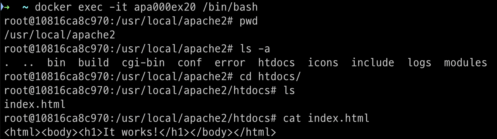

## SECTION 01. 내게 필요한 지식이 무엇인지 정리하기

### 자신의 역할에 따라 알아야 할 지식이 달라진다

서버 엔지니어 / 보안 엔지니어 → 도커에 대한 깊은 이해 필요  

프로그래머/ 디자이너 / PM / 시스템 엔지니어 / etc → 사용할 줄만 알면 됨 

<aside>

    **💡사용하는 입장과 만드는 입장은 크게 다르다.**

    → 이미지로 만들어진 컨테이너를 쓰기만 하는 것과, 이미지부터 생성하는 입장은 알고 있어야 할 지식의 깊이가 다르다.

    but, 필요하지 않더라도 기술의 대략적인 내용을 알아둔다면 서버 엔지니어 / 보안 엔지니어와의 대화가 쉬워지고 그들의 의도도 이해하기 쉬워질 것이다.

</aside>

## SECTION 02. 컨테이너와 호스트 간에 파일 복사하기

### 실습 1. 호스트의 파일을 컨테이너 속으로 복사

1. 파일 준비 
    
    ```bash
    # /Users/jaehwan/Documents/
    vim index.html
    
    # 아래 내용 저장
    <html>
    	<meta charset="utf-8"/>
    		<body>
    			<div>안녕하세요</div>
    		</body>
    </html> 
    ```
    
2. 아파치 컨테이너 생성 및 실행 
    1. 생성할 컨테이너 정보 
        1. 컨테이너 이름: `apa000ex19`
        2. 이미지 이름: `httpd`
        3. 포트 설정: `8089:80`
    
    ```bash
    docker run \
    	--name apa000ex19 \
    	-d \
    	-p 8089:80 \
    	httpd
    ```
    
    
    
    - http://localhost:8089 에 접근해서 아파치 초기 화면 확인
    
    
    
    

    </br>

3. 파일 복사 
    
    ```bash
    # macOS 기준 
    docker cp /Users/jaehwan/Documents/index.html apa000ex19:/usr/local/apache2/htdocs/
    ```
    
    
    
4. 확인 
- http://localhost:8089 에 다시 접속해서 웹 브라우저 확인
    
    
    

    

### 실습 02. 컨테이너의 파일을 호스트로 복사

1. 호스트의 index.html 파일 삭제 
    
    ```bash
    rm /Users/jaehwan/Documents/index.html 
    ```
    
2. 아파치 컨테이너 생성 및 실행 
    1. 위에서 사용한 apa000ex19 컨테이너 그대로 사용 
3. 파일 복사
    
    ```bash
    # macOS 기준
    docker cp apa000ex19:/usr/local/apache2/htdocs/index.html /Users/jaehwan/Documents/
    ```
    
4. 확인 
    
    
    
5. 뒷정리 
    
    ```bash
    # 컨테이너 종료
    docker container stop apa000ex19
    
    # 컨테이너 삭제 
    docker container rm apa000ex19
    
    # 이미지 삭제  
    docker image rm httpd
    ```
    

## SECTION 03. 볼륨 마운트

### 볼륨과 마운트

- 볼륨 (Volume): 스토리지의 한 영역을 분리한 것 (HDD나 SSD를 분할한 하나의 영역)
- 마운트 (Mount): ‘연결하다’→ 대상을 연결해 운영체제 또는 소프트웨어의 관리하에 두는 일

- 실제로 컨테이너를 사용하기 위해서는 (로컬)스토리지 영역을 마운트 해야한다.
→ why? 데이터가 (로컬)스토리지에 있으니까
- 컨테이너의 생애주기에 따라 컨테이너는 언젠가 ‘삭제’되므로 컨테이너 내부에 데이터를 저장한다면, 컨테이너 삭제 시에 데이터도 함께 삭제된다.
    
    → 컨테이너의 데이터를 빈번하게 백업하기보다, 애초에 컨테이너 외부에 존재하는 데이터에 접근하는 방식을 사용 
    
    → **Data Persistency**
    

### 스토리지 마운트의 종류

**볼륨 마운트** 

- 도커 엔진이 관리하는 영역 내에 만들어진 볼륨을 컨테이너에 디스크 형태로 마운트
- 다루기 쉬움 (이름만으로 관리)
- 볼륨에 비해 직접 조작하기 어려움
- 도커 엔진 영역에 저장되므로, 파일에 접근하기 위해서는 도커 엔진을 거쳐야 함

→ 임시 목적의 사용 혹은 자주 쓰지는 않지만 지우면 안되는 파일 저장용 (Archive?)

**바인드 마운트**

- 도커가 설치된 컴퓨터의 문서 폴더 또는 바탕화면 폴더 등 도커 엔진에서 관리하지 않는 영역의 기존 디렉터리를 컨테이너에 마운트 (디렉터리가 아닌 파일 단위로도 마운트 가능)
- 도커 엔진과 무관하게 파일을 다룰 수 있음
- 자주 사용하는 파일을 두는 데 사용

**두 가지 마운트 방식의 차이점**

1. 간단 vs. 복잡
2. 호스트에서의 파일 핸들링 여부
3. 환경의 의존성 배제 여부

볼륨 마운트는 익숙해지면 손쉽게 사용할 수 있다. (도커 제작사 권장 사항)

바인드 마운트는 기존에 사용자가 사용하던 방식으로 파일을 사용할 수 있다. 

그래서 언제 볼륨 마운트를 사용하고, 언제 바인드 마운트를 사용하는데?

- 워드프레스처럼 파일을 자주 편집해야 하는 경우에는 바인드 마운트를 사용

| 항목 | 볼륨 마운트  | 바인드 마운트  |
| --- | --- | --- |
| 스토리지 영역 | 볼륨 | 디렉터리 또는 파일  |
| 물리적 위치 | 도커 엔진의 관리 영역  | 어디든지 가능  |
| 마운트 절차  | 볼륨을 생성한 후 마운트  | 기존 파일 또는 폴더를 마운트  |
| 내용 편집 | 도커 컨테이너를 통해서  | 일반적인 파일과 동일  |
| 백업 | 복잡한 절차  | 일반적인 파일과 동일 |

<aside>


    ❗ 임시 메모리(tmpfs) 마운트 

        임시 메모리 마운트는 주 메모리 영역(RAM)을 마운트 한다. 

        Disk보다 훨씬 빠른 속도로 I/O가 가능하다.

        휘발성 메모리이기 때문에, 도커 엔진이 정지되거나 호스트가 재부팅되면 모두 날아간다.

</aside>

### 스토리지 영역을 마운트하는 커맨드

- 어떤 마운트 방식을 사용하던 `스토리지 마운트는 run 커맨드의 옵션 형태`로 지정한다.
- 마운트하려는 스토리지의 경로가 컨테이너 속 특정 경로와 연결되도록 설정하는 형태

**스토리지 마운트 절차** 

1. 스토리지 영역 생성 
    1. `바인드 마운트`는 원본이 될 폴더(디렉터리)나 파일을 먼저 만든다.
    2. `볼륨 마운트`
        1. 마운트와 동시에 볼륨(스토리지 영역) 생성: 비 권장
        2. 볼륨 생성 후 마운트
            1. 볼륨 생성 
                
                ```bash
                # 볼륨 생성 
                docker volume create 볼륨_이름 
                
                # 볼륨 제거 
                docker volumn rm 볼륨_이름 
                ```
                
2. 컨테이너 생성 (및 마운트)
    1. 스토리지 마운트 커맨드 
        
        ```bash
        # 바인드 마운트 (볼륨을 마운트 하지 않지만 볼륨 마운트와 마찬가지로 -v 옵션 사용) 
        docker run (생략) -v 스토리지_실제_경로:컨테이너_마운트_경로 (생략)
        
        # 볼륨 마운트 
        docker run (생략) -v 볼륨_이름:컨테이너_마운트_경로 (생략)
        ```
        

### 실습: 바인드 마운트 해보기

실습 절차 

1. 폴더 생성
    
    ```bash
    # 로컬 폴더(스토리지 실제 영역) 생성 
    mkdir /Users/jaehwan/Documents/app_folder
    ```
    
2. 아파치 컨테이너 생성
    
    ```bash
    docker run \
    	-dit \
    	--name apa000ex20 \
    	-d \
    	-p 8090:80 \
    	-v /users/jaehwan/documents/apa_folder:/user/local/apache2/htdocs \
    	httpd
    ```
    
    
    
    - 마운트 할 경로를 소문자로 작성하라고 함
    
    
    
    - 마운트할 경로를 도커 데스크탑에서 설정하라고 함
        - 해당 경로를 추가 (**경로 작성 시에 소문자로 작성해야 함)**
            
            
            
    - 다시 실행 → 성공
    
    
    
3. 초기 화면 확인
    - http://localhost:8090/ 에 접근해서 웹 브라우저 확인
        
        
        
        ????????????????????
        
        책에서는 Index of / 메시지가 출력되는데 왜 나는 이럴까?
        
        컨테이너 생성할 때 문제가 있던 거겟지?
        
4. index.html 파일 배치 
    
    ```bash
    cp index.html /users/jaehwan/documents/apa_folder/
    ```
    
5. 확인
    - http://localhost:8090/ 에 접근해서 웹 브라우저 확인
        
        
        
        ???????????????????? 
        
        apa_folder/index.html 파일에는 ‘안녕하세요’가 적혀있는데 왜 It works가 나올까
        
        - `docker inspect apa000ex20`
            
            
            
            - 로컬에서 마운트 된 디렉토리 내부의 index.html 파일 내용 확인
                - ‘안녕하세요’ 작성되어 있음
                    
                    
                    
            - 컨테이너 접속 후 /usr/local/apache2/htdocs/index.html 파일 확인
                - ‘It Works!’ 작성 되어 있음
                    
                    
                    
            - 해당 index.html 파일 삭제 `rm index.html`
            - 그래도 마운트한 스토리지가 인식이 되지 않음. (원인 조차 모르겠음, 모든 세팅이 완벽)
            - 최후의 수단 → 컨테이너 중지 → 삭제 → 재실행 : 성공
    - 컨테이너 재실행 후 ‘안녕하세요’ 확인
        
        
        
6. 뒷정리 
    
    ```bash
    # 컨테이너 종료 
    docker container stop apa000ex20
    
    # 컨테이너 삭제 
    docker container rm apa000ex20
    ```
    

### 실습: 볼륨 마운트 해보기

실습 절차 

1. 마운트 할 볼륨 생성
    
    ```bash
    docker volume create apa000vol1
    ```
    
    1. docker volume list 확인 
        
        ```bash
        docker volume ls
        ```
        
        
        
2. 아파치 컨테이너 생성
    
    ```bash
    docker run \
    	--name apa000ex21 \
    	-d \
    	-p 8091:80 \
    	-v apa000vol1:/usr/local/apache2/htdocs \
    	httpd
    ```
    
    
    
3. 볼륨 상세 정보 확인
    
    ```bash
    docker volume inspect apa000vol1
    ```
    
    
    
4. 컨테이너 볼륨 마운트 확인 
    
    ```bash
    docker container inspect apa000ex21
    ```
    
    
    
5. 뒷정리
    
    ```bash
    # 컨테이너 중지
    docker container stop apa000ex21
    
    # 컨테이너 삭제 
    docker container rm apa000ex21
    ```
    

## 99. 볼륨 마운트 확인하기 (p.193 ~ p.196)

## SECTION 04. 컨테이너로 이미지 만들기

### 컨테이너로 이미지 만드는 방법

- 이미 존재하는 컨테이너를 이용해서 간단하게 이미지를 만들 수 있다. 
→ 컨테이너 분신술
- 이미지를 만드는 방법
    1. **commit 커맨드로 컨테이너를 이미지로 변환** 
        1. code
            
            ```bash
            docker commit 컨테이너_이름 새로운_이미지_이름
            ```
            
    2. Dockerfile 스크립트로 이미지 만들기 
        1. Dockerfile : 오로지 이미지 생성을 위한 파일 
        2. 토대가 되는 이미지 혹은 실행할 명령어 등을 기재
        3. code 
            
            ```bash
            docker build -t 생성할_이미지_이름 재료_폴더_경로 
            ```
            
            - 재료 폴더 경로: 이미지 생성 시에 필요한 각종 파일/문서
        4. 첫 머리에 오는 FROM 뒤에 이미지 이름 기재
        5. 그 뒤로는, 파일 복사 또는 명령어 실행 등 컨테이너를 대상으로 수행할 작업 기재 

### 실습: commit 커맨드로 컨테이너를 이미지로 변환

실습 내용 

아파치 컨테이너 생성 및 실행 → 컨테이너 이미지 변환 → 확인 

- 컨테이너 이름 : apa000ex22
- 새로 만들 이미지 이름: ex22_original1

실습 절차 

1. 아파치 컨테이너 준비 
    
    ```bash
    docker run --name apa000ex22 -d -p 8092:80 httpd
    ```
    
    
    
2. 새로운 이미지 생성 from 컨테이너 및 이미지 확인 
    
    ```bash
    docker commit apa000ex22 ex22_original1
    ```
    
    
    
3. 생성된 이미지 확인 
    
    ```bash
    	docker image ls 
    ```
    
    
    

### 실습: Dockerfile 스크립트로 이미지 만들기

**실습 내용**

Dockerfile 스크립트 작성 → 이미지 빌드 → 확인 

- 기반 이미지 이름: httpd
- 새로 만들 이미지 이름: ex22_original2
- 재료 폴더의 경로 (macOS): /Users/jaehwan/Documents/apa_folder

**실습 절차**

1. 재료 폴더에 재료 준비 
    1. 위에서 정한 재료 폴더 경로에 index.html 파일 준비 
    
    
    
2. Dockerfile 스크립트 작성 
    
    ```bash
    vim /Users/jaehwan/Documents/apa_folder/dockerfile
    ```
    
    
    
    
    
3. build 커맨드로 이미지 빌드 
    
    ```bash
    docker build -t ex22_original2 /Users/jaehwan/Documents/apa_folder
    ```
    
    
    
4. 생성된 이미지 확인 
    
    ```bash
    docker image ls
    ```
    
    
    
5. 컨테이너 실행 및 파일 확인 
    
    ```bash
    docker run --name apa000ex22 -d -p 8092:80 ex22_original2
    ```
    
    
    

    

## 99.  이미지를 옮기는 방법

컨테이너는 이미지로 변환하지 않으면 옮기거나 복사할 수 없다.

하지만 이미지 역시 이미지 상태 그대로는 옮기거나 복사할 수 없으므로 도커 레지스트리(docker hub)를 통하거나 `save` 커맨드를 사용해 tar 포맷으로 도커 엔진의 관리 영역 밖으로 내보내야 한다. 

파일은 호스트 컴퓨터의 파일 시스템에 생성된다. 

파일을 다시 도커 엔진에 가져오려면 `load` 커맨드를 사용한다.

```bash
# tar 파일 생성 커맨드 
docker save -o 파일_이름.tar 이미지_이름
```

## SECTION 05. 컨테이너 개조

### 컨테이너 개조

**컨테이너를 개조하는 방법**

1. 파일 복사 및 마운트 이용 
2. 컨테이너에서 리눅스 명령어를 실행 (SW 설치 / 설정 변경)

**컨테이너에서 명령어를 실행하려면 `shell`이 필요**

- 컨테이너를 아무 설정 없이 실행하면 bash가 동작하지 않는 상태로 실행된다.
- 따라서 bash를 실행해 우리의 명령을 입력받을 수 있는 상태로 만들어야 한다.
    - `/bin/bash` 인자를 전달해주면 된다.
- /bin/bash 인자는 `docker run` 혹은 `docker exec` 커맨드와 함께 사용된다.
    - `docker exec` 는 컨테이너 속에서 명령어를 실행하는 커맨드이다.
    - 실행 중인 컨테이너에 `run` 커맨드 사용은 불가하니 `exec` 커맨드를 사용한다.
    - 만약 run 커맨드에 /bin/bash 인자를 붙여 아파치 컨테이너를 실행한 경우, 아파치 대신 bash 가 실행된다. 이 경우에는, bash를 사용한 컨테이너 조작이 끝나고 나면 다시 docker start 커맨드로 컨테이너를 재시작 해야한다.
    
    ```bash
    # exec 커맨드에 인자 추가
    docker exec (옵션) 컨테이너_이름 /bin/bash
    
    # run 커맨드에 인자 추가 
    docker run (옵션) 이미지_이름 /bin/bash
    
    # run httpd -> 아파치 실행 되지 않고 bash가 실행 됨 
    docker run --name apa000ex23 -it -p 8089:80 httpd /bin/bash
    ```
    
    
    
    - 프롬프트가 로컬(macOS(jaehwan))에서 컨테이너로 변경되는 것을 확인할 수 있다.

### 도커의 구조, 도커 엔진을 통해야 하는 명령과 컨테이너 안에서 실행해야 하는 명령

**도커 엔진을 통한 명령과 컨테이너 내부에서 실행하는 명령**

- 도커 엔진을 통해야 하는 명령
    - 컨테이너 전체에 대한 관리 → `docker` 커맨드
        - 도커 엔진 자체의 시작 또는 종료,
        - 네트워크
        - 디스크 설정
        - 실행 중인 컨테이너 목록 확인
        - 컨테이너 생성 / 실행/ 종료
        - 이미지 내려받기
- 컨테이너 내부에서 실행하는 명령
    - 컨테이너 내부에서 소프트웨어 관리 및 조작 → 리눅스 명령어
        - 소프트웨어 추가
        - 소프트웨어 실행 및 종료
        - 설정 변경
        - 파일 복사 및 이동 / 삭제

## SECTION 06. 도커 허브 등록 및 로그인

### 이미지는 어디서 내려받는 걸까?

- docker run 커맨드를 사용할 때, 로컬에 저장된 이미지가 없다면 자동으로 이미지를 내려받아 컨테이너를 실행한다.
- 이렇게 이미지를 내려받는 저장소가 **도커 허브(Docker Hub)** 이다.
- 도커 허브에는 직접 만든 이미지를 올릴 수 있으며, 비공개로 사용하는 도커 허브 같은 장소도 만들 수 있다.

### 도커 허브와 도커 레지스트리

- **도커 레지스트리**
    - 이미지를 배포하는 장소 (공개 / 비공개 노상관)
- **도커 허브**
    - 도커 제작사에서 운영하는 공식 도커 레지스트리
    - run 커맨드로 받아지는 이미지들의 저장소
    - 각각의 회사나 개인이 가진 레지스트리가 여럿 모인 형태
        - 도커 허브는 도커 제작사에서 운영하는 공식 레지스트리
        - 도커 허브는 여러 개의 레지스트리로 구성 됨
        
        → 도커 허브는 개인 혹은 회사 소유의 레지스트리를 한 곳에 모아 도커 제작사에서 운용하는 공식 도커 레지스트리 
        
        → 결국 도커 허브도 레지스트리이고, 도커 내부도 레지스트리로 구성 됨
        
- **레지스트리(registry) vs. 리포지토리(repository)**
    - 레지스트리: 이미지를 배포하는 장소
    - 리포지토리: 레지스트리를 구성하는 단위

### 태그와 이미지 업로드

- 이미지를 업로드 하기 위해서는 이미지에 태그를 부여해야 한다.

**이미지 이름과 태그** 

- 도커의 태그는 레지스트리에 업로드를 상정한 이미지 이름에 가깝다.
- 로컬에서는 `apa000ex22` 처럼 대충 붙였던 이름을 `zoozoo.coomm/nyapacchi:13` 처럼 레지스트리의 주소와 버전 표기를 추가해 정식 명칭으로 만든다.
    - `zoozoo.coomm`: 레지스트리 주소 (도커 허브는 ID)
    - `nyapacchi`: 리포지토리 이름
    - `13`: 버전 (생략 가능하지만, 추후 관리를 위해 붙이는걸 권장)

**이미지에 태그를 부여해 복제하는 커맨드: docker tag (docker image tag)**

- 원래 있던 이미지 이름을 태그로 바꾸고 이미지를 복제하는 명령어

```bash
docker tag 원래_이미지_이름 레지스트리_주소/리포지토리_이름:버전

# ex22_original1 -> zoozoo.coomm/nyapacchi;13 태그 부여 
docker tag ex22_original1 zoozoo.coomm/nyapacchi:13
```


- 이미지 ID는 동일하지만 서로 다른 TAG를 가지며, 별개의 이미지로 취급된다.

**이미지를 업로드하는 커맨드: docker push (docker image push)**

- 태그는 그 자체로 하나의 이름이다.
- 어느 레지스트리에 업로드 할 지도 태그로 판단한다.
    
    → 태그에 포함된 레지스트리의 주소의 도메인에 있는 레지스트리로 업로드를 시도한다.
    
- 리포지토리는 처음 업로드할 때는 존재하지 않는다.
    - push 커맨드를 실행하며 만들어진다.

```bash
docker push 레지스트리_주소/리포지토리_이름:버전 

# zoozoo.coomm/nyapacchi:13 을 업로드
docker push zoozoo.coomm/nyapacchi:13
```

## 레지스트리를 만드는 방법

**비공개 레지스트리 생성**

- 레지스트리용 컨테이너(registry) 사용
- 컨테이너를 사용하면 사용자는 레지스트리에 로그인 한 다음 이비지를 내려받을 곳으로 이 레지스트리를 지정
    - 포트 번호: 5000

```bash
docker run -d -p 5000:5000 registry 
```

**도커 허브 사용**

- 도커 허브 가입 (이메일 주소 이용)
- Create Repository → 리포지토리 생성 후 사용