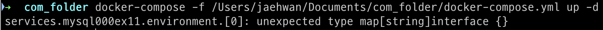
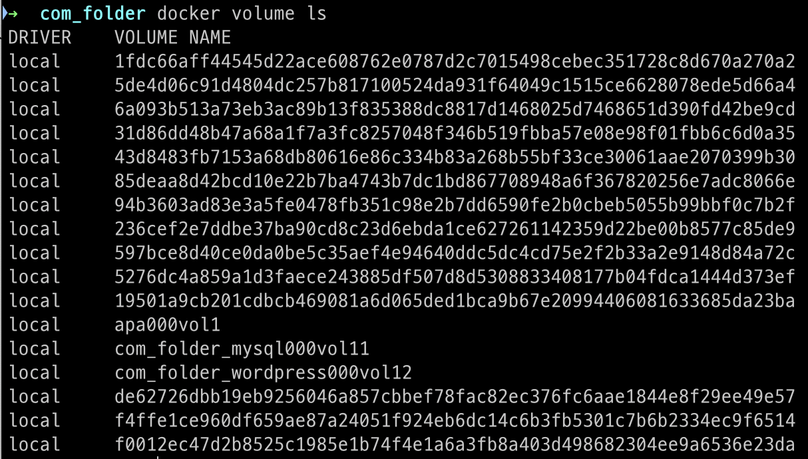

## SECTION 01. 도커 컴포즈란?

### 도커 컴포즈 ?

- **시스템 구축과 관련된 명령어를 하나의 텍스트 파일(정의 파일)에 기재해 명령어 한번에 시스템 전체를 실행하고 종료와 폐기까지 한번에** 하도록 도와주는 도구
- 시스템 구축에 필요한 설정을 YAML 포맷으로 기재한 정의 파일을 이용해 전체 시스템을 일괄 실행(run) 또는 일괄 종료 및 삭제(down)할 수 있다.
- 작성 내용은 도커 명령어와 비슷하나 도커 명령어를 직접적으로 작성 하지는 않음
    - `up` 커맨드:
        - `docker run` 커맨드와 유사
        - 정의 파일에 기재된 내용대로 이미지를 내려받고 컨테이너를 생성 및 실행
    - `down` 커맨드:
        - 컨테이너와 네트워크를 정지 및 삭제
        - 볼륨과 이미지는 삭제하지 않음
    - `stop` 커맨드:
        - 컨테이너와 네트워크 삭제 없이 종료

- Dockerfile 스크립트와의 차이점
    - **도커 컴포즈**는 `docker run` 명령어를 여러 개 모아놓은 것 → 컨테이너와 주변 환경 생성 (네트워크 및 볼륨)
    - **Dockerfile 스크립트**는 이미지를 만들기 위한 것으로 네트워크나 볼륨을 만들 수 없음
    
    → 만드는 대상이 다름 
    

<aside>
    
    ❗도커 컴포즈 vs. 쿠버네티스

    도커 컴포즈는 여러 컨테이너를 생성/실행하고 삭제하는 기능을 제공한다.

    쿠버네티스는 도커 컨테이너를 관리하는 도구로서, 여러 개의 컨테이너를 다루는 것과 관계가 깊으나 컨테이너를 생성/실행하고 삭제하는 도구가 아닌 단지 컨테이너를 관리하는 도구이다.

</aside>

## SECTION 02. 도커 컴포즈의 설치와 사용법

### [실습] 도커 컴포즈 설치

- 도커 컴포즈는 도커 엔진과 별개의 소프트웨어
    
    (도커 데스크톱은 도커 컴포즈가 함께 설치 되므로, 별도로 설치할 필요 없음)
    

**step 01. 도커 컴포즈 설치** 

- macOS 기준 도커 데스크톱 설치하여 사용 중이므로 따로 설치 x

```bash
# linux 기준 아래 명령어로 도커 컴포즈 설치 
# 도커 컴포즈는 파이썬으로 작성된 프로그램 -> pip 이용
sudo pip install docker-compose
```

**step 02. 도커 컴포즈 실행** 

- 설치 되면 바로 실행 가능 상태

### 도커 컴포즈 사용법

- 호스트 컴퓨터에 폴더를 만들고 이 폴더에 정의 폴더 (YAML 파일)을 배치
- 정의 파일 이름은 미리 정해진 **docker-compose.yml** 이라는 이름을 사용해야 함
- 파일은 호스트 컴퓨터에 배치 되지만, 명령어는 똑같이 도커 엔진에 전달됨
- 생성된 컨테이너도 도커 엔진 위에서 동작

→ 사용자가 일일이 입력하던 명령어를 도커 컴포즈가 대신 입력

- 정의 파일은 한 폴더에 하나만 존재 가능
- 컨테이너 생성에 필요한 이미지 파일이나 HTML 파일 역시 컴포즈가 사용할 폴더에 함께 위치해야 함

<aside>

    ❗ 서비스와 컨테이너

    도커 컴포즈에서 컨테이너가 모인 것을 ‘서비스’라고 부른다.

</aside>

## SECTION 03. 도커 컴포즈 파일을 작성하는 법

### 도커 컴포즈 정의 파일의 내용

- 백문이 불여일견
    - 4장에서 만든 아파치 컨테이너(**apa000ex2**)와 동일한 컨테이너 생성
        
        `docker run --name apa000ex2 -d -p 8080:80 httpd`
        
    
    ```
    verson: "3"
    
    services:
      apa000ex02:
        image: httpd
        ports: 
          - 8000:80
        restart: always
    ```
    
    - 5장에서 만든 워드프레스 컨테이너(**wordpress000ex12**)와 동일한 컨테이너 생성
        
        `docker run —-name wordpress0000ex12 -dit —net=wordpress000net1 -p 8085:80 -e WORDPRESS_DB_HOST=mysql000ex11 -e WORDPRESS_DB_NAME=wordpress000db -e WORDPRESS_DB_USER=wordpress000kun -e WORDPRESS_DB_PASSWORD=wkunpass wordpress`
        
    
    ```
    version: "3"
    
    services: 
      wordpress000ex12:
        depends_on:
          - mysql000ex11
        image: wordpress
        networks:
          - wordpress000net1
        ports:
          - 8085:80
        restart: always
        environment:
          WORDPRESS_DB_HOST=mysql000ex11
          WORDPRESS_DB_NAME=wordpress000db
          WORDPRESS_DB_USER=wordpress000kun 
          WORDPRESS_DB_PASS=wkunpass
    ```
    

### 컴포즈 파일 작성

- 컴포즈 파일(정의 파일)은 YAML 형식을 따르며, 확장자는 .yml
- 파일 이름은 **docker-compose.yml**, `-f` 옵션을 사용하면 이름 지정 가능

- **컴포즈 버전 → services → networks → volumes** 순으로 기재
    
    <aside>

        ❗ services
        
        쉽게 말해 컨테이너에 대한 내용.
        
        도커 컴포즈와 쿠버네티스에서는 컨테이너의 집합체를 서비스라고 부른다. 
        
        이것은 리눅스에서 동작하는 소프트웨어를 서비스라고 부르기 때문에 정착된 용어인 듯하다.
    
    </aside>
    
    - 작성 요령: **주 항목 → 이름 추가 → 설정**
    - 주 항목은 **services**, **networks**, **volumes** 등이 있으며, 이러한 주 항목 아래에는 이름을 기재
    - 주 항목 뒤에는 콜론(:) 작성
    - 이름은 주 항목보다 한 단 들여쓰기 후 작성, 이름 뒤에도 콜론(:) 작성
        
        **→ YAML 형식에서는 공백에 따라 의미가 달라짐**
        
        - 한 단의 공백 개수는 상관 없지만, 탭은 사용이 불가
        - 한 번 정한 ‘한 단의 공백 개수’는 해당 파일에서 동일한 공백 개수를 한 단으로 사용해야 함
        

> **컴포즈 파일(YAML 형식)의 작성 요령**
> - 첫 줄에 도커 컴포즈 버전을 기재 
> - 주 항목 services, networks, volumes 아래에 설정 내용을 기재 
>- 항목 간의 상하 관계는 공백을 사용한 들여쓰기로 나타냄 
>- 들여쓰기는 같은 수의 배수만큼의 공백을 사용
>- 이름은 주 항목 아래에 들여쓰기 후 기재 
>- 컨테이너 설정 내용은 이름 아래에 들여쓰기한 다음 기재 
>- 여러 항목을 기재하려면 줄 앞에 하이픈(-)을 붙임 
>- 이름 뒤에는 콜론(:)을 붙임 
>- 콜론 뒤에는 반드시 공백이 와야 함 (바로 줄바꿈 하는 경우는 예외)
>- \# 뒤의 내용은 주석으로 간주 
>- 문자열은 작은 따옴표(’) 또는 큰 따옴표(”)로 감싸서 작성


### 컴포즈 파일 항목

- 주 항목
    
    
    | 항목 | 내용 |
    | --- | --- |
    | services | 컨테이너 정의  |
    | networks | 네트워크 정의 |
    | volumes | 볼륨 정의  |
- 자주 나오는 정의 내용
    
    
    | 항목 | docker run 커맨드의 해당 옵션 또는 인자 | 내용 |
    | --- | --- | --- |
    | image | 이미지 인자 | 사용할 이미지를 지정 |
    | networks | —net | 접속할 네트워크를 지정 |
    | volumes | -v, —mount | 스토리지 마운트를 지정 |
    | ports | -p | 포트 설정 |
    | environment | -e  | 환경변수 설정 |
    | depends_on | 없음  | 다른 서비스에 대한 의존관계를 정의 |
    | restart | 없음  | 컨테이너 종료 시 재시작 여부를 설정 |
    - depends_on:
        - 다른 서비스에 대한 **의존관계**를 나타냄
        - 컨테이너를 생성하는 순서나 연동 여부를 정의
    - restart:
        - 컨테이너 종료 시 **재시작 여부**를 설정
        - restart의 설정값
            
            
            | 설정값 | 내용 |
            | --- | --- |
            | no | 재시작하지 않음 |
            | always | 항상 재시작 |
            | on-failure | 프로세스가 0 외의 상태로 종료됐다면 재시작 |
            | unless-stopped | 종료 시 재시작하지 않음. 그 외에는 재시작 |

<aside>

    ❗ 그 외 정의 항목

    언급된 정의 항목 외에도 다양한 정의 항목들이 존재.
    컴포즈 파일의 버전 업데이트와 함께 정의 항목에도 수정사항이 있을 수 있으므로,
    공식 참조문서를 통해 확인하는 것이 좋다.
    공식 문서: https://docs.docker.com/compose/

</aside>

<aside>

    ❗ 컴포즈 파일

    도커 컴포즈로 만든 컨테이너라도 도커 엔진을 통해 명령을 내릴 수 있음.
    하지만, 도커 엔진을 통해 내린 명령은 컴포즈 파일에 반영되지 않음.
    도커 컴포즈에 작성된 컨테이너 이름과 실제 동작 중인 컨테이너의 이름이 상이한 경우 추후 컨테이너 정지 또는 삭제 시에 정상적으로 동작하지 않음.
    따라서, 컨테이너 이름은 도커 엔진에서든 컴포즈 파일에서든 수정하지 않는 것을 권장.

</aside>

### [실습] 컴포즈 파일 작성

- 5장에서 만들었던 워드프레스 및 MySQL 컨테이너와 동일한 컨테이너를 만드는 파일을 작성
- MySQL 컨테이너를 우선적으로 생성해야하므로, 앞에 작성
- 워드프레스 컨테이너는 `depends_on` 항목을 추가하여 **의존관계** 설정

**실습 내용**

주 항목 작성 → 이름 작성 → MySQL 컨테이너 정의 작성 → 워드프레스 컨테이너 정의 작성

**생성할 네트워크, 볼륨 및 컨테이너 정보** 

| 항목 | 값 |
| --- | --- |
| 네트워크 이름 | wordpress000net1 |
| MySQL 볼륨 이름 | mysql000vol11 |
| 워드프레스 볼륨 이름 | wordpress000vol12 |
| MySQL 컨테이너 이름 | mysql000ex11 |
| 워드프레스 컨테이너 이름 | wordpress000ex12 |

**정의 내용**

- MySQL 컨테이너(mysql000ex11)의 정의
    
    
    | 항목 | 항목 이름 | 값 |
    | --- | --- | --- |
    | MySQL 이미지 이름 | image: | mysql:5.7 |
    | 사용할 네트워크 | networks: | wordpress000net1 |
    | 사용할 볼륨 | volumes: | mysql000vol1 |
    | 마운트 위치 |  | /var/lib/mysql |
    | 재시작 설정 | restart: | always |
    | MySQL 설정 | environment: | *이 붙은 항목 설정 |
    | *MySQL 루트 패스워드 | MYSQL_ROOT_PASSWORD | myrootpass |
    | *MySQL 데이터베이스 이름 | MYSQL_DATABASE | wordpress000db |
    | *MySQL 사용자 이름 | MYSQL_USER | wordpress000kun |
    | *MySQL 패스워드 | MYSQL_PASSWORD | wkunpass |
- 워드프레스 컨테이너(wordpress000ex12)의 정의
    
    
    | 항목 | 항목 이름 | 값 |
    | --- | --- | --- |
    | 의존관계 | depends_on: | mysql000ex11 |
    | 워드프레스 이미지 이름 | image: | wordpress |
    | 사용할 네트워크 | networks: | wordpress000net1 |
    | 사용할 볼륨 | volumes: | wordpress000vol12 |
    | 마운트 위치 |  | /var/www/html |
    | 포트 번호 설정 | port: | 8085:80 |
    | 재시작 설정 | restart: | always |
    | 데이터베이스 관련 정보 | environment: | *이 붙은 항목 설정 |
    | *데이터베이스 컨테이너 이름 | WORDPRESS_DB_HOST | mysql000ex1 |
    | *데이터베이스 이름 | WORDPRESS_DB_NAME | wordpress000db |
    | *데이터베이스 사용자 이름 | WORDPRESS_DB_USER | wordpress000kun |
    | *데이터베이스 패스워드 | WORDPRESS_DB_PASSWORD | wkunpass |

**컴포즈 파일 배치 경로**

- 위치는 상관 없으나, 편의상 com_folder 디렉터리를 만들어 사용
- macOS 기준 실습
    - /Users/사용자명/Documents/com_folder
    
    → /Users/jaehwan/Documents/com_folder
    
    
    

**step 01. docker-compose.yml 파일 생성**

- VisualStudioCode 사용해서 docker-compose.yml 파일 생성
    
    
    

**step 02. 주 항목 작성**

- 버전에 이어 필수 주 항목(services, networks, volumes)을 작성, 복수형임에 주의!!
    
    
    

**step 03. 이름 작성**

- 주 항목 아래로 개행한 뒤 들여쓰기 후 이름 작성 (공백 두 개로 작성)
    
    
    

**step 04. MySQL 컨테이너의 정의 작성**

- 들여쓰기 주의해서 작성
    
    
    

**step 05. 워드프레스 컨테이너의 정의 작성**

- 들여쓰기 주의해서 작성
    
    
    
    최종 composer file
    

**step 06. 확인 후 저장**

- 공백 개수 및 콜론 유무 확인 후 저장

<aside>

    ❗ MySQL 8.0 사용

    MySQL 8.0 부터 변경된 인증 방식때문에, MySQL 8.0 이상의 버전을 사용하기 위해서는 인자가 필요하다. 도커 컴포즈에서도 인자를 추가하면 MySQL 8.0 이상 버전을 사용할 수 있다.

    인자를 추가하려면 컴포즈 파일에 command 항목을 추가해야 한다. 

    command 항목은 restart와 environment 항목 사이에 기재한다. 

    ```
    ____command: mysqld --character-set-server=utf8mb4 --collation-server=utf8mb4_unicode_ci --defualt-authentication-plugin=mysql_native_password
    ```

</aside>

## SECTION 04. 도커 컴포즈 실행

### 도커 컴포즈 커맨드

- 도커 컴포즈는 `docker-compose` 명령어를 사용
- 자주 사용하는 커맨드는 `up`과 `down`, `stop`은 가끔

**컨테이너와 주변 환경을 생성하는 `docker-compose up` 커맨드** 

- 컴포즈 파일의 내용을 따라 컨테이너와 볼륨, 네트워크를 생성하고 실행
- 컴포즈 파일의 경로는 -f 옵션을 사용해 지정

```bash
docker-compose -f 정의_파일_경로 up 옵션

# /Users/jaehwan/Documents/com_folder/docker-compose.yml 
docker-compose -f /Users/jaehwan/Documents/com_folder/docker-compose.yml up -d
```

- 옵션 항목
    
    
    | **옵션** | **내용** | **옵션** | **내용** |
    | --- | --- | --- | --- |
    | **-d** | 백그라운드 실행 | **—build** | 컨테이너를 실행하기 전에 이미지를 빌드 |
    | **—no-color** | 화면 출력 내용을 흑백 | **—abort-on-container-exit** | 컨테이너가 하나라도 종료되면 모든 컨테이너를 종료  |
    | **—no-deps** | 링크된 서비스 실행 안함 | **-t, —timeout** | 컨테이너를 종료할 때의 타임아웃 설정. default 10초 |
    | **—no-create** | 설정 또는 이미지가 변경되지 않더라도 컨테이너 재생성 | **—remove-orphans** | 컴포즈 파일에 정의되지 않은 서비스의 컨테이너를 삭제  |
    | **—force-recreate** | 컨테이너가 이미 존재할 경우 다시 생성하지 않음 | **—scale** | 컨테이너 수를 변경 |
    | **—no-build** | 이미지가 없어도 이미지를 빌드하지 않음 |  |  |

**컨테이너와 네트워크를 삭제하는 `docker-compose down` 커맨드**

- 컴포즈 파일의 내용을 따라 컨테이너와 네트워크를 종료 및 삭제
- 볼륨과 이미지는 삭제 되지 않음
- 컴포즈 파일 경로는 -f 옵션을 사용해 지정

```bash
docker-compose -f 컴포즈_파일_경로 down 옵션

# /Users/jaehwan/Documents/com_folder/docker-compose.yml 
docker-compose -f /Users/jaehwan/Documents/com_folder/docker-compose.yml down
```

- 옵션 항목
    
    
    | 옵션 | 내용 |
    | --- | --- |
    | —rmi 종류  | 삭제 시에 이미지도 삭제된다. 종류를 all로 지정하면 사용했던 모든 이미지가 삭제된다. local로 지정하면 커스텀 태그가 없는 이미지만 삭제한다. |
    | -v, —volumes  | volumes 항목에 기재된 볼륨을 삭제한다. 단, external로 지정된 볼륨은 삭제되지 않는다. |
    | —remove-orphans | 컴포즈 파일에 지정되지 않은 서비스의 컨테이너도 삭제한다. |

**컨테이너를 종료하는 `docker-compose stop` 커맨드**

- 컴포즈 파일의 내용에 따라 컨테이너를 종료
- 컴포즈 파일의 경로는 -f 옵션을 사용해 지정

```bash
docker-compose -f 컴포즈_파일_경로 stop 옵션

# /Users/jaehwan/Documents/com_folder/docker-compose.yml 
docker-compose -f /Users/jaehwan/Documents/com_folder/docker-compose.yml stop
```

> **up, down, stop 외에도 다양한 커맨드가 있지만, 
자주 사용하지 않으니 필요하다면 그때그때 찾아서 사용하면 될 것 같다.**
> 

<aside>

    ❗ 도커 컴포즈로 실행한 컨테이너의 이름과 스케일링(scale 옵션)

    도커 컴포즈로 실행한 컨테이너의 이름은 임의로 결정된다.

    예를 들어, com_folder에 둔 컴포즈 파일을 사용해 penguin이라는 이름의 컨테이너를 생성하면 도커 컴포즈가 실제로 생성한 컨테이너의 이름은 com_folder_penguin_1과 같이 폴더 이름과 번호가 붙는다. (-f 옵션을 생략했다면 폴더 이름은 붙지 않는다.)

    하지만, 컨테이너 이름에 폴더 이름이나 번호가 붙어도 도커 컴포즈를 통해 컨테이너를 지정할 때는 (도커 컴포즈에 기재된)원래 이름을 사용할 수 있다는 점이다.


    같은 구성의 컨테이너를 여러 세트 만들고 싶다면 up 커맨드에 —scale 옵션을 붙이면 된다.

    예를 들어, 아래의 명령어를 입력하면 com_folder_penguin_1 ~ 3, 총 3개의 penguin 컨테이너가 실행된다.

    ```bash
    docker-compose -f /Users/jaehwan/Documents/com_folder/docker-compose.yml up --scale penguin=3
    ```

</aside>

### [실습] 도커 컴포즈 실행

**실습 내용**

- 네트워크 생성 → MySQL 컨테이너 생성 → 워드 프레스 컨테이너 생성 → 확인

**실습에 사용할 컴포즈 파일**

- **/Users/jaehwan/Documents/com_folder/docker-compose.yml** 그대로 사용

**step 01. 컴포즈 파일을 적절한 위치에 배치** 

- /Users/jaehwan/Documents/com_folder/docker-compose.yml
    
    
    

**step 02. 컴포즈 파일 내용 실행**

- docker-compose up 명령어를 실행하면 컴포즈 파일의 정의대로 컨테이너 및 주변 환경이 생성 됨
- -d 옵션을 사용하고, -f 옵션을 사용하여 컴포즈 파일의 경로를 지정

```bash
docker-compose -f /Users/jaehwan/Documents/com_folder/docker-compose.yml up -d
```

- **Trouble Shooting**
    - 위에서 작성한 [docker-compose.yml](https://www.notion.so/CH7-159d2e168cd380c9a8fce5198b381d89?pvs=21) 파일로 실행
        - docker-compose.yml (before)
            
            ```
            version: '3'
            services:
              mysql000ex11:
                image: mysql:5.7
                networks:
                  - wordpreess000net1
                volumes:
                  - mysql000vol11:/var/lib/mysql
                restart:  always
                environment:
                  - MYSQL_ROOT_PASSWORD: myrootpass
                  - MYSQL_DATABASE: wordpress000db
                  - MYSQL_USER: wordpress000kun
                  - MYSQL_PASSWORD: wkunpass
              wordpress000ex12:
                depends_on:
                  - mysql000ex11
                image: wordpress
                networks:
                  - wordpreess000net1
                volumes:
                  - wordpress000vol12
                ports:
                  - 8085:80
                restart: always
                environment:
                  - WORDPRESS_DB_HOST: mysql000ex11
                  - WORDPRESS_DB_NAME: wordpress000db
                  - WORDPRESS_DB_USER: wordpress000kun
                  - WORDPRESS_DB_PASSWORD: wkunpass
            networks:
              wordpreess000net1:
            volumes:
              mysql000vol11:
              wordpress000vol12:
            ```
            
    - 에러 발생(01)
        
        
        
    - 에러 원인
        - docker-compose.yml 파일에서 environment 섹션의 값을 리스트 형식으로 작성했기 때문
        - environment 섹션은 기본적으로 key-value pair 형식의 딕셔너리로 작성되어야 함
    - 솔루션: docker-compose.yml 파일 수정
        - docker-compose.yml (after)
            
            ```
            version: '3'
            services:
              mysql000ex11:
                image: mysql:5.7
                networks:
                  - wordpreess000net1
                volumes:
                  - mysql000vol11:/var/lib/mysql
                restart: always
                environment:
                  MYSQL_ROOT_PASSWORD: myrootpass
                  MYSQL_DATABASE: wordpress000db
                  MYSQL_USER: wordpress000kun
                  MYSQL_PASSWORD: wkunpass
              wordpress000ex12:
                depends_on:
                  - mysql000ex11
                image: wordpress
                networks:
                  - wordpreess000net1
                volumes:
                  - wordpress000vol12:/var/www/html
                ports:
                  - 8085:80
                restart: always
                environment:
                  WORDPRESS_DB_HOST: mysql000ex11
                  WORDPRESS_DB_NAME: wordpress000db
                  WORDPRESS_DB_USER: wordpress000kun
                  WORDPRESS_DB_PASSWORD: wkunpass
            networks:
              wordpreess000net1:
            volumes:
              mysql000vol11:
              wordpress000vol12:
            
            ```
            
    - 재 실행 → 에러 발생(02)
        
        
        
    - 에러 원인
        - MySQL 5.7이 ARM 아키텍처를 지원하지 않는 듯 함
    - 솔루션 (from ChatGPT 4o)
        1. MySQL 버전 수정 (ARM 아키텍처를 지원하는 버전 채택)
            1. mysql:5.7 → mysql:8.0
            2. 이와 같이 버전을 수정할 경우 [인증 방식 관련 인자도 추가](https://www.notion.so/CH7-159d2e168cd380c9a8fce5198b381d89?pvs=21)해주어야 함
        2. 플랫폼 강제 설정 
            1. Docker Compose 파일에서 platform을 명시적으로 설정하여 x86 아키텍처용 이미지를 강제로 사용할 수 있음 
            2. 하지만 이렇게 하면 에뮬레이션을 사용하므로 성능 저하 유발 
        3. MariaDB 로 교체 
            1. MySQL과 상당 부분 유사한 MariaDB는 ARM 아키텍처 지원이 더 잘 되어 있음 
            2. MariaDB:10.5 버전 사용 추천 
    - 채택 솔루션: 1. MySQL 버전 수정
        - `image` 수정 및 인증 방식 관련한 `command` 추가
        
            
        
    - 정상 실행
        
        
        

<aside>

    ❗ WARN: the attribute `version` is obsolete, it will be ignored, please remove it to avoid potential confusion

    Docker Compose의 최신 버전에서 기존에 사용되던 version 필드가 더 이상 필요하지 않음을 알리는 경고.

    이는 성능이나 기능에 영향을 주지 않은 단순 경고이기 때문에, 무시 해도 됨.

    깔끔하게 정리하고 싶다면 docker-compose.yml 파일 내의 version 필드를 제거.

</aside>

**step 04. 웹 브라우저에서 워드프레스에 접근 가능한지 확인**

- localhost:8085

    
**step 04. 컨테이너와 네트워크를 종료 및 삭제** 

- `docker-compose down` 명령어를 이용해 컨테이너와 네트워크 종료 및 삭제
    
    
    
- 종료 및 삭제 확인 (컨테이너, 네트워크)
    
    
    
- volume은 삭제되지 않음
    
    