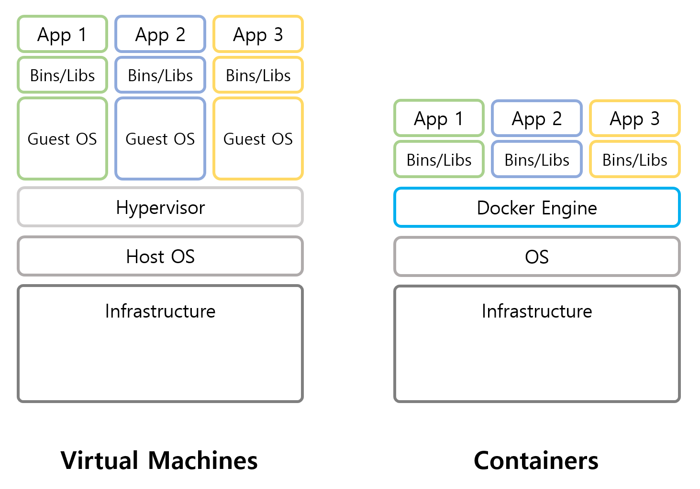

# SECTION 2. 서버와 도커
---
## 1. 서버

### 1-1. 두 가지 의미의 서버

기능적 의미의 서버는 **어떤 기능을 제공하는 의미**이다. 즉, 우베 기능을 제공하는 서버는 '웹 서버'이고, 메일 기능을 제공하는 서버는 '메일 서버'가 된다.

물리적 컴퓨터로의 서버는 데스크톱 컴퓨터와 마찬가지로 어딘가에 **물리적으로 존재하는 컴퓨터**이다.

개인용 컴퓨터는 개인이 사용하지만 서버는 여러 사람잉 원격으로 접근해 사용한다.

### 1-2. 서버의 기능

> 서버의 기능은 소프트웨어가 제공한다.

아파치 같은 웹 서버 소프트웨어를 설치하면 웹 서버 기능을 갖추며, Sendmail 같은 메일 서버 소프트웨어를 설치하면 메인 서버가 된다.
그리고 기능이 소프트웨어에서 나온다는 말은 "**여러가지 소프트웨어를 한 컴퓨터에 설치할 수 있다**"는 말이다. 그러므로 여러 기능적 의미의 서버가 하나의 물리적 컴퓨터에 함께 존재할 수 있다.

### 1-3. 자유로이 옮길 수 있는 컨테이너

> 도커를 이용하면 물리적 환경의 차이, 서버 구성의 차이를 무시할 수 있다.

컨테이너는 자유롭게 옮길 수 있다. 실제 컨테이너 자체를 옮긴다기 보다는 컨테이너의 정보를 내보내기한 다음, 다른 도커 엔진에서 복원하는 형태이다.

이런 특성을 통해 똑같은 상태로 튜닝한 컨테이너를 팀원 전원에게 배포해 모두가 돌일한 개발환경을 사용할 수 있다.

## 도커 VS. 가상화

### 가상화 기술

메인보드, CPU, RAM 등의 물리적인 부품을 소프트웨어로 구현하여 대체하는 것.
실질적으로 물리 서버와 동등한 것이므로 운영체제도 아무 것이나 설치할 수 있고, 그 위에 어떤 소프트웨어를 구동해도 무방하다.

### 도커

컨테이너에서 리눅스가 동작하는 것처럼 보이지만 실제 리눅스가 동작하는 것은 아니다. 운영체제의 기능 중 일부를 호스트 역할을 하는 물리 서버에 맡겨 부담을 덜어 둔 형태이다.
즉, 컨테이너는 운영체제의 일부 기능을 호스트 컴퓨터에 의존하기 때문에 물리 서버에도 리눅스 기능이 필요하며, 컨테이너의 내용도 리눅스 운영체제가 될 수 밖에 없다.

