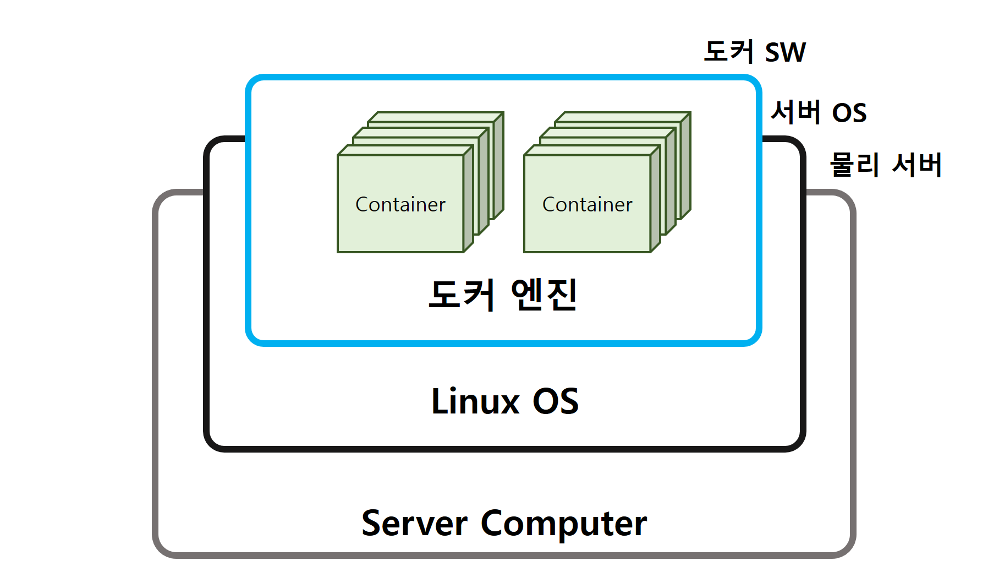

# SECTION 1. 도커의 동작 원리
---
## 2. 도커의 구조

위 그림은 도커의 간단한 구조를 나타낸 것이다. 뮬리 서버가 있고, 여기서 동작하는 리눅스 운영체제가 있다.

일반적인 서버라면 이 상황에서 운영체제 위에 프로그램이나 데이터가 직접 올라가겠지만 도커를 사용하는 경우에는 **OS 위에 도커 엔진이 동작하고 그 위에서 컨테이너가 동작**한다.

### 2-1. OS는 뭘 하는가?

> 소프트웨어나 프로그램의 명령을 하드웨어에 전달하는 역할을 한다.

하드웨어는 자신의 판단으로 여러 의미 중 적절한 것을 고르거나 적당히 일을 할 수 없고, 지시받은 대로만 수행할 수 있으므로 동작 하나하나를 지정해주지 않으면 안 된다.

OS는 이런 일들을 하드웨어가 알아들을 수 있게 번역하여 전달하게 된다.

### 2-2. 도커의 리눅스 OS 비슷한 것

본래 OSsms '커널'이라는 부분과 '그 이외의 주변 부분'으로 구성된다. 주변 부분이 프로그램의 연락 내용을 커널에 전달하고 커널이 하드웨어를 다룬다.

여기서 도커의 컨테이너는 운영체제의 주변 부분을 가지고 있다. 이를 통해 프로그램의 명령을 전달받고, 이를 밑바탕이 되는 커널에 전달하는 구조로 되어 있다.

이 덕분에 OS 전체를 컨테이너에 넣지 않을 수 있어, 도커는 가장 큰 특징인 '가벼움'을 얻을 수 있다.

### 2-3. 도커는 기본적으로 Linux 용이다.

> 도커는 리눅스 운영체제가 동작하는 것을 전제로 하는 구조로 되어 있기 때문에 리눅스 운영체제에서만 동작할 수 있다.

그러므로 컨테이너 안에 들어 있는 주변 부분도 이에 맞춰 리눅스 운영체제의 주변 부분이어야 한다.

도커에 대한 이야기는 보통 서버 환경을 전제로 한 것이 많은데, 리눅스 운영체제가 서버에서 사용되는 경우가 많고, 리눅스용 SW도 서버용 SW가 많기 때문이다.

#### 윈도우와 macOS에서 도커 구동하기

VirtualBos나 VMware와 같은 가상 환경 위에 리눅스 운영체제를 설치하고 그 위에서 도커를 싱행하거나$^{1)}$, '윈도우 / macOS 용 도커 데스크톱'처럼 도커를 싱행하는 데 필요한 리눅스 운영체제를 포함하는 패키지를 설치$^{2)}$해 사용한다.

즉, 도커를 사용하려면 **어떤 형태로든 리눅스 운영체제를 갖춰야 한다**.