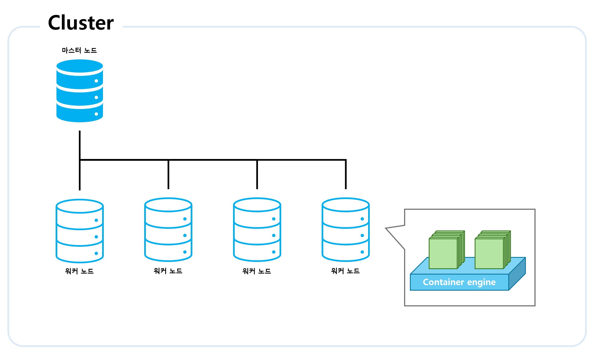
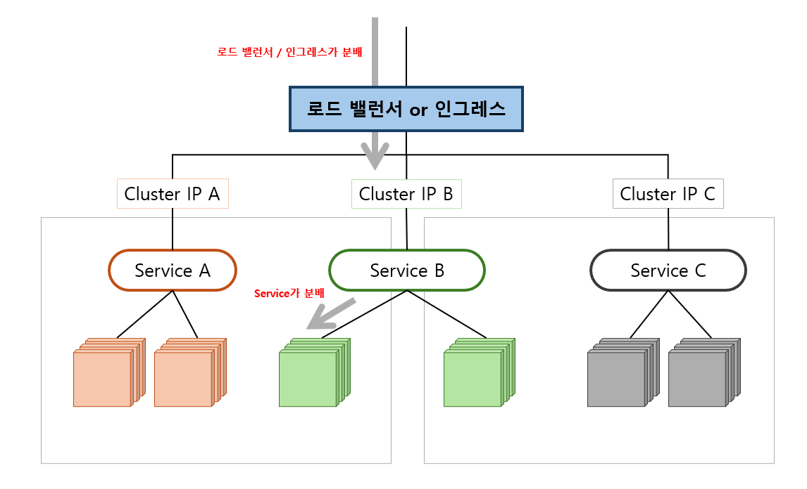

# SECTION 1. 쿠버네티스란?

## 쿠버네티스

> **Kubernetes**는 컨테이너 오케스트레이션 도구이다.

컨테이너 오케스트레이션이란 시스템 전체를 통괄하고 여러 개의 컨테이너를 관리하는 일을 말한다.
쿠버네티스는 **k8s**라고 줄여 쓰기도 한다. k와 s 사이에 8개의 글자가 있다는 의미로, 쿠버네티스와 관련된 검색어로 유용하다.

최근 쿠버네티스가 유행을 타고는 있지만 그 본질상 일반적인 프로그래머가 쿠버네티스를 활발하게 사용할 일은 많지 않다.
왜냐하면 여러 개의 컨테이너(=서버)를 관리하는 도구이기 때문이다.
즉 많은 수의 서버로 구성되는 대규모 시스템을 관리하는 경우 사용되는 것이다.

하지만 쿠버네티스로 어떤 일을 할 수 있는가에 대한 지식은 시스템을 개발할 때 유용할 수 있다.
쿠버네티스로 관리되는 시스템은 이를 전제로 개발해야 한다.

쿠버네티스는 여러 대의 물리적 서버가 존재하는 것을 전제로 한다.
그리고 이 서버 한 대 한 대마다 여러 대의 컨테이너를 실행한다.
이런 환경에서 쿠버네티스는 컨테이너의 생성이나 관리의 수고를 덜어주는 역할을 한다.

# SECTION 2. 마스터 노드와 워커 노드

쿠버네티스는 전체적인 제어를 담당하는 **마스터 노드**와 실제 동작을 담당하는 **워커 노드**라는 두 가지 유형의 노드로 구성된다.

마스터 노드는 워커 노드에서 실행되는 컨테이너를 관리하는 역할을 한다.
마스터 노드에서는 **컨테이너를 실행하지 않기** 때문에 도커 엔진과 같은 컨테이너 엔진도 설치되지 않는다.

워커 노드는 실제 서버에 해당하는 부분으로 컨테이너가 실제 동작하는 서버이다.
컨테이너가 동작해야 하므로 컨테이너 엔진이 설치되어야 한다.

이렇게 마스터 노드와 워커 노드로 구성된 일군의 구버네티스 시스템을 **클러스터**라고 한다.
클러스터는 사람이 개입하지 않아도 마스터 노드에 설정된 내용에 따라 워커 노드가 관리되며 자율적으로 동작한다.

쿠버네티스는 컨테이너 엔진과는 별개의 SW이므로 따로 설치가 필요하다.
쿠버네티스 SW와 CNI(가상 네트워크 드라이버, Container Network Interface)를 설치해야 한다.
대표적인 CNI로 flannel, Calico, AWS VPC CNI 등이 있다.

마스터 노드에는 컨테이너 등의 상태를 관리하기 위해 etcd라는 데이터베이스가 설치된다.
또한 마스터 노드를 설정하는 관리자의 컴퓨터에는 kubectl을 설치하여 마스터 노드에 로그인 및 초기 설정, 추후 조정을 한다.
워커 노드에는 물론 도커 엔진 같은 컨테이너 엔진이 필요하다.

\* 가상 네트워크: 도커의 가상 네트워크는 같은 물리적 컴퓨터 안에서의 네트워크이며,
쿠버네티스에서의 가상 네트워크는 오버레이 네트워크로 다른 물리적 컴퓨터를 같은 로컬 네트워크로 묶기 위해 사용한다.

\* etcd: key-value store 타입의 데이터베이스로 이 밖의 다른 목적으로도 사용된다.

---

## 컨트롤 플레인(제어판)과 kube-let

마스터 노드는 컨트롤 플레인을 통해 워커 노드를 관리한다.
컨트롤 플레인은 아래 다섯 가지의 컴포넌트로 구성된다.

| 항목                     | 내용                                                              |
| ------------------------ | ----------------------------------------------------------------- |
| kube-apiserver           | 외부와 통신하는 프로세스, kubectl로부터 명령을 전달받아 실행한다. |
| kube-controll-manager    | 컨트롤러를 통합 관리 실행한다.                                    |
| kube-scheduler           | 파드를 워커 노드에 할당한다.                                       |
| cloud-controller-manager | 클라우드 서비스와 연돌해 서비스를 생성한다.                        |
| etcd                     | 클러스터 관련 정보 전반을 관리하는 데이터베이스                   |

etcd를 제외하고 모두 쿠버네티스에 포함되어 있으므로 추가로 설치할 필요는 없다.

워커 노드에서는 아래 요소들로 구성되어 있다.

| 항목       | 내용                                                                                                                                                           |
| ---------- | -------------------------------------------------------------------------------------------------------------------------------------------------------------- |
| kube-let   | 마스터노드에 있는 kube-scheduler와 연동하며 워커 노드에 파드를 배치하고 실행한다. 또 실행 중인 파드의 상태를 정기적으로 모니터링하며 kube-scheduler에 통지한다 |
| kube-proxy | 네트워크 통신의 라우팅 메커니즘 |

kube-let은 마스터 노드의 kube-scheduler와 연동하며 워커 노드에 컨테이너 또는 볼륨을 배치하고 실행한다.
이들도 쿠버네티스에 포함되어 있다.

---
> 쿠버네티스는 항상 '바람직한' 상태를 유지한다.

쿠버네티스도 컨테이너를 생성하거나 삭제할 수 있지만 일일이 명령어를 입력하는 방식을 사용하지는 않는다.
어떠한 '바람직한 상태'를 YAML 파일에 정의하고, 자동으로 컨테이너를 생성하거나 삭제하면서 이 상태를 만들고 유지하는 것이 쿠버네티스의 기본적인 아이디어이다.

docker compose는 모니터링 기능이 없어 컨테이너를 만들 때 외에는 관여하지 않는다.
반면 쿠버네티스는 '**이 상태를 유지**'하는 기능이 있다.

그러므로 어떤 이유로 컨테이너가 망가지면 쿠버네티스가 알아서 말가진 컨테이너를 삭제하고 새 컨테이너로 대체하며,
정의에서 '컨테이너 5개'를 '컨테이너 4개'로 수정하면 컨테이너 하나를 삭제한다.

만약 사용자가 컨테이너를 명령어로 삭제한다면 쿠버네티스는 자동으로 컨테이너를 새로 만들어 채우려고 할 것이므로,
파일에서 '바람직한 상태'를 수정해야 한다.

---

# SECTION 3. 쿠버네티스의 구성과 관련 용어

## 쿠버네티스의 구성과 관련된 용어

### pod

pod는 컨테이너와 볼륨을 함께 묶은 단위이다. 기본적으로 pod 하나에 컨테이너 하나이지만, 여러개의 컨테이너가 속할 수도 있다.

pod에 포함되는 볼륨은 함께 포함되는 컨테이너가 정보를 공유하기 위해 사용하는 것으로, 볼륨이 없는 경우도 많다.

### service

service는 pod를 모은 것으로, 어러개의 pod를 이끄는 반장으로 생각할 수 있다.
service가 관리하는 pod는 모두 기본적으로 동일한 구성을 가지며, 구성이 다른 pod는 별도의 service로 관리한다.
또한 pod가 여러 개의 워커 노드에 걸쳐 동작 하더라고 이들을 모두 관리한다.

service는 로드 밸런서 역할을 한다. 각 service는 자동적으로 고정된 IP 주소(cluster IP)를 부여받으며, 이 주소로 들어오는 통신을 처리한다.
내부적으로 여러 pod가 있어도 밖에서는 하나의 IP 주소만 볼 수 있으며,
이 주소로 접근하면 service가 통신을 적절히 분배한다.

하지만 service가 분배하는 통신은 한 워커 노드 안으로 국한된다.
여러 워크 노드 간의 분배는 실제 로드 밸런서 또는 인그레스가 담당한다.
이들은 마스터 노드도 워커 노드도 아닌 별도의 노드에서 동작하거나 물리적 전용 하드웨어이다.

### ReplicaSet, deployment

service가 요청을 배분했다면, ReplicaSet는 pod의 수를 관리한다.
장애 등의 이유로 pod가 종료되었을 때, 정의 파일에 pod의 수가 바꼈을 때 pod의 수를 실제로 변경한다.

ReplicaSet가 관리하는 동일한 구성의 pod를 replica라고 한다.

ReplicaSet는 원하는대로 다루기가 어렵기 때문에 deployment와 함께 쓰이는 경우가 많다.
deployment는 pod의 배포를 관리하는 요소로, pod가 가용하는 이미지 등 pod에 대한 정보를 가지고 있다.

### 쿠버네티스 리소스

pod, service, deployment, replicaSet 등을 resource라고 한다.
쿠버네티스에는 50여 종의 resource기 있으며 실제로 많이 사용되는 것을 아래 표에서 확인할 수 있다.

| resource 이름          | 내용                                     |
| ---------------------- | ---------------------------------------- |
| **pods**               | containers + volumes                     |
| podtemplates           | 배포 시 pod의 틀 역할                    |
| replicationcontrollers | replication 제어                         |
| resourcequotas         | 쿠버네티스 resource의 사용향 제한을 설정 |
| secrets                | 키 정보를 관리                           |
| serviceaccounts        | resource를 다루는 사용자를 관리          |
| **services**           | pod에 요청을 배분                        |
| daemonsets             | 워커 노드마다 하나의 pod를 생성          |
| **deployments**        | pod 배포 관리                            |
| replicasets            | pod 수 관리                              |
| statefulsets           | pod의 배포를 상태를 유지하며 관리        |
| cronjobs               | 지정된 스케줄대로 pod를 실행             |
| jobs                   | pod르 한 번 실행                         |

---

# SECTION 4. 쿠버네티스 설치 및 사용법

> 쿠버네티스는 CNCF(Cloud Native Compution Foundation)에서 제장한 표준이다.

쿠버네티스는 구글에서 개발됐지만 구글 등의 회사가 CNCF를 조직하고 이 재단에서 쿠버네티스를 기부해 개발이 오픈소스로 전환되면서 급속하게 보급되었다.

CNCF에서도 쿠버네티스를 만들고 있지만 관리 기능을 강화한 버전이나 크기를 줄인 버전 등 쿠버네티스의 규격을 따른 서드파티 SW 들이 여럿 나오고 있다.
특히 AWS나 Azure, GCP 같은 클라우드 서비스에서는 자사 서비스에 맞춰 커스터마이징된 쿠버네티스를 제공한다.

원조 쿠버네티스를 채택하는 것은 흔한 일이지만 직접 구축하는 것은 어려운 일이기에, 실습에서는 docker desktop에 포함된 쿠버네티스를 사용한다.
도커 설정 화면에서 Kubernetes를 체크하면 바로 사용할 수 있다.

리눅스에서는 Minikube라는 간단히 사용할 수 있는 쿠버네티스가 있다.
Minikube는 원조 쿠버네티스와 달리 컴퓨터 한 대에 마스터 노드와 워커 노드를 모두 구축한다. 즉 물리적 컴퓨터를 따로 둘 필요가 없다.

