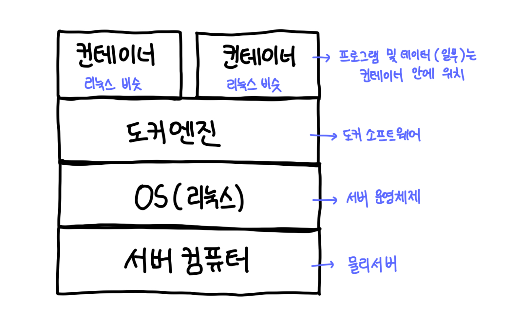
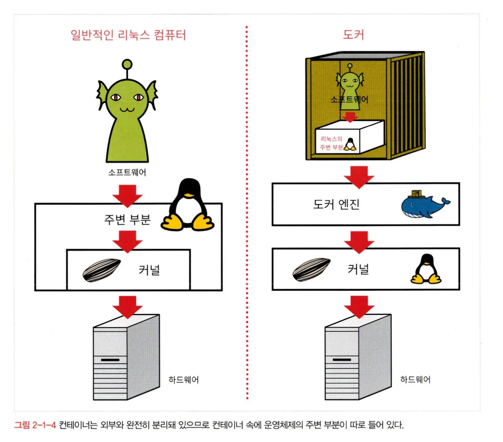
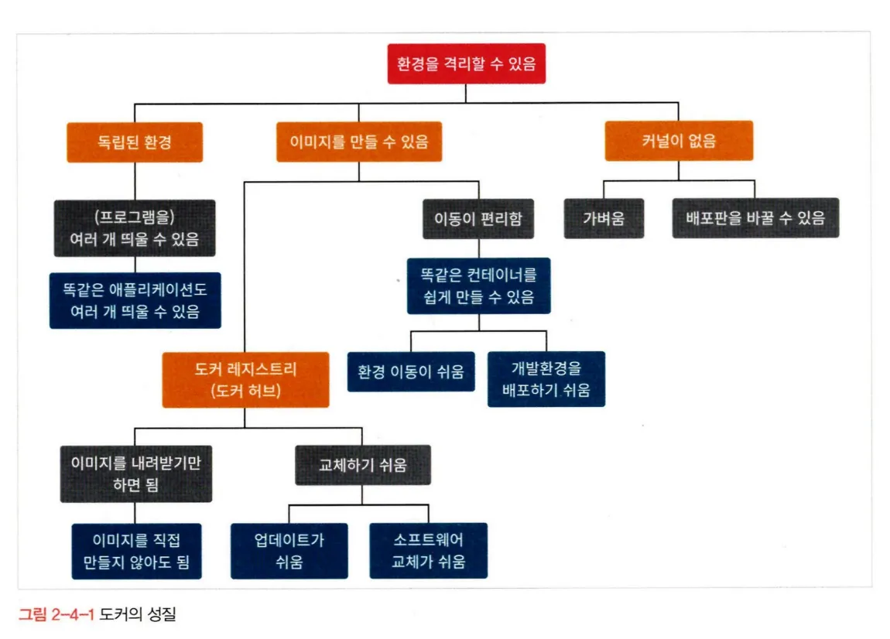

# 1. 도커의 동작 원리

## 도커의 구조

- 운영체제 위에 도커 엔진이 동작하고 그 위에서 컨테이너가 동작함

## 도커의 동작 방식

### 운영 체제(OS)
- 운영 체제가 하는 일?
  - 소프트웨어나 프로그램의 명령을 하드웨어에 전달하는 역할
- OS의 구성 요소
  - 커널
    - 하드웨어를 다룸
  - 그 외의 주변 부분
    - 프로그램의 명령을 커널에 전달
    - 커널이 실행한 결과를 프로그램에 다시 전달

### 도커에서의 OS
- 도커에서는 컨테이너가 완전히 분리됨
  - 리눅스 OS의 주변 부분이 컨테이너 속 프로그램의 명령을 전달받을 수 없음
- 컨테이너 속에 OS의 주변 부분이 들어있음
  - 프로그램의 명령을 전달받고 이를 커널에 전달
    
- OS 주변 부분만 컨테이너에 넣고 커널은 밑바탕에 있는 것을 빌려쓰는 형태 덕분에 가벼움
- 도커는 리눅스 운영체제가 동작하는 것을 전제로 하는 구조
  - 리눅스 운영체제에서만 동작 가능
  - 컨테이너 안에 들어있는 주변 부분도 리눅스 운영체제의 주변 부분이어야 함
- (참고) 호스트 컴퓨터에서와 컨테이너에서 각각 다른 리눅스 배포판 사용 가능(왜?)

### 윈도우, macOS에서 도커 구동
- 도커를 사용하려면 어떤 형태로든 리눅스 운영체제를 갖추어야 함
- 방법
  - VirtualBox나 VMware 등 가상 환경 위에 리눅스 OS를 설치하고 그 위에서 도커 실행
  - 윈도우용 또는 macOS용 도커 데스크톱과 같이 도커를 실행하는데 필요한 리눅스 OS를 포함하는 패키지 설치

# 2. 도커 허브와 이미지, 컨테이너

## 이미지와 컨테이너
- 컨테이너를 생성하기 위해 이미지가 필요
- 실제로 사용하는 것은 컨테이너이며, 이미지를 그대로 사용하는 일은 없음
- 이미지 -> 거푸집과 유사
  - 하나만 있으면 똑같은 것을 여러 개만들 수 있음
  - 클래스, 인터페이스와 유사한 개념인듯...?
- 다른 물리 서버에 이미지를 통해 컨테이너 이식 가능
  - 컨테이너 자체가 이동하는 것은 아니지만 이미지를 통해 컨테이너가 이동한 것과 같은 효과

## 도커 허브와 도커 이미지

### 도커 허브
- 공개된 컨테이너 이미지가 모여 있는 곳
- 안전한 컨테이너 이미지 고르는 법
  - 공식 이미지 사용(쉽고 보안 good)
    - 도커에서 직접 배포
    - 해당 소프트웨어를 개발 및 관리하는 기업이나 조직에서 지공
    - 컨테이너에 포함된 OS(비슷한것)이 특정 OS 및 버전으로 한정되어 원하는 것 선택하지 못하는 경우가 발생할 수 있음
  - 커스텀 이미지를 직접 만들어 사용
    - 필요한 최소한의 요소가 담긴 이미지에 필요한 소프트웨어를 추가로 설치

### 컨테이너 구성 방법
- 한 컨테이너에 모든 프로그램 설치
  - 유지보수나 도커의 장점을 누리기 어려움
  - but 바로 실행할 수 있어서 자주 쓰임
- 한 컨테이너 당 하나의 프로그램 설치
  - 보안 및 유지관리 측면에서 유리
    - 컨테이너가 완전히 격리된 환경이며 가벼움
    - 다른 SW와 독립된 환경을 갖기 때문에 다른 SW의 영향을 덜 받음
    - side effect가 적은 만큼 업데이트가 쉬워서 유지보수 측면에서 유리

# 3. 도커 컨테이너의 생애주기와 데이터 저장

## 도커 컨테이너의 생애 주기

### 컨테이너는 일회용품
- 컨테이너 하나를 업데이트 하면서 계속 사용하기 보다 업데이트된 소프트웨어가 들어있는 새로운 컨테이너를 사용하는 것이 좋음
  - 새로운 버전이 나오면 새로운 컨테이너로 갈아타자
- 왜?
  - 컨테이너는 일반적으로 여러 개를 동시 가동하는 상황을 전제로 함
  - 여러 개의 컨테이너를 하나 하나 업데이트 하려먼 많은 수고가 듬 → 간단한 초기 구축에 비해 장점 반감

### 컨테이너 생애주기
- 컨테이너 생성
- 실행
- 종료
- 폐기
- 다시 컨테이너 생성
- …

## 데이터 저장
- 컨테이너 폐기 시 컨테이너 내부에서 편집했던 파일은 사라짐
- 이를 방지하기 위해 도커가 설치된 물리적 서버(호스트)의 디스크(HDD or SSD)를 마운트해 디스크에 데이터를 저장함
  - 마운트
    - 디스크를 연결해 데이터를 기록할 수 있도록 한 상태
  - 컨테이너가 폐기되더라도 데이터는 외부에 안전하게 저장되어 사라지지 않을 수 있음
  - 다른 컨테이너와 데이터를 공유할 수 있음

# 4. 도커의 장점과 단점

## 도커의 구조와 성질

### 도커의 성질
- 환경을 격리시킬 수 있다
  - 독립된 환경
    - 여러 개의 컨테이너를 띄울 수 있음
    - 같은 애플리케이션도 여러 개 띄울 수 있음
    - 그 중 일부를 교체하거나 수정할 수 있음
  - 이미지 생성 가능
    - 만든 이미지를 도커 허브에서 배포 가능
    - 이미지를 내려받기만 하면 컨테이너 사용 가능
    - 교체가 쉽고 업데이트가 쉬움
  - 컨테이너에 커널을 포함시킬 필요 없음
    - 가벼움
    - 배포판을 원하는 것으로 사용할 수 있음

## 도커의 장단점

### 도커의 장점
- 한 대의 물리 서버에 여러 대의 서버를 띄울 수 있음
  - 격리된 환경을 제공하므로 각각 안전한 상태로 실행됨
  - 일반적인 서버에서는 함께 실행할 수 없는 조합도 가능
  - 컨테이너에는 커널이 포함되지 않으므로 물리 서버의 OS에 의존
    - SW적으로 HW를 재현하는 가상화 기술에 비하면 압도적으로 가벼움
- 서버 관리가 용이
  - 각 독립된 환경에 SW를 격리
    - 다른 SW에 영향을 끼치지 않음
    - 업데이트가 간단
    - 항상 최신 상태로 SW를 유지하기 쉬운 구조
    - 컨테이너 교체나 수정이 쉬우므로 환경 이전도 간단함
    - 초기 설정에 따르는 시간과 수고를 들일 필요가 없음
- 서버 고수가 아니어도 다루기 쉬움
  - 명령 한 줄로 서버 구축이 끝남

### 도커의 단점
- 리눅스용 소프트웨어밖에 지원하지 않음
- 호스트 서버에 문제가 생기면 모든 컨테이너에 영향이 미침
  - 가상화 기술이나 렌탈 서버(여러 명의 사용자가 서버를 공유), 랜탈 클라우드 등의 가상화 플랫폼에서도 마찬가지
  - but 하나의 물리 서버에 하나의 기능을 띄우는 상태와 비교하면 영향이 미치는 범위가 크다
  - 물리 서버 이상에 대해 확실한 대책이 필요
- 컨테이너 하나를 장기간에 걸쳐 사용할 때는 그리 큰 장점을 느끼기 어려움
  - 도커 엔진이 오버헤드에 지나지 않음

## 도커의 주 용도

### 동일한 환경 여러 개 생성
- 개발환경에서 팀원 모두에게 동일한 개발환경 제공
- 프로젝트별로 컨테이너 따로 사용 가능
- 개발환경과 운영환경의 차이가 근본적으로 사라짐
- 운영 서버 구축 담당이 개발환경 컨테이너를 만들어 배포

### 격리된 환경 이용
- OS나 라이브러리 등의 새로운 버전을 먼저 개발환경에서 테스트한 후 운영환경에 적용할 때 컨테이너 이용 가능
- 컨테이너 형태를 유지하는 한 도커 엔진이 구동을 보장하므로 물리 서버와의 상성은 고려하지 않아도 됨
- 변경된 환경에 대한 테스트

### 컨테이너 밖과 독립된 성질
- 동일한 서버가 여러 대 필요한 경우에도 컨테이너 이용해 한 대의 물리 서버에 같은 서버를 여러 개 만들 수 있음
- 물리 서버를 여러 개의 컨테이너가 공유하므로 비용 절약