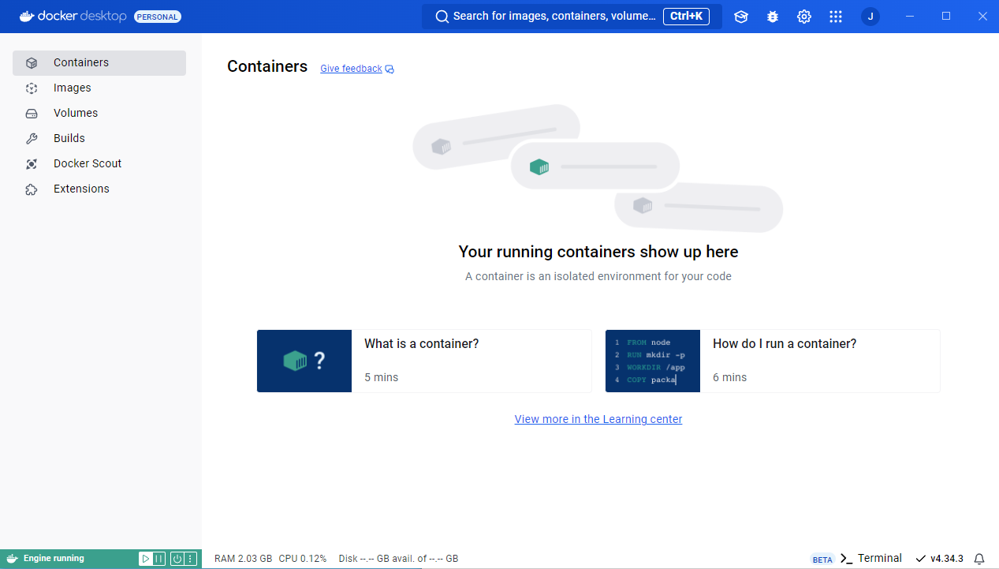
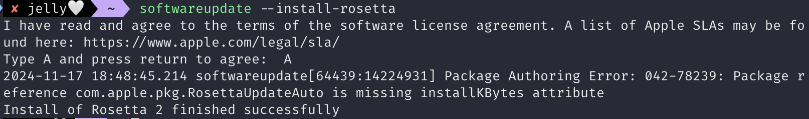
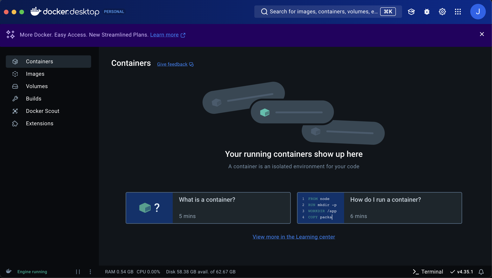
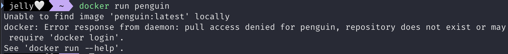

# 1. 도커를 사용하려면

## 도커 설치

- 도커를 사용하려면 **도커 엔진**이라는 소프트웨어 설치해야 함
    - but도커 엔진을 설치하려면 기본적으로 **리눅스 운영체제** 필요
    - 윈도우, macOS에서 사용하려면??

### 도커 환경 구축

- 도커 환경 구축하는 3가지 방법
    - 리눅스 컴퓨터에서 도커 사용하기
    - 가상 머신이나 렌탈 환경에 도커 설치하고 윈도우나 macOS를 통해 사용하기
    - 윈도우용/macOS용 도커 사용하기

### 윈도우용/macOS용 도커 사용하기

- 윈도우용/macOS용 **도커 데스크탑**
    - 리눅스 운영체제가 들어있는 패키지
        - 리눅스에는 도커 엔진만 있으면 되지만, 윈도우나 macOS에서는 리눅스 운영체제 등 실행 환경이 추가로 필요하기 때문에 패키지로 묶어서 배포함
    - 가상의 리눅스 환경을 만들고 이 환경에서 도커 엔진을 구동하는 구조
- 내부 가상화 소프트웨어
    - 윈도우 → Hyper-V
        - 윈도우에 포함되어 있음
    - macOS → HyperKit
        - 도커 데스크탑 패키지에 포함되어 있음

### 도커 데스크탑이 불안정한 경우

- 증상
    - 매우 느려짐
    - VirtualBox 또는 VMware와 같은 가상화 소프트웨어와 충돌을 일으키는 경우
- 해결
    - 윈도우 및 가상화 소프트웨어를 모두 **최신으로 업데이트**
    - but 버전에 따라 충돌이 일어날 가능성이 있음

### 도커 데스크탑을 사용하기 위한 조건

- Hyper-V(윈도우용 가상환경)가 활성 상태
    - macOS에서는 사용 요건 외에 따로 필요 조건 없음

## 도커 실행하기 위한 조건

### 64비트 운영체제에서만 동작

- x64 기반 프로세서(64비트 CPU)라도 32비트 운영체제이면 도커 사용 불가
    - 윈도우(32비트)를 삭제하고 리눅스를 설치하면 가능

### 윈도우 버전 사용 조건

- OS 요구사항
    - 윈도우 10 64비트 버전
        - 프로, 엔터프라이즈, 에듀케이션 중 Build 16299 이후 버전
        - 홈 에디션일 경우 WSL2 사용 가능(2004 버전 이후)
    - Hyper-V 및 Containers가 활성화됨
- 하드웨어 요구사항
    - CPU
        - SLAT 기능을 지원하는 64비트 프로세서
    - 메모리
        - 4GB 이상
    - BIOS에서 virtualization이 활성화됨

### macOS 버전 사용 조건

- 2010년 이후 발매 모델
- macOS 10.13(하이 시에라) 이후 버전
- 메모리
    - 4GB 이상

### 리눅스 버전 사용 조건

- 배포판 및 버전이 다음 표시된 것 이상
    
    
    | 배포본 | 버전 |
    | --- | --- |
    | CentOS | CentOS 7 이후 |
    | 우분투 | ubuntu 16.04 이후 |
    | 데비안 | 데비안 9(스트레치) 이후 |
    | 페도라 | 페도라 30 이후 |
- 리눅스 커널: 3.10 이후 버전
- iptables: 1.4 이후 버전
- Git: 1.7 이후 버전
- XZ Utils: 4.9 이후 버전
- procp와 cgroups 계층을 준수

# 2. 도커 설치

- 윈도우, macOS
    - GUI(Graphical User Interface)로 설치 가능
    - 그래픽 통해 조작 가능
- 리눅스
    - CUI(Character User Interface) 사용
    - 명령을 직접 키보드로 쳐서 입력하는 스타일의 사용자 인터페이스

### 설치완료(윈도우)



### 설치완료(mac)

https://docs.docker.com/desktop/setup/install/mac-install/





# 3. 도커의 조작 방법과 명령 프롬프트 및 터미널 실행

## CUI를 이용한 도커 실행

### 터미널 소프트웨어

- 컴퓨터에 명령을 전달하는 소프트웨어
    - 윈도우
        - 명령 프롬프트(cmd)
    - macOS
        - 터미널

### 도커 실행, 중지 명령어

```bash
docker run <container_name>
docker stop <container_name>
```



## [참고] SSH란?

- Secure SHell의 약자
- 네트워크상의 다른 컴퓨터에 로그인하여 명령을 실행하고 정보를 보고 받을수 있도록 해 주는 통신 프로토콜
- SSH는 운영 체제에 관계없이 보안 연결을 제공하는 프로토콜임
    - 일반적으로 리눅스나 유닉스 계열의 OS에서 많이 사용되지만 무조건 리눅스에서만 사용하는 것은 아님
- SSH 소프트웨어
    - Tera Term, PuTTy 등