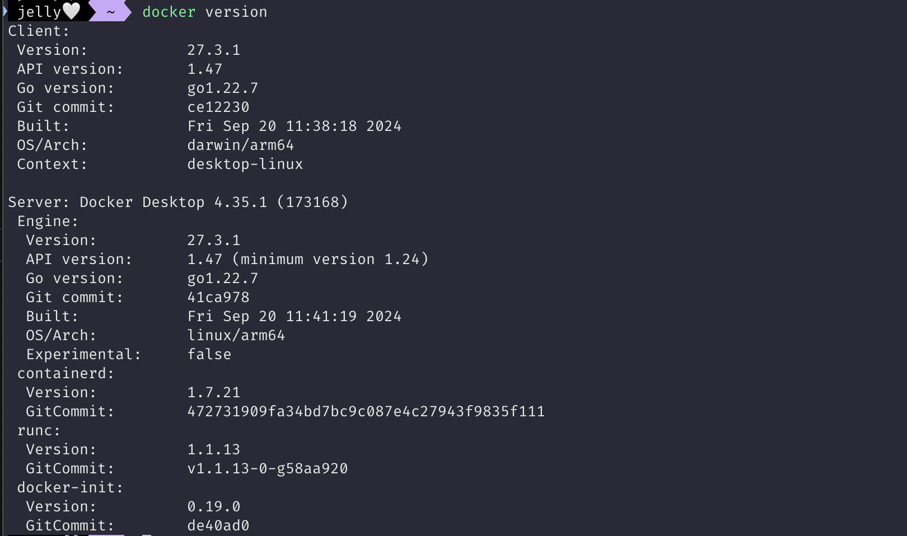
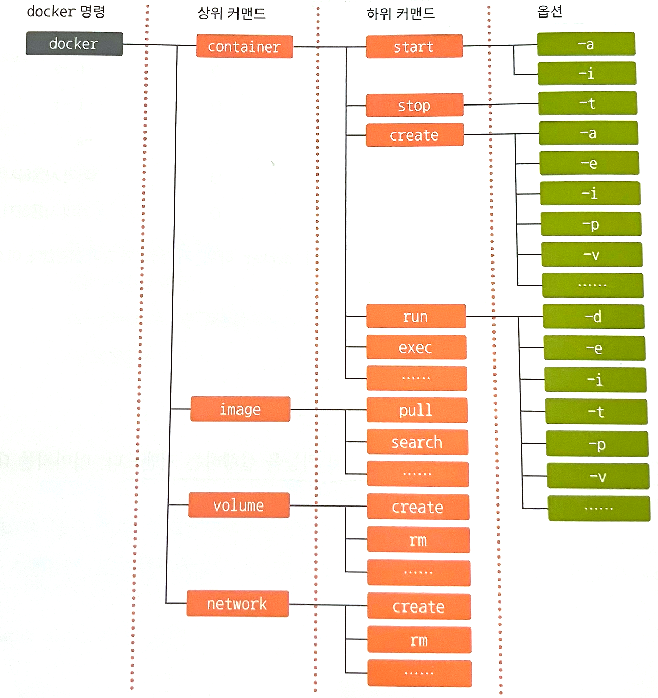
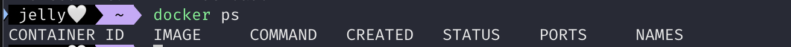

# 1. 도커 엔진 시작하기/종료하기

## 도커 엔진을 시작/종료하는 방법

- 도커 엔진은 설치와 함께 실행되며, 계속 동작 상태로 남아 있음
    - 컨테이너 실행 중이 아니라면 컴퓨터의 리소스를 거의 차지하지 않음
- 도커 데스크톱은 도커 엔진을 자동으로 실행 (설정 비활성화 가능)
    - 컴퓨터가 부팅될 때마다 도커 엔진도 자동으로 실행
- but 도커 엔진이 한 번 종료되면 모든 컨테이너는 정지 상태가 됨
    - 컨테이너는 자동 실행 설정이 없으므로 따로 설행하는 스크립트 작성 필요

# 2. 컨테이너의 기본적인 사용 방법

## 명령어

### 도커 명령어

```bash
docker ~
```

- 컨테이너를 다루는 모든 명령어는 `docker` 명령어로 시작함

### 명령어와 대상

```bash
docker <상위커맨드_무엇을> <하위커맨드_어떻게> <대상>
docker container run penguin
```

- 커맨드
    - `docker` 명령어 다음에 오는 ‘무엇을’, ‘어떻게’에 해당하는 부분
    - 상위 커맨드와 하위 커맨드로 구성
        - 상위 커맨드 → 무엇을
        - 하위 커맨드 → 어떻게
        - 대상 → 컨테이너 명 또는 이미지명 등 구체적인 이름

### 옵션과 인자

```bash
docker container run -d penguin --mode=1
```

- 명령어에 대한 추가 정보
- `-d`
    - 백그라운드로 실행하라는 옵션
- `--mode=1`
    - 모드 1로 실행하라

## 기본적인 명령어

### 도커 명령어의 기본 형태

```bash
docker <커맨드> (옵션) <대상> (인자)
```

### 커맨드

- ‘무엇을’(상위 커맨드), ‘어떻게’(하위 커맨드) 할 것인지 지정하는 부분
- 상위 커맨드를 붙이지 않아도 실행 가능한 명령어가 있으며, 관례상 이렇게 사용하는 경우가 더 많다
    - docker 1.13부터 커맨드 재편
        - 일부 커맨드에서 단독 커맨드 형태로 상위 커맨드 없이 사용가능
        - but 도커 엔진이 업데이트 되면서 언제 수정될 지 모르기 때문에 상위 커맨드를 알아두는 것이 좋다

```bash
docker container run
docker run  # container 생략 가능
```

### 옵션

- 커맨드에 세세한 설정을 지정
- 옵션은 `-` 또는 `--`로 시작하는 경우가 일반적이지만 붙이지 않는 경우도 있음
    - `-` 나 `--` 중 무엇을 사용할 지는 커맨드 작성자 취향이므로 명확한 기준 없음
- 커맨드에 어떤 값을 전달하고 싶다면 옵션 뒤에 옵션 값 지정 가능
- -를 하나만 사용하는 옵션은 한 번에 모아쓸 수 있음

```bash
--name penguin  # name 옵션 값 지정
-dit  # -d + -i + -t
```

### 대상

- 커맨드와 달리 구체적인 이름을 지정

```bash
container start <옵션> penguin  # 이름이 penguin인 이미지의 컨테이너 실행
```

### 인자

- 대상에 전달할 값을 지정
- 필요한 상황이 제한적임 (잘 사용하지 않는다)
    - ex. 문자 코드 또는 포트 번호 등을 전달

```bash
--mode=1
--style nankyoku
```

## 실습



### 대표적인 명령어



~ 정리하기 ~

# 3. 컨테이너의 생성과 삭제, 실행, 정지

## 생성, 삭제, 실행, 정지 명령어

### 컨테이너 실행

- 컨테이너 생성, 실행, 이미지 내려받는 명령어가 따로 존재하지만, docker run을 통해 한 번에 수행 가능

```bash
docker (image) pull  # 이미지 내려받기
docker (container) create  # 컨테이너 생성
docker (container) start)  # 컨테이너 실행

docker (container) run (옵션) <이미지> (인자)  # 생성, 실행, 이미지 내려받기 한 번에 수행
```

### 컨테이너 정지, 폐기

- 도커 컨테이너는 생애 주기가 있으며 쓰고 버리는 방식으로 사용
- 컨테이너를 폐기하기 전 컨테이너를 정지시켜야 함
    - 동작 중인 컨테이너를 그대로 삭제할 수는 없음

```bash
docker (container) stop <컨테이너명>  # 컨테이너 정지
docker (container) rm <컨테이너명>  # 컨테이너 삭제
```

## 컨테이너 목록 확인 명령어

### 컨테이너 목룍 출력

- 현재 실행중인 컨테이너 목록 출력

```bash
docker container ls
docker ps (옵션)
```

- 현재 존재하는 컨테이너(정지 상태의 컨테이너 포함)

```bash
docker ps -a
```



- 확인할 수 있는 정보
    - 컨테이너 ID (무작위 값)
    - 컨테이너를 만들 때 사용한 이미지 이름
    - 컨테이너 실행 시 설정된 프로그램 이름
    - 컨테이너 생성 후 경과된 시간
    - 컨테이너의 현재 상태
    - 컨테이너에 할당된 포트 번호
    - 컨테이너의 이름