# 1. 도커 엔진 시작하기/종료하기

## 도커 엔진을 시작/종료하는 방법

- 도커 엔진은 설치와 함께 실행되며, 계속 동작 상태로 남아 있음
    - 컨테이너 실행 중이 아니라면 컴퓨터의 리소스를 거의 차지하지 않음
- 도커 데스크톱은 도커 엔진을 자동으로 실행 (설정 비활성화 가능)
    - 컴퓨터가 부팅될 때마다 도커 엔진도 자동으로 실행
- but 도커 엔진이 한 번 종료되면 모든 컨테이너는 정지 상태가 됨
    - 컨테이너는 자동 실행 설정이 없으므로 따로 설행하는 스크립트 작성 필요

# 2. 컨테이너의 기본적인 사용 방법

## 명령어

### 도커 명령어

```bash
docker ~
```

- 컨테이너를 다루는 모든 명령어는 `docker` 명령어로 시작함

### 명령어와 대상

```bash
docker <상위커맨드_무엇을> <하위커맨드_어떻게> <대상>
docker container run penguin
```

- 커맨드
    - `docker` 명령어 다음에 오는 ‘무엇을’, ‘어떻게’에 해당하는 부분
    - 상위 커맨드와 하위 커맨드로 구성
        - 상위 커맨드 → 무엇을
        - 하위 커맨드 → 어떻게
        - 대상 → 컨테이너 명 또는 이미지명 등 구체적인 이름

### 옵션과 인자

```bash
docker container run -d penguin --mode=1
```

- 명령어에 대한 추가 정보
- `-d`
    - 백그라운드로 실행하라는 옵션
- `--mode=1`
    - 모드 1로 실행하라

## 기본적인 명령어

### 도커 명령어의 기본 형태

```bash
docker <커맨드> (옵션) <대상> (인자)
```

### 커맨드

- ‘무엇을’(상위 커맨드), ‘어떻게’(하위 커맨드) 할 것인지 지정하는 부분
- 상위 커맨드를 붙이지 않아도 실행 가능한 명령어가 있으며, 관례상 이렇게 사용하는 경우가 더 많다
    - docker 1.13부터 커맨드 재편
        - 일부 커맨드에서 단독 커맨드 형태로 상위 커맨드 없이 사용가능
        - but 도커 엔진이 업데이트 되면서 언제 수정될 지 모르기 때문에 상위 커맨드를 알아두는 것이 좋다

```bash
docker container run
docker run  # container 생략 가능
```

### 옵션

- 커맨드에 세세한 설정을 지정
- 옵션은 `-` 또는 `--`로 시작하는 경우가 일반적이지만 붙이지 않는 경우도 있음
    - `-` 나 `--` 중 무엇을 사용할 지는 커맨드 작성자 취향이므로 명확한 기준 없음
- 커맨드에 어떤 값을 전달하고 싶다면 옵션 뒤에 옵션 값 지정 가능
- -를 하나만 사용하는 옵션은 한 번에 모아쓸 수 있음

```bash
--name penguin  # name 옵션 값 지정
-dit  # -d + -i + -t
```

### 대상

- 커맨드와 달리 구체적인 이름을 지정

```bash
container start <옵션> penguin  # 이름이 penguin인 이미지의 컨테이너 실행
```

### 인자

- 대상에 전달할 값을 지정
- 필요한 상황이 제한적임 (잘 사용하지 않는다)
    - ex. 문자 코드 또는 포트 번호 등을 전달

```bash
--mode=1
--style nankyoku
```

## 실습


### 대표적인 명령어


~ 정리하기 ~

# 3. 컨테이너의 생성과 삭제, 실행, 정지

## 생성, 삭제, 실행, 정지 명령어

### 컨테이너 실행

- 컨테이너 생성, 실행, 이미지 내려받는 명령어가 따로 존재하지만, docker run을 통해 한 번에 수행 가능

```bash
docker (image) pull  # 이미지 내려받기
docker (container) create  # 컨테이너 생성
docker (container) start)  # 컨테이너 실행

docker (container) run (옵션) <이미지> (인자)  # 생성, 실행, 이미지 내려받기 한 번에 수행
```

### 컨테이너 정지, 폐기

- 도커 컨테이너는 생애 주기가 있으며 쓰고 버리는 방식으로 사용
- 컨테이너를 폐기하기 전 컨테이너를 정지시켜야 함
    - 동작 중인 컨테이너를 그대로 삭제할 수는 없음

```bash
docker (container) stop <컨테이너명>  # 컨테이너 정지
docker (container) rm <컨테이너명>  # 컨테이너 삭제
```

## 컨테이너 목록 확인 명령어

### 컨테이너 목룍 출력

- 현재 실행중인 컨테이너 목록 출력

```bash
docker container ls
docker ps (옵션)
```

- 현재 존재하는 컨테이너(정지 상태의 컨테이너 포함)

```bash
docker ps -a
```


| 항목 | 내용 |
| --- | --- |
| `CONTAINER ID` | 컨테이너 식별자. 무작위 문자열이 할당됨. 원래 64글자이지만 앞에서부터 12글자만 출력. 12개만으로도 식별자 역할 수행 가능.  |
| `IMAGE` | 컨테이너 만들 때 사용된 이미지 이름 |
| `COMMAND` | 컨테이너 실행 시 실행하도록 설정된 프로그램 이름 |
| `CREATED` | 컨테이너 생성 후 경과된 시간 |
| `STATUS` | 컨테이너의 현재 상태. 실행 중이면 `Up`, 종료된 상태이면 `Exited`가 출력됨 |
| `PORTS` | 컨테이너에 할당된 포트 번호. `호스트 포트 번호 → 컨테이너 포트 번호` 형식으로 출력됨
포트 번호가 동일한 경우 →의 뒷부분은 출력되지 않음 |
| `NAMES` | 컨테이너 이름 |

## [실습] 컨테이너 생성, 실행, 상태 확인, 종료, 삭제

### 실습 내용

- 개요
    - **컨테이너 생성 및 실행** → 컨테이너 상태 확인 → **컨테이너 종료** → 컨테이너 상태 확인 → **컨테이너 삭제** → 컨테이너 상태 확인
- 생성할 컨테이너 정보
    
    
    | 컨테이너 이름 | apa000ex1 |
    | --- | --- |
    | 이미지 이름 | httpd |

### 1) 컨테이너 생성 및 실행

- 아파치 이미지(httpd)를 사용해 apa000ex1이라는 이름의 컨테이너 생성, 실행

```bash
docker run --name apa000ex1 -d httpd
```

- `--name apa000ex1`
    - apa000ex1이라는 이름으로 컨테이너 생성
- `-d`
    - 백그라운드 실행
- `httpd`
    - 아파치 이미지 이름
    - 버전을 지정하지 않았으므로 최신 버전(latest)이 사용됨

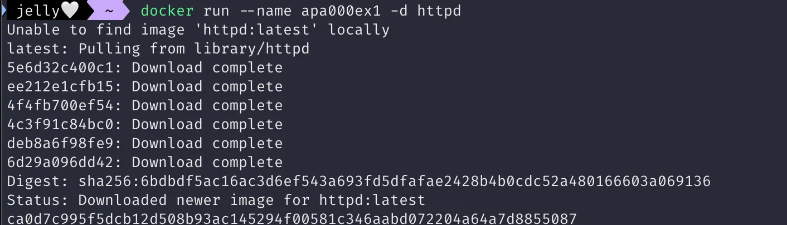

- Unable to find image ‘httpd:latest’ locally
    - 해당 이미지가 로컬 컴퓨터에 없다는 뜻
    - 이후 이미지를 내려받는(pull) 작업을 수행
- 출력되는 무작위 문자열은 SHA-256 해시 암호화 알고리즘을 통해 생성됨

### 2) 컨테이너 상태 확인

```bash
docker ps
```

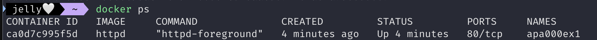

- STATUS 항목 값이 Up 이므로 실행 중임을 확인

### 3) 컨테이너 종료

```bash
docker stop apa000ex1
```

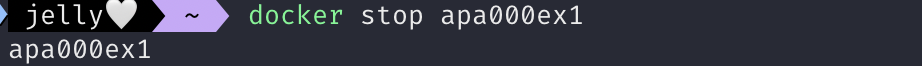

### 4) 컨테이너 상태 확인

```bash
docker ps
```


### 5) 컨테이너 존재 여부 확인

```bash
docker ps -a
```

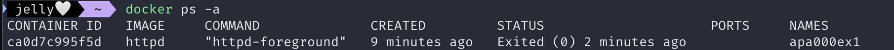

- STATUS 값이 Exited이므로 컨테이너가 존재하기는 하지만 종료된 상황임을 확인

### 6) 컨테이너 삭제

```bash
docker rm apa000ex1
```

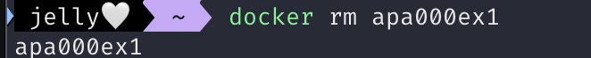

### 7) 컨테이너 삭제 확인

```bash
docker ps -a
```


### [참고] 컨테이너의 ID 식별자 이용하기

- stop이나 rm처럼 이미 생성된 컨테이너 이름을 지정할 경우 커맨드는 컨테이너 ID와 그 생략형으로도 실행할 수 있음

```bash
docker stop 2bdbaFb4022
docker stop 2b  # 생략형 사용 가능
```

# 4. 컨테이너의 통신

## 아파치란?

- 아파치
    - 웹 서버 기능을 제공하는 소프트웨어
    - 아파치가 동작중인 서버에 파일을 두면, 이 파일을 웹 사이트 형태로 볼 수 있음

## 컨테이너와 통신하려면?

### 포트 설정하기

- 웹 브라우저를 통해 컨테이너에 접근하려면 외부와 접속하기 위한 설정이 필요
    - 이를 위해 포트를 설정
- 아파치는 서버에서 정해둔 포트(80번 포트)에서 웹 사이트에 대한 접근을 기다리다가 사용자가 포트를 통해 접근해오면 요청에 따라 웹 사이트의 페이지를 제공
    - 컨테이너 속에서 실행 중인 아파치는 외부와 직접 연결되지 않았기 때문에 외부에서 접근할 수는 없음
    - 컨테이너를 실행 중인 물리적 컴퓨터가 외부의 접근을 대신 받아 전달
    
    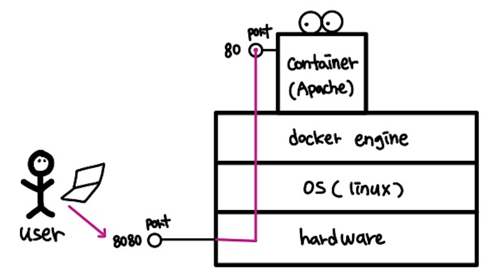
    
    ```bash
    -p <호스트_포트_번호>:<컨테이너_포트_번호>  # -p: 포트를 지정하는 옵션
    
    # ex
    -p 8080:80
    ```
    
- 여러 개의 웹 서버를 함께 실행할 때
    - 호스트의 포트 번호를 모두 같은 것으로 사용하면 어떤 컨테이너로 가야 할 요청인지 구분할 수 없으므로 포트 번호가 겹치지 않게 설정해야 함
        
        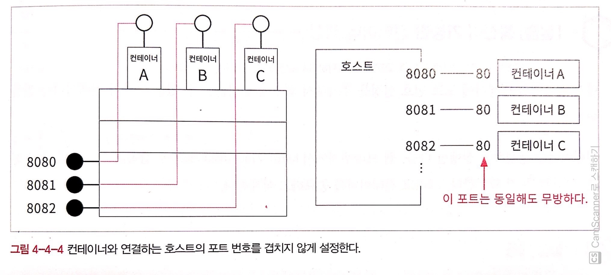
        
    - 컨테이너 내부의 포트 번호는 동일해도 무방
        - 왜? 컨테이너는 독립적으로 존재하니까
    - 꼭 여러 컨테이너로 연결되는 포트를 같게 하고 싶다면 리버스 프락시로 서버 이름을 통해 구별할 수 있도록 구성
    - (참고) Proxy란?
        - **클라이언트와 서버 사이에 중개 역할을 수행하는 서버**
        - 클라이언트가 직접 서버에 요청을 보내는 대신, **프록시 서버를 통해 요청이 전달되고, 응답이 반환되는 방식**으로 동작
        - 프록시의 종류
            - **포워드 프록시 (Forward Proxy)**
                - 클라이언트의 요청을 서버로 대신 보내주는 프록시
                - 주로 **클라이언트가 서버에 직접 접근하지 못하도록 제한할 때 사용**
                - 예: 회사에서 인터넷 사용을 제어하거나, 지역 제한을 우회하려고 사용할 때
                
                **작동 방식:**
                
                1. 클라이언트 → 프록시 서버로 요청
                2. 프록시 서버 → 실제 서버로 요청 전달
                3. 실제 서버 → 프록시 서버로 응답
                4. 프록시 서버 → 클라이언트로 응답 전달
                
                **예시:**
                
                - VPN 서비스
                - 웹 브라우저 설정에서 프록시를 설정해 지역 제한 우회
            - **리버스 프록시 (Reverse Proxy)**
                - 서버를 대신하여 클라이언트 요청을 처리하는 프록시.
                - **클라이언트가 서버의 IP 주소와 포트를 모르게 하거나, 부하 분산을 위해 사용**.
            
            **작동 방식:**
            
            1. 클라이언트 → 리버스 프록시로 요청.
            2. 리버스 프록시 → 적절한 백엔드 서버로 요청 전달.
            3. 백엔드 서버 → 리버스 프록시로 응답.
            4. 리버스 프록시 → 클라이언트로 응답 전달.
            
            **예시:**
            
            - Nginx나 HAProxy를 사용해 웹 서버 요청 분배.
            - HTTPS를 리버스 프록시에서 처리하여 백엔드 서버는 HTTP로만 동작.

## [실습] 웹 사이트로 접근

### 실습 내용

- 개요
    - **컨테이너 생성 및 실행** → 컨테이너 상태 확인 → **컨테이너 종료** → 컨테이너 상태 확인 → **컨테이너 삭제** → 컨테이너 상태 확인
- 생성할 컨테이너 정보
    
    
    | 컨테이너 이름 | apa000ex2 |
    | --- | --- |
    | 이미지 이름 | httpd |
    | 포트 설정 | 8080:80 |

### 1) 컨테이너 생성 및 실행

```bash
docker run --name apa000ex2 -d -p 8080:80 httpd
```

| `— name apa000ex2` | apa000ex2 라는 이름의 컨테이너 생성 |
| --- | --- |
| `-d` | 백그라운드 실행 |
| `-p 8080:80` | 호스트의 8080번 포트를 컨테이너 80번 포트로 포워딩 |
| `httpd` | 아파치 이미지 이름. 버전을 지정하지 않았기 때문에 latest가 사용됨 |

### 2) 컨테이너 상태 확인

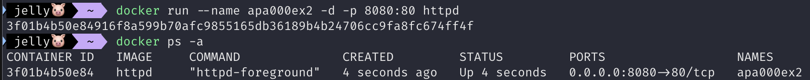

### 3) 웹 브라우저를 통해 아파치에 접근할 수 있는지 확인

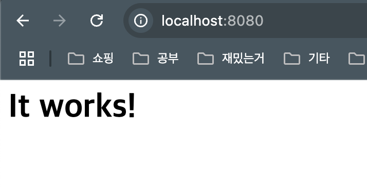

### 4) 컨테이너 종료 및 삭제

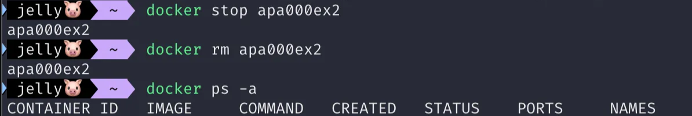

# 5. 컨테이너 생성에 익숙해지기

## 컨테이너의 유형

- 컨테이너는 다양한 유형의 소프트웨어를 담을 수 있으므로, 컨테이너의 종류도 그만큼 다양하다

### 리눅스 OS 컨테이너

| 이미지 이름 | 컨테이너 내용 | 옵션 및 인자 |
| --- | --- | --- |
| ubuntu | 우분투 | `-d` 없이 `-it` 옵션만 사용. 인자로는 `/bin/bash`등 셸 명령어를 지정 |
| centos | CentOS | `-d` 없이 `-it` 옵션만 사용. 인자로는 `/bin/bash`등 셸 명령어를 지정 |
| debian | 데비안 | `-d` 없이 `-it` 옵션만 사용. 인자로는 `/bin/bash`등 셸 명령어를 지정 |
| fedora | 페도라 | `-d` 없이 `-it` 옵션만 사용. 인자로는 `/bin/bash`등 셸 명령어를 지정 |
| busybox | BizyBox | `-d` 없이 `-it` 옵션만 사용. 인자로는 `/bin/bash`등 셸 명령어를 지정 |
| alpine | 알파인 리눅스 | `-d` 없이 `-it` 옵션만 사용. 인자로는 `/bin/bash`등 셸 명령어를 지정 |

### 웹 서버/데이터베이스 서버용 컨테이너

| 이미지 이름 | 컨테이너 내용 | 옵션 및 인자 |
| --- | --- | --- |
| httpd | Apache | `-d`로 백그라운드로 실행. `-p`로 포트 번호 지정 |
| nginx | Nginx | `-d`로 백그라운드로 실행. `-p`로 포트 번호 지정 |
| mysql | MySQL | `-d`를 사용. 실행 시 `-e MYSQL_ROOT_PASSWORD`와 같이 루트 페스워드 지정 |
| postgres | PostgreSQL | `-d`를 사용. 실행 시 `-e POSTGRES_ROOT_PASSWORD`와 같이 루트 페스워드 지정 |
| mariadb | MariaDB | `-d`를 사용. 실행 시 `-e MYSQL_ROOT_PASSWORD`와 같이 루트 페스워드 지정 |
- (참고) MariaDB에서 옵션으로 MYSQL_ROOT_PASSWORD를 주는 이유?
    - **MariaDB**는 MySQL의 포크(fork)로, MySQL과 매우 유사한 구조와 설정 방식을 공유
    - Docker 이미지를 통해 MariaDB를 사용할 때도, MySQL과 동일한 환경 변수 이름을 사용하는 이유는 **MySQL과의 호환성과 익숙한 사용성을 유지**하기 위해서

### 프로그램 실행을 위한 런타임과 그 외 소프트웨어

| 이미지 이름 | 컨테이너 내용 | 옵션 및 인자 |
| --- | --- | --- |
| openjdk | 자바 런타임 | -d를 사용하지 않고, 인자로 java 명령 등을 지정해 도구 형태로 사용 |
| python | 파이썬 런타임 | -d를 사용하지 않고, 인자로 python 명령 등을 지정해 도구 형태로 사용 |
| php | PHP 런타임 | 웹 서버가 포함된 것과 실행 명령만 포함된 것으로 나뉘어 제공 |
| ruby | 루비 런타임 | 웹 서버가 포함된 것과 실행 명령만 포함된 것으로 나뉘어 제공 |
| perl | 펄 런타임 | -d를 사용하지 않고, 인자로 perl 명령 등을 지정해 도구 형태로 사용 |
| gcc | C/C++ 컴파일러 | -d를 사용하지 않고, 인자로 gcc 명령 등을 지정해 도구 형태로 사용 |
| node | Node.js | -d를 사용하지 않고, 인자로 app 명령 등을 지정해 도구 형태로 사용 |
| registry | 도커 레지스트리 | -d 옵션을 사용해 백그라운드로 실행하며, -p 옵션으로 포트 번호를 지정 |
| wordpress | WordPress | -d 옵션을 사용해 백그라운드로 실행, -p 옵션으로 포트 번호를 지정
MySQL 이나 MariaDB가 필요, 접속에 필요한 패스워드는 -e 옵션으로 지정 |
| nextcloud | NextCloud | -d 옵션을 사용해 백그라운드로 실행, -p 옵션으로 포트 번호를 지정 |
| redmine | Redmine | -d 옵션을 사용해 백그라운드로 실행, -p 옵션으로 포트 번호 지정
MySQL 또는 MariaDB 필요 |

## [실습] 아파치 컨테이너 여러 개 실행하기

### 실습 내용

- 컨테이너 정보
    
    
    | 컨테이너 이름 | apa000ex3 | apa000ex4 | apa000ex5 |
    | --- | --- | --- | --- |
    | 이미지 이름 | httpd | httpd | httpd |
    | 포트 설정 | 8081:80 | 8082:80 | 8083:80 |

### 1) 컨테이너 실행

```bash
docker run --name apa000ex3 -d -p 8081:80 httpd
docker run --name apa000ex4 -d -p 8082:80 httpd
docker run --name apa000ex5 -d -p 8083:80 httpd
```

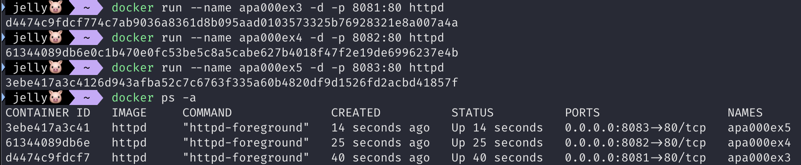

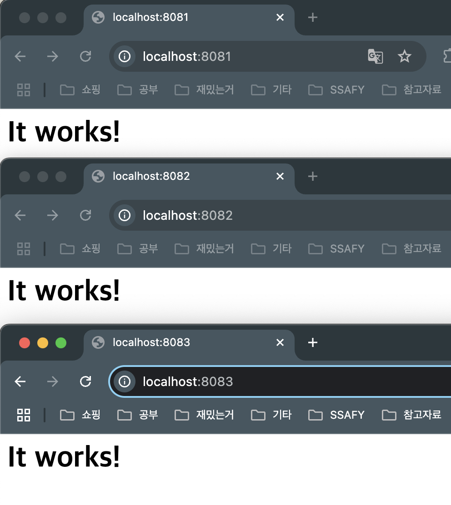

### 2) 컨테이너 종료 및 삭제

```bash
docker stop apa000ex3 apa000ex4 apa000ex5
docker rm apa000ex3 apa000ex4 apa000ex5
```

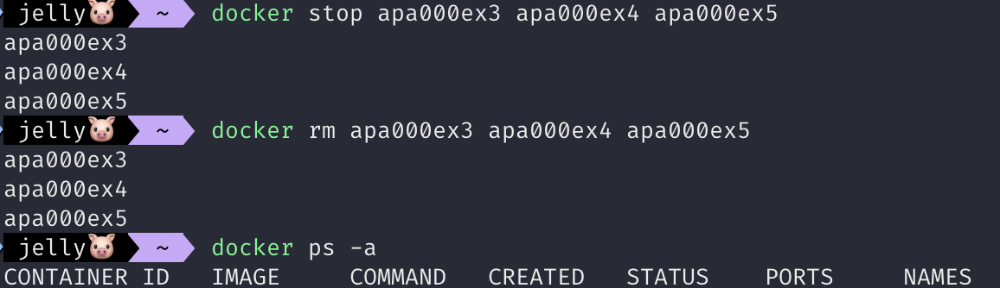

### [참고] 컨테이너 이름

- 컨테이너 이름을 옵션으로 넣지 않으면 ID로 컨테이너 이름이 지정됨 (필수 인자 아니다)
- 무작위 문자열이니 시각적으로 구분하기 쉽지 않으므로 컨테이너에 이름 붙이는 것이 낫다

## [실습] Nginx 컨테이너 실행하기

### 실습 내용

- Nginx
    - 아파치와 같은 웹 서버 소프트웨어
- 생성할 컨테이너 정보
    
    
    | 컨테이너 이름 | nginx000ex6 |
    | --- | --- |
    | 이미지 이름 | nginx |
    | 포트 설정 | 8084:80 |

### 1) 컨테이너 생성 및 실행

```bash
docker run --name nginx000ex6 -d -p 8084:80 nginx
```

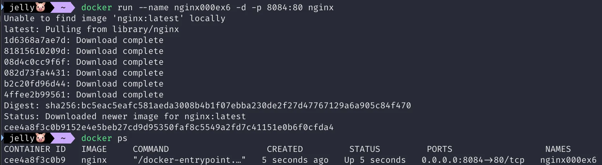

- nginx 이미지가 없으므로 내려받은 후 컨테이너 생성
- STATUS가 Up 이면 컨테이너가 실행 중이라는 뜻

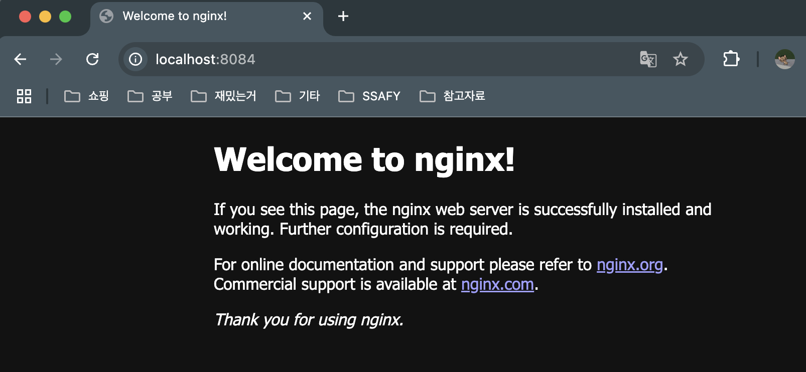

### 2) 컨테이너 종료 및 삭제

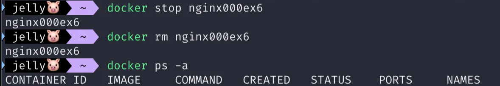

## [실습] MySQL 컨테이너 실행하기

### 실습 내용

- MySQL
    - 데이터베이스 기능을 제공하는 소프트웨어, RDBMS의 한 종류
    - RDBMS에는 PostgreSQL, MariaDB 등이 있다
    - MySQL은 특히 WordPress와 함께 사용한느 것으로 유명함
- MySQL 컨테이너 만들기
    - 제대로 동작하게 하려면 ***인자를 반드시 지정해야 함***
- 생성할 컨테이너 정보
    
    
    | 컨테이너 이름 | mysql000ex7 |
    | --- | --- |
    | 이미지 이름 | mysql |
    | MySQL 루트 패스워드 | myrootpass |

### 1) 컨테이너 생성 및 실행

```bash
docker run --name mysql000ex7 -dit -e MYSQL_ROOT_PASSWORD=myrootpass mysql
```

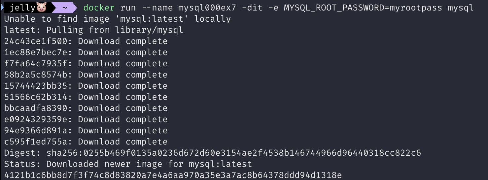

### 2) 컨테이너 종료 및 삭제

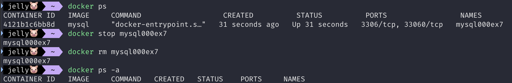

# 6. 이미지 삭제

## 이미지 삭제

- 컨테이너를 삭제해도 이미지는 그대로 남아 쌓인다
- 이미지가 늘어나면 스토리지 용량을 압박하게 되므로 필요없어진 이미지는 그때그때 삭제하도록 한다
- 해당 이미지로 실행한 컨테이너가 남아 있으면 이미지를 삭제할 수 없음
    - 컨테이너 목록을 출력(`docker ps -a`)해 확인하고 컨테이너를 종료 및 삭제한 후 이미지를 삭제한다

### 이미지 이름(또는 이미지 ID) 확인하기

```bash
docker image ls
```

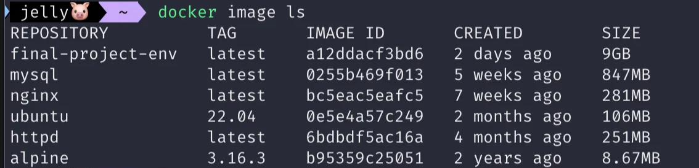

| 항목 | 내용 |
| --- | --- |
| REPOSITORY | 이미지 이름 |
| TAG | 버전 정보. 이미지를 내려받을 때 따로 지정하지 않으면 latest(최신 버전)를 내려받음 |
| IMAGE ID | 이미지 식별자. 원래 64글자이지만 앞에서부터 12글자만 출력. 12글자만으로두 식별자 역할 수행 가능 |
| CREATED | 이미지 생성 후 경과된 시간 |
| SIZE | 이미지 전체 용량 |

### 이미지 삭제하기

- 해당 이미지로 실행된 컨테이너 모두 삭제 후 진행해야 함
- 공백으로 구분해 여러 이미지 지정 가능

```bash
docker image rm <이미지_이름>
docker image rm <이미지_이름_1> <이미지_이름_2> <이미지_이름_3>
```

### [참고] 이미지 버전 지정하기

- `이미지_이름:버전_넘버` 로 지정

```bash
docker run --name apa000ex2 -d -p 8080:80 httpd:2.2
docker image rm httpd:2.2
```

## [실습] 이미지 삭제하기

### 1) 컨테이너 확인

- `docker ps`로 삭제할 이미지로 생성된 컨테이너가 있는지 확인
    - 컨테이너가 있다면 `docker rm` 커맨드로 컨테이너 먼저 삭제


### 2) 이미지 확인

- 도커 이미지 목록을 출력해 이미지 이름 또는 이미지 ID를 지정해 삭제

```bash
docker image ls
```


### 3) 이미지 삭제

```bash
docker image rm httpd
```

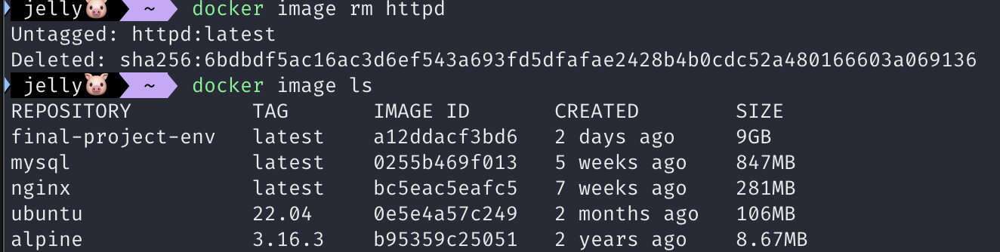

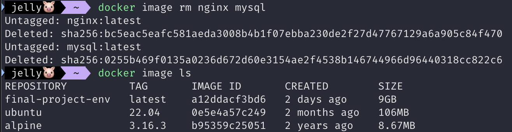

### [참고] 여러 버전의 이미지 삭제

- TAG 항목에 출력되는 버전을 명시해 주어야 함
- 이미지가 2개 이상 있을 경우 버전을 명시해주지 않으면 이미지를 구별할 수 없기 때문에 이미지가 삭제되지 않음