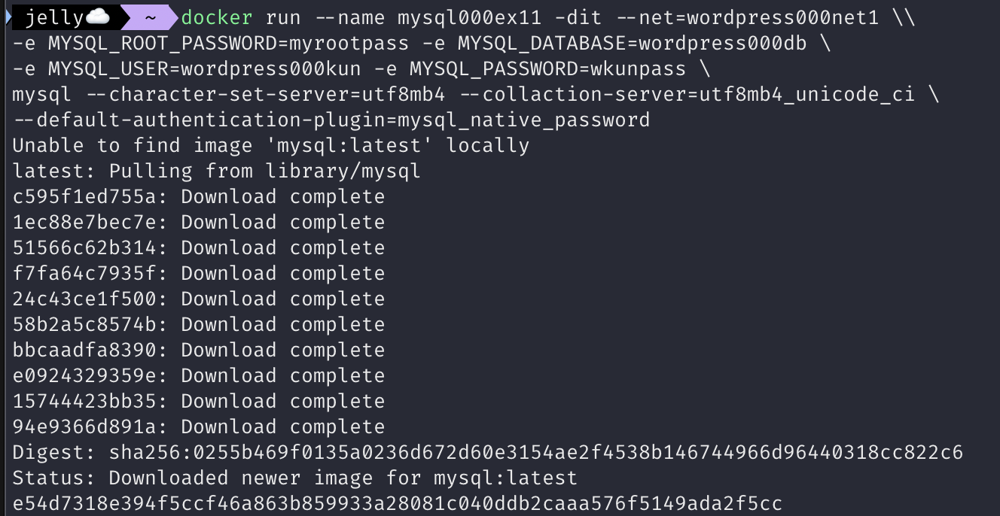
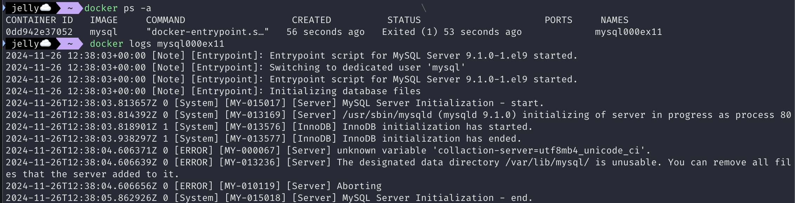

# 1. 워드프레스 구축

## 워드프레스 사이트 구성 및 구축

### 워드프레스란?

- 블로그 생성 도구
- 웹 사이트 작성자가 작성한 내용을 DB에 저장하고, 웹 사이트 열람자의 요청에 따라 웹 페이지를 보여줌

## 도커 네트워크 생성/삭제

- 워드프레스 사용 시 워드프레스 프로그램 외에도 아파치, DB, PHP 런타임 등이 필요
- 워드프레스 공식 이미지에는 워드프레스 프로그램 본체, 아파치, PHP 런타임을 함께 포함하고 있음
    - 워드프레스 컨테이너와 MySQL 컨테이너가 있으면 워드프레스를 사용할 수 있다
- 프로그램이 MySQL에 저장된 데이터를 읽고 쓰기 위해 두 컨테이너가 연결되어 있어야 함
    - 두 컨테이너를 연결하기 위해 가상 네트워크를 만들고 이 네트워크에 두 개의 컨테이너를 소속시켜 두 컨테이너를 연결

### 도커 네트워크 커맨드

- 도커 네트워크 생성/삭제
    
    ```bash
    docker network create <네트워크_이름>  # 도커 네트워크 생성
    docker network rm <네트워크_이름>  # 도커 네트워크 삭제
    ```
    
- 그 외 도커 네트워크 관련 커맨드

| 커맨드 | 내용 | 생략 가능 여부 | 주요 옵션 |
| --- | --- | --- | --- |
| connect | 네트워크에 컨테이너 새로 접속 | X | 거의 사용하지 않음 |
| disconnect | 네트워크에서 컨테이너의 접속을 끊음 | X | 거의 사용하지 않음 |
| create | 네트워크 생성 | X | 거의 사용하지 않음 |
| inspect | 네트워크 상세 정보 확인 | X | 거의 사용하지 않음 |
| ls | 네트워크 목록 확인 | X | 거의 사용하지 않음 |
| prune | 현재 아무 컨테이너도 접속하지 않은 네트워크를 모두 삭제 | X | 거의 사용하지 않음 |
| rm | 지정한 네트워크 삭제 | X | 거의 사용하지 않음 |

## MySQL 컨테이너 실행 시 필요한 옵션, 인자

```bash
docker run --name <컨테이너_이름> -dit --net=<네트워크_이름> \
-e MYSQL_ROOT_PASSWORD=MySQL_루트_패스워드 \
-e MYSQL_USER=<MySQL_사용자_이름> \
-e MYSQL_PASSWORD=<MySQL_패스워드> \
mysql --character-set-server=<문자_인코딩> --collection-server=<정렬_순서> \
--default-authentication-plugin=<인증_방식>
```

### 사용된 옵션

| 옵션 | 항목 | 실습 시 사용할 값 |
| --- | --- | --- |
| —net | 네트워크 이름 | wordpress000net1 |
| —name | MySQL 컨테이너 이름 | mysql000ex11 |
| -dit | 실행 옵션 | x |
| -e MYSQL_ROOT_PASSWORD | MySQL 루트 패스워드 | myrootpass |
| -e MYSQL_DATABASE | MySQL 데이터베이스 이름 | wordpress000db |
| -e MYSQL_USER | MySQL 사용자 이름 | wordpress000kun |
| -e MYSQL_PASSWORD | MySQL 패스워드 | wkunpass |

### 사용된 인자

| 인자 | 항목 | 값 | 의미 |
| --- | --- | --- | --- |
| —character-set-server= | 문자 인코딩 | utf8mb4 | 문자 인코딩으로 UTF8 사용 |
| —collaction-server= | 정렬 순서 | utf8mb4_unicode_ci | 정렬 순서로 UTF8을 따름 |
| —default-authentication-plugin= | 인증 방식 | mysql_native_password | 인증 방식을 예전 방식(native)으로 변경 |

## 워드프레스 컨테이너 실행 시 필요한 옵션, 인자

```bash
docker run --name <컨테이너_이름> -dit --net=<네트워크_이름> -p <포트_설정> \
-e WORDPRESS_DB_HOST=<데이터베이스_컨테이너_이름> \
-e WORDPRESS_DB_NAME=<데이터베이스_이름> \ 
-e WORDPRESS_DB_USER=<데이터베이스_사용자_이름> \
-e WORDPRESS_DB_PASSWORD=<데이터베이스_패스워드> wordpress
```

### 사용된 옵션

| 옵션 | 항목 | 설정값 |
| --- | --- | --- |
| —net | 네트워크 이름 | wordpress000net1 |
| —name | 워드프레스 컨테이너 이름 | wordpress000ex1 |
| -dit | 실행 옵션 | x |
| -p | 포트 번호 설정 | 8085:80 |
| -e WORDPRESS_DB_HOST | 데이터베이스 컨테이너 이름 | mysql000ex11 |
| -e WORDPRESS_DB_NAME | 데이터베이스 이름 | wordpress000db |
| -e WORDPRESS_DB_USER | 데이터베이스 사용자 이름 | wordpress000kun |
| -e WORDPRESS_DB_PASSWORD | 데이터베이스 패스워드 | wkunpass |

### 사용된 인자

- 없음

# 2. 워드프레스 및 MySQL 컨테이너 생성과 연동

## [실습] 워드프레스 , MySQL 컨테이너 생성 및 실행

### 실습 내용

- 네트워크 생성 → MySQL 컨테이너 생성 → 워드프레스 컨테이너 생성 → 컨테이너 및 네트워크 확인 → 뒷정리
- 생성할 컨테이너 정보

### 1) 네트워크 생성

```bash
docker network create wordpress000net1
```


### 2) MySQL 컨테이너 생성 및 실행

```bash
docker run --name mysql000ex11 -dit --net=wordpress000net1 \
-e MYSQL_ROOT_PASSWORD=myrootpass -e MYSQL_DATABASE=wordpress000db \
-e MYSQL_USER=wordpress000kun -e MYSQL_PASSWORD=wkunpass \
mysql --character-set-server=utf8mb4 --collaction-server=utf8mb4_unicode_ci \
--default-authentication-plugin=mysql_native_password
```



- TroubleShooting
    - 계속 mysql 컨테이너가 Exited 상태임
    
    
    
    - 문제 원인
        1. `collaction-server=utf8mb4`인줄 알았는데 `collation-server=` 로 써야함;;
        
        
        
        - 이제 다른 에러 발생
        1. MySQL 9.x는 아직 일부 설정이나 플러그인을 완전히 지원하지 않을 수 있다고 함. 8.1버전으로 다시 실행해보자
        
        
        
        - 해결 완료

### 3) 워드프레스 컨테이너 생성 및 실행

```bash
docker run --name wordpress000ex12 -dit --net=wordpress000net1 -p 8085:80 \
-e WORDPRESS_DB_HOST=mysql000ex11 -e WORDPRESS_DB_NAME=wordpress000db \
WORDPRESS_DB_USER=wordpress000kun -e WORDPRESS_DB_PASSWORD=wkunpass wordpress
```


### 4) 웹 브라우저를 통해 워드프레스 접근해 확인


### 5) 뒷정리

- 컨테이너 종료

```bash
docker stop wordpress000ex12
docker stop mysql000ex11
```

- 컨테이너 삭제

```bash
docker rm wordpress000ex12
docker rm mysql000ex11
```

- 이미지 삭제

```bash
docker image rm wordpress mysql
```

- 네트워크 삭제

```bash
docker network rm wordpress000net1
```


# 3. 명령어를 직접 작성하자

## 소프트웨어와 데이터베이스의 관계

### LAMP 스택

- 웹 애플리케이션 개발에 자주 사용되는 **오픈 소스 소프트웨어 스택**
- Linux + Apach + MySQL + PHP 에서 앞 글자만 따 온 것
    - OS(리눅스) + 웹 서버 + 데이터베이스 + 프로그래밍 언어 런타임 조합
- 워드프레스와 마찬가지로, `프로그램 본체 + 프로그램 런타임 + 웹 서버` 컨테이너와 `데이터베이스` 컨테이너로 구성해 운영하는 사례가 흔하다

# 4. 레드마인 및 MariaDB 컨테이너를 대상으로 연습하자

## 레드마인 및 MySQL 컨테이너 생성

### 레드마인?

- 티켓(누구에게 업무를 맡길지 나타내는 ToDo)을 관리하는 소프트웨어(협업 관리 툴)

## [실습] 레드마인, MariaDB 컨테이너 생성 및 실행

### 실습 내용

- 네트워크 생성 → MySQL 컨테이너 생성 → 레드마인 컨테이너 생성 → 확인 → 뒷정리
- 생성할 네트워크 및 컨테이너 정보

### 1) 네트워크 생성

```bash
docker network create redmine000net2
```


### 2) MySQL 컨테이너 생성 및 실행

```bash
docker run --name mysql000ex13 -dit --net=redmine000net2 \\
-e MYSQL_ROOT_PASSWORD=myrootpass -e MYSQL_DATABASE=redmine000db \
-e MYSQL_USER=redmine000kun -e MYSQL_PASSWORD=rkunpass \
mysql:8.1 --character-set-server=utf8mb4 --collation-server=utf8mb4_unicode_ci \
--default-authentication-plugin=mysql_native_password
```


### 3) 레드마인 컨테이너 생성 및 실행

```bash
docker run -dit --name redmine000ex14 --network redmine000net2 -p 8086:3000 \
-e REDMINE_DB_MYSQL=mysql000ex13 -e REDMINE_DB_DATABASE=redmine000db \
-e REDMINE_DB_USERNAME=redmine000kun -e REDMINE_DB_PASSWORD=rkunpass redmine
```


### 4) 실행 확인


## [실습] 레드마인 및 MariaDB로 컨테이너 만들기

- MariaDB?
    - MySQL 개발자가 만든 RDBMS
    - MySQL과 비슷한 점이 많고, 대부분의 기능을 공통으로 갖추고 있음
    - MariaDB 컨테이너는 옵션 이름에 MySQL이 들어간다
        - `MYSQL_ROOT_PASSWORD`
        - `MYSQL_DATABASE`

### 실습 내용

- 네트워크 생성 → MariaDB 컨테이너 생성 → 레드마인 컨테이너 생성 → 확인 → 뒷정리

### 1) 네트워크 생성

```bash
docker network create redmine000net3
```

### 2) MariaDB 컨테이너 생성

```bash
docker run --name mariadb000ex15 -dit --net=redmine000net3 \
-e MYSQL_ROOT_PASSWORD=mariarootpass -e MYSQL_DATABASE=redmine000db \
-e MYSQL_USER=redmine000kun -e MYSQL_PASSWORD=rkunpass \
mariadb --character-set-server=utf8mb4 --collation-server=utf8mb4_unicode_ci \
--default-authentication-plugin=mysql_native_password
```

### 3) 레드마인 컨테이너 생성

```bash
docker run --name redmine000ex16 --network redmine000net3 -p 8087:3000 \
-e REDMINE_DB_MYSQL=mariadb000ex15 -e REDMINE_DB_DATABASE=redmine000db \
-e REDMINE_DB_USERNAME=redmine000kun -e REDMINE_DB_PASSWORD=rkunpass redmine
```

### 4) 실행 확인


### 5) 뒷정리


- 컨테이너 뒷정리
    - 컨테이너 목록 확인
    - 컨테이너 종료
    - 컨테이너 삭제
- 이미지 뒷정리
    - 이미지 목록 확인
    - 이미지 삭제
- 네트워크 뒷정리
    - 네트워크 목록 확인
    - 네트워크 삭제
- 볼륨 뒷정리
    - 볼륨 목록 확인
    - 볼륨 삭제