# 1. 도커 응용

## 도커 응용 기술들

- 컨테이너와 호스트 사이 파일 복사(6-2)
    - 컨테이너에서 호스트로, 호스트에서 컨테이너로 파일을 복사하는 방법
- 볼륨 마운트(6-3)
    - 바인드 마운트
    - 볼륨 마운트
- 컨테이너 이미지 만들기(6-4)
    - 컨테이너를 다른 컴퓨터나 서버로 복사하거나 똑같은 컨테이너를 여러 개 만들고 싶을 때
    - 개발환경에서 운영환경으로 컨테이너 배포할 때
- 컨테이너 개조(6-5)
- 도커 허브 로그인(6-6)
    - 자신이 직접 만든 컨테이너를 다른 사람에게 공개
    - 회사에서는 사내 레지스트리를 이용
- 도커 컴포즈(7)
    - 여러 컨테이너를 함께 실행하거나, 환경을 대량으로 생산할 때
    - 컨테이너와 주변 환경을 한꺼번에 만들고 종료하고 삭제
- 쿠버네티스(8)
    - 여러 대의 서버에서 컨테이너를 실행할 때 사용하는 컨테이너 오케스트레이션 도구
    - 주로 대규모 시스템 운영 시 사용

# 2. 컨테이너와 호스트 간에 파일 복사하기

## 파일 복사

- `컨테이너 → 호스트`, `호스트 → 컨테이너` 양방향 모두 가능
- 도커에서는 커맨드를 이용해 파일 복사
    
    ```bash
    docker cp <원본_경로> <복사할_경로>
    
    # 호스트 -> 컨테이너
    docker cp <호스트_경로> <컨테이너_이름:컨테이너_경로>
    
    # 컨테이너 -> 호스트
    docker cp <컨테이너_이름:컨테이너_경로> <호스트_경로>
    ```
    

## [실습] 호스트 파일을 컨테이너 속으로 복사

### 실습 내용

- 아파치 컨테이너 생성 및 실행 → 파일 복사 → 확인
- 아파치에 접근하면 초기 화면이 표시되는데, index.html 파일을 만들면 이 파일의 내용이 초기 화면보다 우선해 표시됨
- 초기 화면을 확인하고, 파일을 복사해서 초기 화면이 표시되지 않는 지를 확인해보자

### 0) 사전 준비

- mac에서 vi 편집기로 `index.html` 파일 생성하기

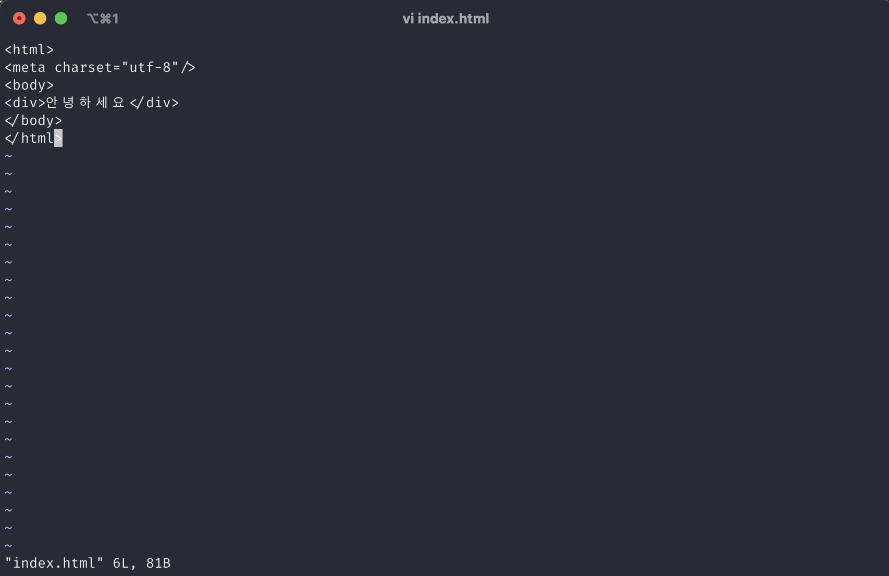

### 1) 아파치 컨테이너 생성

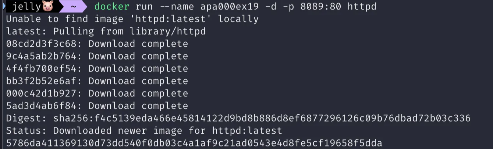

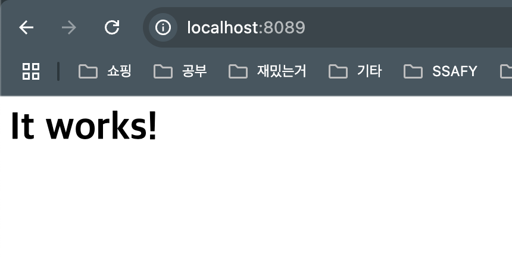

아파치의 초기 화면

### 2) 호스트에서 컨테이너로 파일 복사

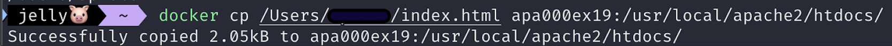

### 3) 확인

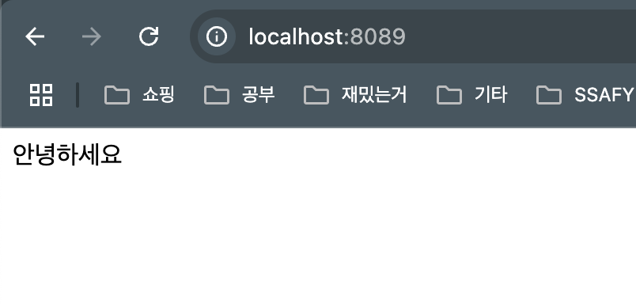

- 처음 페이지를 로드했을 때 페이지 변경 사항이 반영되지 않아 여전히 It works!가 나옴
    - 강력 새로고침으로 해결(기존에 캐시된 리소스를 무시하고 서버에서 최신 데이터를 가져옴)

## [실습] 컨테이너 파일을 호스트로 복사

### 실습 내용

- 아파치 컨테이너 생성 및 실행 → 파일 복사 → 확인
- 반대로 아파치 컨테이너의 파일을 호스트로 복사해보자

### 1) 컨테이너에서 호스트로 파일을 복사

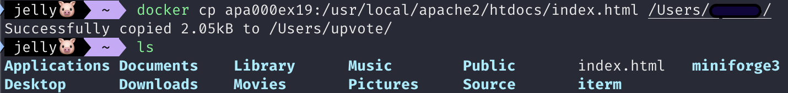

# 3. 볼륨 마운트

## 볼륨과 마운트

- 볼륨
    - 스토리지의 한 영역을 분할한 것
- 마운트
    - 대상을 연결해 운영체제 또는 소프트웨어의 관리하에 두는 것
    - 마운트를 하면 컨테이너가 외부에 있는 데이터를 다룰 수 있음

## 데이터 퍼시스턴시

- ‘쓰고 버리는’ 도커의 성격 상, 컨테이너는 언젠가는 삭제됨(ex. 소프트웨어 업데이트)
    - 컨테이너 속에 데이터가 있다면 데이터도 함께 소멸됨
- 컨테이너는 생성 및 폐기가 매우 빈번하므로 매번 데이터를 옮기는 대신 처음부터 컨테이너 외부에 둔 데이터에 접근해 사용하는 것이 일반적임
- 이것이 데이터 퍼시스턴시(data persistency)이고, 이때 데이터를 두는 장소가 마운트된 스토리지 영역이다

## 스토리지 마운트 종류

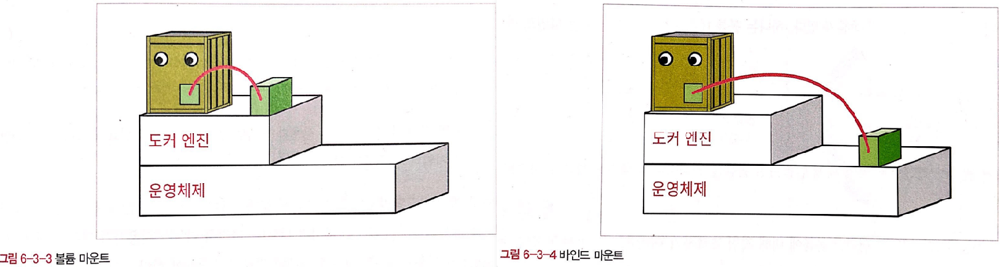

### 볼륨 마운트

- 도커 엔진이 관리하는 영역 내에 만들어진 볼륨을 컨테이너에 디스크 형태로 마운트
- 이름만으로 관리가 가능하므로 다루기 쉬움 but 직접 조작하기 어려움
- 임시 목적의 사용, 자주 쓰지 않지만 지우면 안되는 파일을 두는 목적으로 많이 사용함

### 바인드 마운트

- 도커 엔진에서 관리하지 않는 영역의 기존 디렉터리를 컨테이너에 마운트
- 디렉터리 또는 파일 단위로 마운트
- 폴더(디렉터리) 속에 파일을 직접 두거나 열어볼 수 있기 때문에 자주 사용하는 파일을 두는 데 사용

### [참고] 임시 메모리(tmpfs) 마운트

- 디스크가 아닌 주 메모리 영역을 마운트
- 디스크보다 훨씬 빠른 속도로 읽고 쓰기 가능 → 접근 속도를 높일 목적으로 사용
- but 도커 엔진이 정지되거나 호스트가 재부팅되면 소멸함

## 두 가지 마운트 방식의 차이점

- 간단한지 복잡한지
- 호스트 컴퓨터에서 파일을 다룰 필요가 있는지
- 환경의 의존성을 배제해야 하는지

| 항목 | 볼륨 마운트 | 바인드 마운트 |
| --- | --- | --- |
| 스토리지 영역 | 볼륨 | 디렉터리 또는 파일 |
| 물리적 위치 | 도커 엔진의 관리 영역 | 아무 곳이나 가능 |
| 마운트 절차 | 볼륨 생성 → 마운트 | 기존 파일 또는 폴더를 마운트 |
| 내용 편집  | 도커 컨테이너를 통해 편집 | 일반적인 파일과 동일 |
| 백업 | 복잡한 절차 존재 | 일반적인 파일과 동일 |
- 볼륨 마운트
    - 도커 제작사에서 권장하는 방법
    - 장점
        - 도커 엔진 관리 하에 있으므로 사용자가 파일 위치 신경쓸 필요 없음
        - 실수로 지워버릴 일이 없다
        - 환경에 따라 경로가 바뀌는 일이 없다
        - 익숙해지면 손쉽게 사용할 수 있음
    - 단점
        - 컨테이너를 경유하지 않고 직접 볼륨에 접근할 방법이 없고, 억지로 볼륨을 수정하려 하면 볼륨 자체가 깨질 우려가 있다
        - 백업에도 복잡한 절차가 필요
- 바인드 마운트
    - 장점
        - 기존과 동일한 방식으로 파일 사용 가능
        - 도커 엔진과 무관하게 파일을 다룰 수 있음
- 파일을 직접 편집할 일이 많다면(ex. 워드프레스) 바인드 마운트를, 그렇지 않다면 볼륨 마운트를 사용하자

## 스토리지 영역 마운트 방법

- 마운트하려는 스토리지의 경로가 컨테이너 속 특정 경로와 연결되도록 설정
    - run 커맨드의 옵션 형태로 지정해야 함

### 스토리지 마운트 절차

- 마운트될 스토리지 생성
    - 볼륨 마운트의 경우 마운트와 동시에 볼륨을 만들 수 있긴 하지만 권장하지는 않음
    - 마운트 전에 별도로 볼륨을 먼저 생성하는 것이 좋다

### 스토리지 영역 만들기

- 바인드 마운트
    - 원본이 될 폴더(디렉터리)나 파일 먼저 생성
- 볼륨 마운트
    - 볼륨 상위 커맨드를 사용해 먼저 볼륨을 생성

```bash
docker volume create <볼륨_이름>  # 볼륨 생성
docker volume rm <볼륨_이름>  # 볼륨 삭제
```

### 스토리지 마운트 커맨드

| command | 내용 |
| --- | --- |
| create | 볼륨 생성 |
| inspect | 볼륨 상세 정보 출력 |
| ls | 볼륨 목록 출력 |
| prune | 현재 마운트되지 않은 볼륨을 모두 삭제 |
| rm | 지정한 볼륨을 삭제 |

## [실습] 바인드 마운트

### 실습 내용

- 폴더 생성 → 아파치 컨테이너 생성 → 초기 화면 확인 → index.html 파일 배치 → 확인
- 바인드 마운트를 통해 컨테이너 실행하기

```docker
docker run --name <컨테이너명> -d -p <로컬port>:<컨테이너port> -v <로컬 디렉토리 경로>:<컨테이너 디렉토리 경로> <이미지 이름>
```

### 1) 마운트 원본 디렉토리 생성

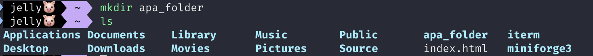

### 2) 로컬 디렉토리를 바인드 마운트 하여 아파치 컨테이너 실행

```docker
docker run --name apa000ex20 -d -p 8090:80 -v /Users/seoyun/apa_folder:/usr/local/apache2/htdocs httpd
```

### 3) 웹 브라우저를 통해 아파치에 접근해 초기 화면 확인

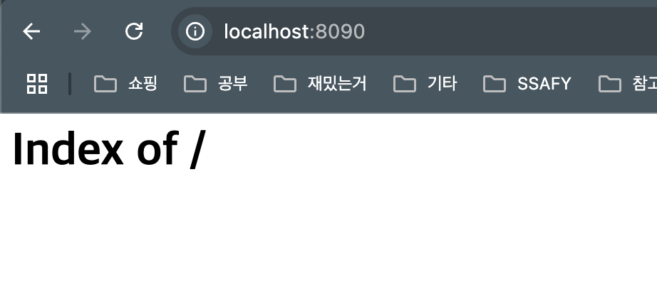

- 아무 파일도 없다면 `It Works!`가 적힌 초기 화면이 출력되어야 하지만 디렉토리가 존재하기 때문에 `Index of /` 가 출력됨

### 4) 마운트된 디렉토리에 index.html 파일 배치

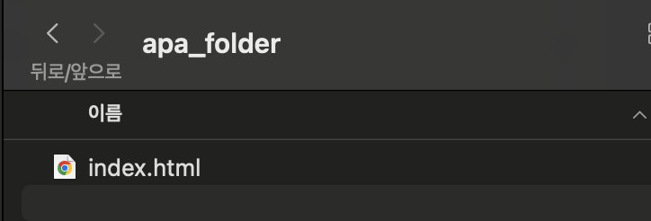

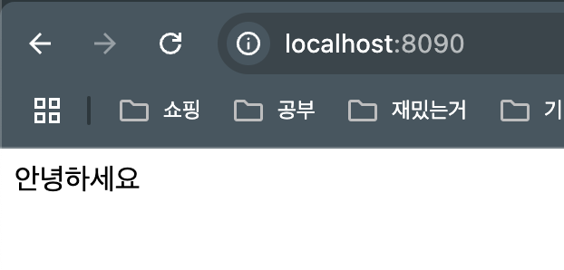

- index.html 파일이 마운트 된 것을 확인할 수 있다

## [실습] 볼륨 마운트

### 실습 내용

- 볼륨 생성 → 아파치 컨테이너 생성 → 확인
- 볼륨 마운트 명령어

```docker
	# 볼륨 생성
	docker volume create <볼륨명>
	
	# 볼륨 상세 정보 확인
	docker volume inspect <볼륨명>
	
	# 볼륨 삭제
	docker volume rm <볼륨명>
```

### 1) 마운트할 볼륨 생성

```docker
docker volume create <볼륨이름>
```

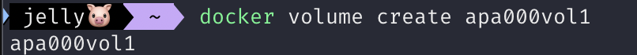

### 2) 아파치 컨테이너 실행

```docker
docker run --name apa000ex21 -d -p 8091:80 -v apa000vol1:/usr/local/apache2/htdocs httpd
```

### 3) 볼륨 상세 정보 확인

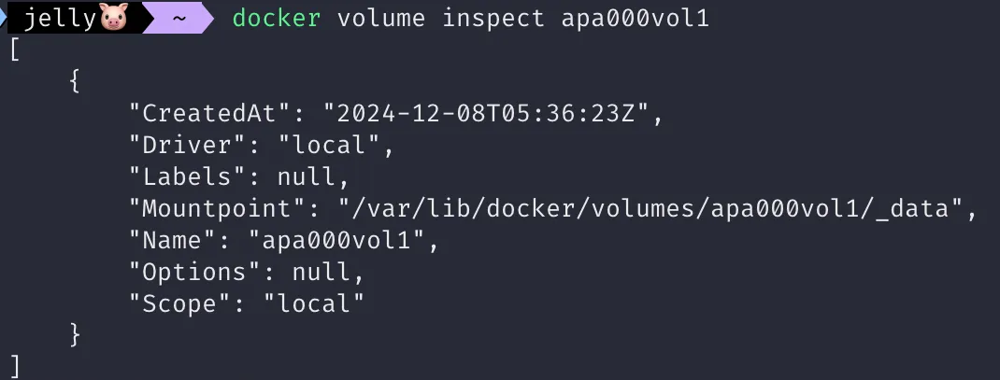


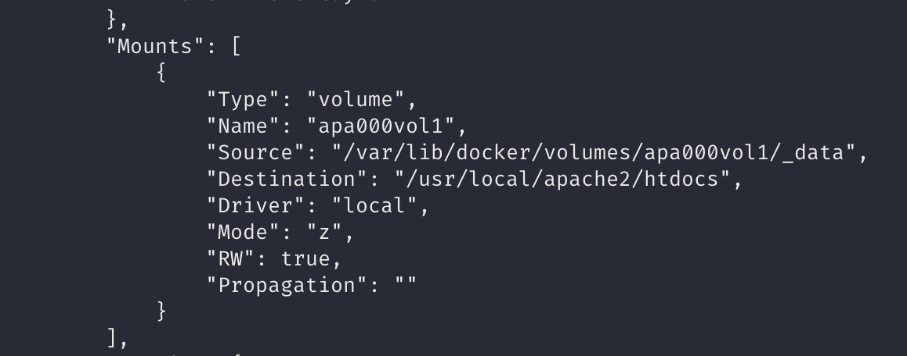

## [참고] 볼륨 마운트 확인

### 운영 환경에서 확인하는 방법

- 별도의 컨테이너에 해당 볼륨을 마운트하고 이 컨테이너에서 볼륨의 내용을 보는 방법
- 원래 컨테이너에서 읽고쓰기한 데이터를 다른 컨테이너에서 확인하는 것으로 마운트를 확인

### 학습 환경에서 확인하는 방법

- 볼륨과 컨테이너는 별개의 요소로, 컨테이너를 폐기해도 볼륨은 그대로 남음
- 볼륨에 읽고 쓰기를 마친 후 해당 컨테이너를 삭제하고, 동일한 볼륨을 마운트해 새로운 컨테이너 생성
- 첫 번째 컨테이너에서 제대로 볼륨이 마운트 되었다면 두 번째 컨테이너에서 수정된 데이터 확인 가능

## [참고] 볼륨 백업

- 바인드 마운트라면 파일 복사만으로 백업이 끝나지만, 볼륨 마운트는 백업이 까다로움
- 볼륨 자체를 복사할 수 없기 때문에 별도의 리눅스 컨테이너를 연결해 볼륨의 내용을 압축하여 저장한다
    - 컨테이너 생성(run)과 함께 tar 명령어로 백업을 수행
    - 압축 파일을 컨테이너 밖에 저장해야 함

### 백업 과정

- 주 컨테이너의 종료를 확인 → 리눅스 운영체제 컨테이너를 만들고 tar 명령어를 사용해 백업 수행

### 백업 명령어

```docker
docker run --rm -v <볼륨명>:/source -v <백업 저장 폴더명>:/target busybox tar cvzf /target/<백업파일이름>.tar.gz -C /source .
```

- `docker run --rm`
    - run 커맨드로 리눅스 운영체제(busybox) 컨테이너 실행
    - ubuntu, CentOS와 같은 리눅스 배포판 컨테이너를 사용해도 되지만, busybox가 가벼워서 사용하기 좋다
    - 이 컨테이너는 실행 후 바로 삭제할 예정이므로 `--rm` 옵션을 추가
- `-v <볼륨명>:/source`
    - 볼륨을 busybox 컨테이너의 /source에 마운트
    - 볼륨마운트
- `-v <백업 저장 폴더명>:/target`
    - 백업이 저장될 호스트의 폴더를 busybox의 컨테이너의 /target에 마운트
    - 바인드 마운트
- `tar cvzf /target/<백업파일이름>.tar.gz -C /source .`
    - /source의 내용을 /target 안의 <백업파일이름>.tar.gz 로 압축해 저장

```docker
# ex
docker run --rm -v apa000vol1:/source -v /Users/seoyun/Documents:/target busybox tar czvf /target/backup_apa.tar.gz -C /source .
```

### 복원 명령어

```docker
docker run --rm -v apa000vol2:/source -v /Users/seoyun/Documents:/target busybox tar xzvf /target/backup_apa.tar.gz -C /source
```

# 4. 컨테이너로 이미지 만들기

## 컨테이너로 이미지 만드는 방법

### commit 커맨드로 컨테이너를 이미지로 변환

- 기존 컨테이너를 이미지로 변환하는 방법
- 컨테이너만 있으면 명령어 한 번으로 이미지를 만들 수 있어 간편함
- 컨테이너를 먼저 만들어야 한다

```bash
docker commit <컨테이너_이름> <새로운_이미지_이름>
```

### Dockerfile 스크립트로 이미지 만들기

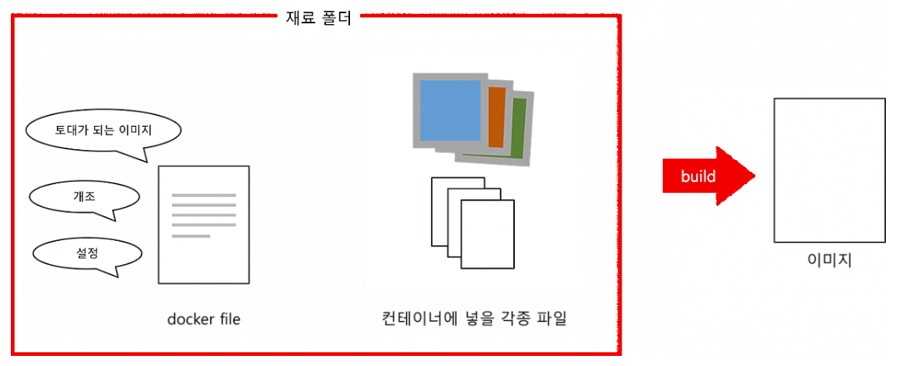

- Dockerfile 스크립트를 작성하고 이 스크립트를 빌드해 이미지 만들기
- Dockerfile로는 이미지 만드는 일 밖에 할 수 없다

```bash
docker build -t <생성할_이미지_이름> <재료_폴더_경로>
```

```docker
FROM 이미지_이름
COPY 원본_경로 대상_경로
RUN 리눅스_명령어
...
```

- 주요 Dockerfile 인스트럭션

| 인스트럭션 | 내용 |
| --- | --- |
| FROM | 토대가 되는 이미지 지정 |
| ADD | 이미지에 파일이나 폴더 추가 |
| COPY | 이미지에 파일이나 폴더 추가 |
| RUN | 이미지를 빌드할 때 실행할 명령어 지정 |
| CMD | 컨테이너 실행할 때 실행할 명령어 지정 |
| ENTRYPOINT | 컨테이너 실행할 때 실행할 명령어 강제 지정 |
| ONBUILD | 이 이미지를 기반으로 다른 이미지를 빌드할 때 실행할 명령어 지정 |
| EXPOSE | 이미지가 통신에 사용할 포트를 명시적으로 지정 |
| VOLUME | 퍼시스턴시 데이터를 지정할 경로를 명시적으로 지정 |
| ENV | 환경 변수를 정의 |
| WORKDIR | RUN, CMD, ENTRYPOINT, ADD, COPY에 정의된 명령어를 실행하는 작업 디렉터리 지정 |
| SHELL | 빌드 시 사용할 쉘 변경 |
| LABEL | 이름이나 버전, 저작자 정보 설정 |
| USER | RUN, CMD, ENTRYPOINT, ADD, COPY에 정의된 명령어를 실행하는 사용자 또는 그룹 지정 |
| ARG | docker build 커맨드 사용할 때 입력받을 수 있는 인자 선언 |
| STOPSIGNAL | docker stop 커맨드를 사용할 때 컨테이너 안에서 실행 중인 프로그램에 전달되는 시그널 변경 |
| HEALTHCHECK | 컨테이너 헬스체크 방법을 커스터마이징 |

## [실습] 컨테이너를 이미지로 변환

### 실습 내용

- 아파치 컨테이너 생성 및 실행 → 컨테이너를 이미지로 변환 → 확인

### 0) 아파치 컨테이너 준비

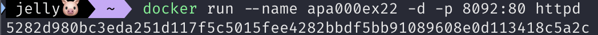

### 1) 컨테이너를 변환한 새로운 이미지 생성

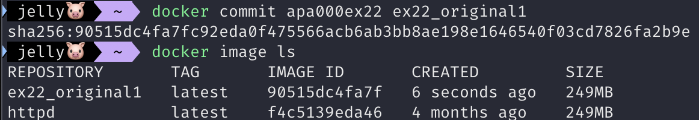

## [실습] Dockerfile 스크립트로 이미지 만들기

### 실습 내용

- Dockerfile 스크립트 작성 → 이미지 빌드 → 확인
- Dockerfile 스크립트로 이미지 빌드

```docker
docker build -t <빌드할_이미지_이름> <재료_폴더_경로>
```

### 1) 재료 폴더에 재료 준비

- 재료 폴더(apa_folder)에 index.html을 배치

### 2) Dockerfile 스크립트 작성

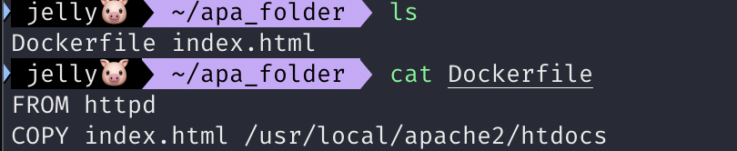

### 3) 이미지 빌드

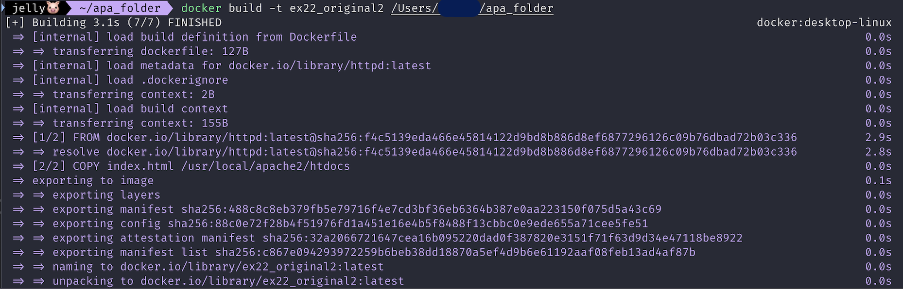

### 4) 이미지 생성 확인

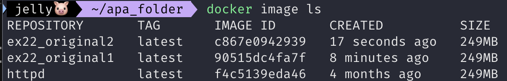

## [참고] 이미지 옮기는 방법

- 컨테이너는 이미지로 변환하지 않으면 복사할 수 없음
- 이미지 또한 상태 그대로 옮기거나 복사할 수 없고, 도커 레지스트리를 통하거나, save 커맨드를 사용해 tar 포맷으로 도커 엔진의 관리 영역 밖으로 내보내야 함
- 파일을 호스트 컴퓨터의 파일 시스템에 생성하고, 다시 도커 엔진에 가져오려면 load 커맨드 사용

```docker
docker save -o <파일_이름>.tar <이미지_이름>
```

# 5. 컨테이너 개조

## 컨테이너 개조?

- 컨테이너를 수정해야 할 때 설정 파일을 매번 작성하기 힘들기 때문에 컨테이너를 개조해 사용

### 컨테이너 개조 방법

1. 파일 복사와 마운트를 이용한 방법
2. 컨테이너에서 리눅스 명령어를 실행하는 방법 (소프트웨어 설치, 설정 변경)

### 리눅스 명령어를 실행하기 위한 Shell

- Shell
    - 명령어를 리눅스에 전달해 주는 프로그램
    - 일반적으로는 bash가 설치되어 있다
- 컨테이너를 아무 설정 없이 실행하면 bash가 동작하지 않는 상태로 실행됨
    - `/bin/bash` 인자를 `docker run` 커맨드와 함께 실행
    - 실행 중인 컨테이너에서 bash를 사용하기 위해너는 `docker exec` 사용
- `docker exec`로 실행한 경우
    - 컨테이너 속에서 명령어를 실행함
    - bash 없이도 어느 정도 명령을 직접 전달할 수는 있음
    - but 초기 설정이 없어 동작하지 않는 경우도 있기 때문에 기본적으로는 셸을 통해 명령을 실행
    
    ```bash
    docker exec (옵션) <컨테이너_이름> /bin/bash
    ```
    
- `docker run` 커맨드에 인자를 붙여 실행한 경우
    - 컨테이너에 들어있는 소프트웨어(ex. 아파치)를 실행하는 대신 bash가 실행되므로, 컨테이너는 실행 중인데 소프트웨어는 실행 중이 아닌 상태가 됨
    - bash를 사용한 조작이 끝나고 나면 다시 `docker start` 커맨드로 컨테이너를 재시작해야 함
    
    ```bash
    docker run (옵션) <이미지_이름> /bin/bash
    ```
    
- bash가 실행되면 셸에 입력된 명령은 도커 엔진이 아니라 해당 컨테이너로 전달됨
    - bash를 통해 컨테이너 내부를 조작하는 동안 도커 명령을 사용할 수 없음
    - 컨테이너 안에서 할 일을 마쳤다면 다시 컨테이너에서 나와야 함
    
    ```bash
    # 컨테이너에서 나오는 명령어
    exit
    ```
    

## 도커 엔진을 통해야 하는 명령, 컨테이너 안에서 실행해야 하는 명령

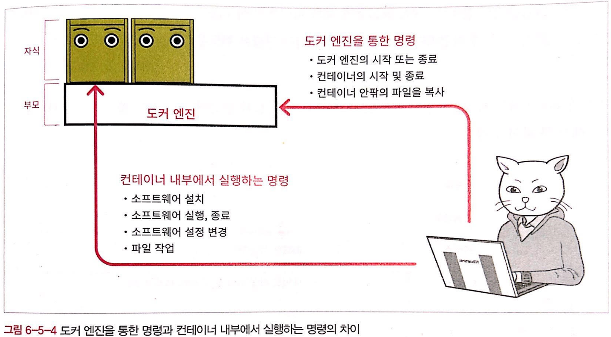

### 도커 엔진을 통한 명령

- 도커 엔진 자체의 시작 또는 종료, 네트워크, 디스크 설정, 실행 중인 컨테이너 목록 확인 등
- 컨테이너 전체에 대한 관리 작업
- docker 명령어로 실행

### 컨테이너 내부에서 실행하는 명령

- 컨테이너 속에 새로운 소프트웨어를 추가하거나, 컨테이너 속 소프트웨어의 실행 및 종료, 설정 변경, 컨테이너 안과 밖의 파일 복사 및 이동, 삭제 작업 등

### 도커와 컨테이너는 별개의 언어를 사용

- 컨테이너 안에 들어있는 OS에 따라 명령어가 조금씩 달라짐
    - A 컨테이너가 데비안 계열, B 컨테이너가 리눅스 계열이라면, 두 컨테이너에서 사용하는 명령어는 다를 수 있다
- 헷갈리기 쉬우므로 도커에서는 공식적으로 특별한 이유가 없다면 데비안 계열을 기반으로 하는 것을 권장함

# 6. 도커 허브 등록 및 로그인

## 도커 이미지

- 도커에서 이미지를 내려받는 곳은 **도커 허브**
- 직접 만든 이미지도 도커 허브에 올릴 수 있으며, 비공개로 사용하는 장소도 만들 수 있다

## 도커 허브와 도커 레지스트리

- 도커 레지스트리
    - 이미지를 배포하는 장소
    - 일반에 공개되어 있든 비공개이든 상관없이 이미지가 배포되는 곳은 모두 도커 레지스트리다
- 도커 허브
    - 도커 제작사에서 운영하는 공식 도커 레지스트리
    - 아파치, MySQL, 우분투 공식 이미지 모두 도커 허브에 참여해 도커 허브에서 이미지를 배포함
    - run 커맨드를 이용해 내려받는 이미지는 도커 허브에서 제공됨

### 레지스트리와 리포지토리

- 레지스트리
    - 등록 장부
    - 이미지를 배포하는 장소
- 리포지토리
    - 창고
    - 레지스트리를 구성하는 단위
- 도커 허브에는 리포지토리가 각각 ID를 갖게 됨
    - 도커 허브는 각각 회사나 개인이 가진 레지스트리가 여럿 모인 형태가 된다

## 태그와 이미지 업로드

- 이미지를 업로드하려면 이미지에 태그를 부여해야 함

### 이미지 이름과 태그

- 태그
    - 레지스트리에 업로드를 상정한 이미지 이름
    - 레지스트리의 주소와 버전 표기를 추가해 정식 명칭을 부여하는 작업
    - ex. nyangpa00ex22 → zoozoo.comm/nyappacchi:13
    - `레지스트리_주소(또는 도커허브_ID)/리포지토리_이름:버전`
- 비공개 레지스트리 태그 명명 예

| 비공개 레지스트리 태그 | 레지스트리_주소/리포지토리_이름:버전 |
| --- | --- |
| localhost에 만든 레지스트리
리포지토리 이름은 nyappacchi, ver13 | localhost:5000/nyappacchi:13 |
| 레지스트리 도메인 zoozoo.comm
리포지토리이름 nyappacchi, ver13 | zoozoo.comm/nyappacchi:13 |
- 도커 허브 태그 명명 예

| 도커 허브 태그 | 도커허브_ID/리포지토리_이름:버전 |
| --- | --- |
| 도커허브ID zoozoousagi
리포지토리 이름 nyapacchi, ver13 | zoozoousagi/nyappacchi:13 |

### 이미지에 태그를 부여해 복제

- 원래 있던 이미지 이름을 태그로 바꾸고 이미지를 복제

```bash
docker tag <원래_이미지_이름> <레지스트리_주소/리포지토리_이름:버전>
```

- 명령어 실행 후 image ls 커맨드로 이미지 목록 확인해 보면 원래 이미지와 태그 부여된 이미지 둘 다 존재
    - 이미지 ID는 동일하지만 별개의 이미지로 취급됨
    - 삭제할 때 두 가지 모두 삭제해야 함

### 이미지 업로드

```bash
docker push <레지스트리_주소/리포지토리_이름:버전>
```

- 태그는 ‘레지스트리 주소/리포지토리 이름:버전’ 과 같이 길어서 보기 힘들지만 그 자체로 하나의 이름임
    - 도커 엔진은 태그에 포함된 레지스트리 주소의 도메인에 있는 레지스트리로 업로드를 시도함
    - 리포지토리는 처음 업로드할 때 존재하지 않고, push 커맨드를 실행하며 만들어짐

## 레지스트리 만드는 방법

- 개발 회사는 대개 사내용 도커 레지스트리를 만들고 여기에 개발환경 이미지를 올려 배포
- 외부 공개를 목적으로 한다면 도커 허브

### 비공개 레지스트리 만드는 방법

- 레지스트리용 컨테이너(registry) 사용
    - 레지스트리도 도커를 통해 운영된다

```bash
docker run -d -p 5000:5000 registry
```

- 컨테이너를 만들면 사용자는 레지스트리에 로그인하고 다음 이미지를 내려받을 곳으로 이 레지스트리를 지정
- 레지스트리는 포트 5000번을 사용

### 도커 허브 사용

- 이메일 주소만 있으면 누구든지 도커 허브에 가입할 수 있음
- 도커 허브에 이미지를 업로드하면 전 세계 사람들에게 이미지를 배포할 수 있음
    - push 커맨드로 리포지토리 만들면 자동으로 공개 상태가 됨
    - 비공개 설정을 하려면 미리 리포지토리 만들어 두어야 함