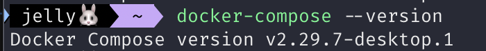
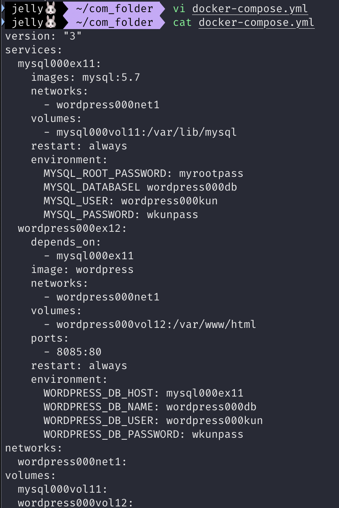
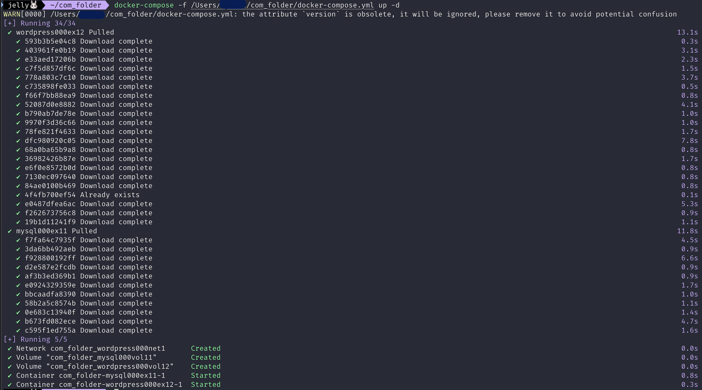
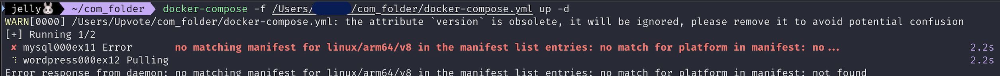

# 1. 도커 컴포즈란?

## 도커 컴포즈란?

- 시스템 구축과 관련된 명령어를 하나의 텍스트 파일(정의 파일, Compose file)에 기재해 명령어 한 번에 시스템 전체를 실행하고 종료와 폐기까지 한 번에 하도록 도와주는 도구

### 도커 컴포즈의 구조

- 정의 파일
    - 컨테이너나 볼륨을 어떠한 설정으로 만들지에 대한 항목이 기재됨
    - 작성 내용은 도커 명령어와 비슷하지만 도커 명령어는 아니다


- `up` 커맨드
    - `docker run` 커맨드와 비슷
    - 정의 파일에 기재된 내용대로 이미지를 내려받고 컨테이너를 생성 및 실행
    - 네트워크나 볼륨에 대한 정의도 기재할 수 있어 주변 환경을 한꺼번에 생성 가능
- `down` 커맨드
    - 컨테이너와 네트워크를 정지 및 삭제
        - 삭제 없이 종료만 하고 싶다면 `stop` 커맨드 사용
    - 볼륨과 이미지는 삭제하지 않음

### 도커 컴포즈와 Dockerfile 스크립트의 차이점

- 도커 컴포즈
    - docker run 명령어를 여러 개 모아놓은 것과 같음
    - 컨테이너와 주변 환경을 생성(네트워크, 볼륨)
- Dockerfile 스크립트
    - 이미지를 만들기 위한 것
    - 네트워크나 볼륨은 만들 수 없음

### [참고] 도커 컴포즈와 쿠버네티스의 차이점

- 쿠버네티스
    - 여러 개의 도커 컨테이너를 관리하는 도구
- 도커 컴포즈는 컨테이너를 생성하고 삭제하는 것 뿐이므로, 컨테이너 관리 기능은 없다

# 2. 도커 컴포즈의 설치와 사용법

## [실습] 도커 컴포즈 설치

- 도커 컴포즈, 쿠버네티스 모두 도커 엔진과는 별개의 소프트웨어
- but 도커 컴포즈로 생성한 컨테이너는 도커 엔진으로 똑같이 관리할 수 있다

### 1) 도커 컴포즈 설치

- 윈도우나 macOS에는 도커 데스크톱을 설치할 때 함께 설치됨
- 리눅스에서는 파이썬 런타임과 도커 컴포즈를 아래와 같이 설치

```bash
sudo apt install -y python3 python3-pip
sudo pip3 install docker-compose
```

### 2) 확인 및 실행



- 도커 컴포즈는 설치되면 바로 실행 가능한 상태가 됨

## 도커 컴포즈의 사용법


- 도커 컴포즈를 사용하려면 Dockerfile로 이미지를 빌드할 때처럼 호스트 컴퓨터에 폴더를 만들고 이 폴더에 정의 파일(YAML파일)을 배치
- 정의 파일의 이름은 `docker-compose.yml`
    - 다른 이름을 사용할 때는 인자로 이름을 지정
- 파일은 호스트 컴퓨터에 배치되지만 명령어는 도커 엔진에 전달되며, 만들어진 컨테이너도 도커 엔진 위에서 동작함
    - 도커 컴포즈가 명령어를 도커 엔진에 대신 전달해주는 구조
- 정의 파일은 한 폴더에 하나만 존재해야 함
    - 여러 개의 정의 파일을 사용하려면 그 개수만큼 폴더를 만들어야 함
    - 컨테이너 생성에 필요한 이미지 파일, HTML 파일 모두 컴포즈가 사용할 폴더에 함께 둔다

## [참고] 서비스와 컨테이너

- 서비스
    - 도커 컴포즈에서 컨테이너가 모인 것
- 컨테이너와 서비스 모두 컨테이너로 이해하면 된다

# 3. 도커 컴포즈 파일 작성법

## 도커 컴포즈 정의 파일 내용

- 도커 컴포즈는 정의 파일을 그대로 실행하는 역할을 하므로 컴포즈 파일이 반드시 필요함
- 컴포즈 파일 예 1) 아파치 서버
    
    ```bash
    version: "3"
    
    services:
    	apa000ex2:
    		image: httpd
    		ports:
    			- 8080:80
    		restart: always
    ```
    
    - 위 컴포즈 파일은 아래 명령어와 동일한 동작을 수행한다
    
    ```bash
    docker run --name apa000ex2 -d -p 8080:80 httpd
    ```
    
- 컴포즈파일 예 2) 워드프레스
    
    ```bash
    version: "3"
    
    services:
    	wordpress000ex12:
    		depends_on:
    			- mysql000ex11
    		image: wordpress
    		networks:
    			- wordpress000net1
    		port:
    			- 8085:80
    		restart: always
    		environment:
    			WORDPRESS_DB_HOST=mysql000ex11
    			WORDPRESS_DB_NAME=wordpress000db
    			WORDPRESS_DB_USER=wordpress000kun
    			WORDPRESS_DB_PASSWORD=wkunpass
    ```
    
    - 위 컴포즈 파일은 아래 명령어와 동일한 동작을 수행한다
    
    ```bash
    docker run --name wordpress000ex12 -dit --net=wordpress000net1 \
    -p 8085:80 -e WORDPRESS_DB_HOST=mysql000ex11 -e \
    WORDPRESS_DB_NAME=wordpress000db -e WORDPRESS_DB_USER=wordpress000kun \
    -e WORDPRESS_DB_PASSWORD=wkunpass wordpress
    ```
    

## 컴포즈파일 작성법

- 정의 파일은 YAML 형식을 따름
    - 파일의 확장자는 .yml
- 파일 이름은 `docker-compose.yml` 을 사용
    - -f 옵션을 사용해 파일 이름을 지정하면 다른 이름 사용 가능

### 컴포즈 파일 작성하는 방법

- 맨 앞에 컴포즈 버전을 적고, 그 뒤로 services, networks, volumes를 차례로 기재
- 작성 요령은 주 항목 → 이름 추가 → 설정
    - 주 항목
        
        ```bash
        version: "3"   # 버전 기재
        services:      # 컨테이너 관련 정보
        networks:      # 네트워크 관련 정보
        volumes:       # 볼륨 관련 정보
        ```
        
    - 이름 추가
        
        ```bash
        version: "3"
        services:
          컨테이너_이름1:
          컨테이너_이름2:
        networks:
        	네트워크_이름:
        volumes:
        	볼륨_이름1:
        	볼륨_이름2:
        ```
        
        - YAML 형식에는 공백에 따라 의미가 달라짐
            - 탭은 사용할 수 없다
            - 들여쓰기 시 공백 개수 동일하게 사용할 것
        - 이름 뒤에는 반드시 콜론(:)
            - 콜론 뒤에 공백이 있어야 한다
            - 오류가 발생하기 쉬운 지점
    - 각 컨테이너 설정 기재
        
        ```bash
        version: "3"
        services:
          컨테이너_이름1:
            image: 이미지_이름
        		networks:
        			- 네트워크_이름
        		ports:
        			- 포트_설정
        		...
          컨테이너_이름2:
        		image: 이미지_이름
        		...
        		
        volumes:
        	볼륨_이름1:
        	볼륨_이름2:
        	...
        ```
        
        - 기재할 내용이 한 가지일 경우
            - 콜론 뒤에 이어 적으면 됨
        - 기재할 내용이 여러가지일 경우
            - 줄을 바꿔 하이픈(-)을 앞에 적고 들여쓰기 맞추기

### 컴포즈 파일 작성 요령 정리

```
컴포즈 파일(YAML 형식)의 작성 요령

- 첫 줄에 도커 컴포즈 버전을 기재
- 주 항목 services, networks, volumes 아래에 설정 내용을 기재
- 항목 간의 상하 관계는 공백을 사용한 들여쓰기로 나타냄
- 들여쓰기는 같은 수의 배수만큼의 공백을 사용
- 이름은 주 항목 아래에 들여쓰기를한 다음 기재
- 컨테이너 설정 내용은 이름 아래에 들여쓰기한 다음 기재
- 여러 항목을 기재하려면 줄 앞에 '-' 붙임
- 이름 뒤에는 콜론(:) 붙임
- 콜론 뒤에는 반드시 공백이 와야 함(바로 줄바꿈하는 경우는 예외)
- # 뒤의 내용은 주석으로 간주
- 문자열은 작은따옴표(') 또는 큰따옴표(")로 감싸 작성
```

### 컴포즈 파일의 항목

- 주 항목
    
    
    | 항목 | 내용 |
    | --- | --- |
    | services | 컨테이너 정의 |
    | networks | 네트워크 정의 |
    | volumes | 볼륨을 정의 |
- 자주 나오는 정의 내용
    
    
    | 항목 | docker run 커맨드의 해당 옵션 또는 인자 | 내용 |
    | --- | --- | --- |
    | image | 이미지 인자 | 사용할 이미지를 지정 |
    | networks | --net | 접속할 네트워크를 지정 |
    | volumes | -v, --mount | 스토리지 마운트를 설정 |
    | ports | -p | 포트 설정 |
    | environment | -e | 환경변수 설정 |
    | depends_on | 없음 | 다른 서비스에 대한 의존관계를 정의 |
    | restart | 없음 | 컨테이너 종료 시 재시작 여부를 설정 |
    - depends_on
        - 다른 서비스에 대한 의존 관계
        - ex. penguine 컨테이너 정의에 `depends_on: -namgeuk` 이 작성되어 있다면
            - namgeuk 컨테이너 생성 후 penguin 컨테이너 만듦
        - 워드프레스처럼 MySQL 컨테이너가 먼저 있어야 하는 경우 컨테이너 생성 순서를 지정할 수 있다
    - restart
        - 컨테이너 종료 시 재시작 여부 설정 가능
        - restart의 설정값
            
            
            | 설정값 | 내용 |
            | --- | --- |
            | no | 재시작하지 않음 |
            | always | 항상 재시작 |
            | no-failure | 프로세스가 0 이외의 상태로 종료되었다면 재시작 |
            | unless-stopped | 종료 시 재시작하지 않음. 그 외에는 재시작 |
- 그 외 정의 항목
    
    
    | 항목 | docker run 커맨드의 해당 옵션 또는 인자 | 내용 |
    | --- | --- | --- |
    | command | 커맨드 인자 | 컨테이너 시작 시 기존 커맨드 오버라이드 |
    | container_name | --name | 실행할 컨테이너의 이름을 명시적으로 지정 |
    | dns | --dns | DNS 서버를 명시적으로 지정 |
    | env_file | 없음 | 환경설정 정보를 기재한 파일을 로드 |
    | entrypoint | --entrypoint | 컨테이너 시작 시 ENTRYPOINT 설정을 오버라이드 |
    | external_links | --link | 외부 링크를 설정 |
    | extra_hosts | --add-host | 외부 호스트의 IP 주소를 명시적으로 지정 |
    | logging | --log-driver | 로그 출력 대상을 설정 |
    | network_mode | --network | 네트워크 모드를 설정 |

## [참고] 컴포즈 파일

- 도커 컴포즈로 만든 컨테이너 → 도커 엔진을 통해 명령 가능
    - but 도커 엔진을 통해 내린 명령 → 컴포즈 파일에 반영 X

## [실습] 컴포즈 파일 작성

### 실습 내용

- 주 항목 설정 → 이름 작성 → MySQL 컨테이너 정의 작성 → 워드프레스 컨테이너 정의 작성

### 1) docker-compose.yml 파일 작성

- com_folder에 docker-compose.yml 파일을 작성
    - 주 항목 → 이름 → 각 컨테이너별 설정 작성

### 2) 주 항목 작성

```bash
version: "3"
services:
networks:
volumes:
```

### 3) 이름 작성

```bash
version: "3"
services:
  mysql000ex11:
  wordpress000ex12:
networks:
  wordpress000net1:
volumes:
  mysql000vol11:
  wordpress000vol12:
```

### 4) MySQL 컨테이너 정의 작성

```bash
version: "3"
services:
  mysql000ex11:
    images: mysql:5.7
    networks:
      - wordpress000net1
    volumes:
      - mysql000vol11:/var/lib/mysql
    restart: always
    environment:
      MYSQL_ROOT_PASSWORD: myrootpass
      MYSQL_DATABASEL wordpress000db
      MYSQL_USER: wordpress000kun
      MYSQL_PASSWORD: wkunpass
  wordpress000ex12:
networks:
  wordpress000net1:
volumes:
  mysql000vol11:
  wordpress000vol12:
```

### 5) 워드프레스 컨테이너 정의 작성

```bash
version: "3"
services:
  mysql000ex11:
    images: mysql:5.7
    networks:
      - wordpress000net1
    volumes:
      - mysql000vol11:/var/lib/mysql
    restart: always
    environment:
      MYSQL_ROOT_PASSWORD: myrootpass
      MYSQL_DATABASEL wordpress000db
      MYSQL_USER: wordpress000kun
      MYSQL_PASSWORD: wkunpass
  wordpress000ex12:
		depends_on:
		  - mysql000ex11
		image: wordpress
		networks:
		  - wordpress000net1
		volumes:
		  - wordpress000vol12:/var/www/html
		ports:
		  - 8085:80
		restart: always
		environment:
		  WORDPRESS_DB_HOST: mysql000ex11
		  WORDPRESS_DB_NAME: wordpress000db
		  WORDPRESS_DB_USER: wordpress000kun
		  WORDPRESS_DB_PASSWORD: wkunpass
networks:
  wordpress000net1:
volumes:
  mysql000vol11:
  wordpress000vol12:
```



# 4. 도커 컴포즈 실행

## 도커 컴포즈 커맨드

- 도커 컴포즈는 `docker-compose` 명령을 사용

### 컨테이너와 주변 환경을 생성

- 컴포즈 파일의 내용을 따라 컨테이너, 볼륨, 네트워크를 생성하고 실행

```bash
docker-compose -f <정의_파일_경로> up <옵션>

# ex.
docker-compose -f /Users/seoyun/Documents/com_folder/docker-compose.yml up -d
```

- 옵션 항목
    
    
    | 옵션 | 내용 |
    | --- | --- |
    | -d | 백그라운드 실행 |
    | --no-color | 화면 출력 내용을 흑백으로 |
    | --no-deps | 링크된 서비스 실행하지 않음 |
    | --force-recreate | 설정 또는 이미지가 변경되지 않더라도 컨테이너 재생성 |
    | --no-create | 컨테이너 이미 존재할 경우 다시 생성하지 않음 |
    | --no-build | 이미지가 없어도 이미지 빌드하지 않음 |
    | --build | 컨테이너 실행하기 전에 이미지 빌드 |
    | --abort-on-container-exit | 컨테이너가 하나라도 종료되면 모든 컨테이너 종료 |
    | -t, --timeout | 컨테이너 종료할 때 타임아웃 설정. 기본은 10초 |
    | --remove-orphans | 컴포즈 파일에 정의되지 않은 서비스의 컨테이너는 삭제 |
    | --scale | 컨테이너 수 변경 |

### 컨테이너와 네트워크 삭제

- 컴포즈 파일의 내용에 따라 컨테이너와 네트워크를 종료 및 삭제
    - 볼륨과 이미지는 삭제되지 않음

```bash
docker-compose -f <컴포즈_파일_경로> down <옵션>
```

- 옵션 항목
    
    
    | 옵션 | 내용 |
    | --- | --- |
    | --rmi 종류 | 삭제 시에 이미지도 삭제
    종류를 `all`로 지정하면 사용했던 모든 이미지가 삭제됨
    `local`로 지정하면 커스텀 태그가 없는 이미지만 삭제 |
    | -v, --volumes | volumes 항목에 기재된 볼륨을 삭제
    단, external로 지정된 볼륨은 삭제되지 않음 |
    | --remove-orphans | 컴포즈 파일에 정의되지 않은 서비스의 컨테이너도 삭제 |

### 컨테이너 종료

- 컴포즈 파일의 내용에 따라 컨테이너를 종료

```bash
docker-compose -f <컴포즈_파일_경로> stop <옵션>
```

### 그 밖에 주요 커맨드 목록

| 커맨드 | 내용 |
| --- | --- |
| up | 컨테이너 생성, 실행 |
| down | 컨테이너와 네트워크 종료, 삭제 |
| ps | 컨테이너 목룍 출력 |
| config | 컨테이너 파일 확인, 내용 출력 |
| port | 포트 설정 내용을 출력 |
| logs | 컨테이너가 출력한 내용 화면에 출력 |
| start | 컨테이너를 시작 |
| stop | 컨테이너를 종료 |
| kill | 컨테이너 강제 종료 |
| exec | 명령어 실행 |
| run | 컨테이너 실행 |
| create | 컨테이너 생성 |
| restart | 컨테이너 재실행 |
| pause | 컨테이너 일시 정지 |
| unpause | 컨테이너 일시 정지 해제 |
| rm | 종료된 컨테이너 삭제 |
| build | 컨테이너에 사용되는 이미지 빌드 혹은 재빌드 |
| pull | 컨테이너에 사용될 이미지 내려받기 |
| scale | 컨테이너 수 지정 |
| events | 컨테이너로부터 실시간 이벤트 수신 |
| help | 도움말 화면에 출력 |

## [참고] 도커 컴포즈로 실행한 컨테이너 이름과 스케일링

## [실습] 도커 컴포즈 실행

### 실습 내용

- 네트워크 생성 → MySQL 컨테이너 생성 → 워드프레스 컨테이너 생성 → 확인

### 1) 컴포즈 파일 내용을 실행

- docker-compose up 명령을 실행하면 컴포즈 파일 정의대로 컨테이너 및 주변환경 생성
- Trouble Shooting…
    1. `docker-compose.yml` 파일에 오타가 하나라도 있을 경우 제대로 실행되지 않는다
        
        
        
        - images: mysql:5.7 → image: mysql:5.7
        - MYSQL_DATABASEL → MYSQL_DATABASE
        - 그리고 콜론(:) 뒤 공백 추가, 들여쓰기에 탭 말고 띄어쓰기로 작성 등 수정하여 해결함
    2. 사용 중인 Docker 환경이 `linux/arm64/v8` 아키텍처를 사용하는데, mysql:5.7 이미지가 해당 아키텍처를 지원하지 않아서 발생
        
        
        
        - mysql8.0 이미지로 바꾸어 다시 실행
            - 이 때, mysql8.0 버전부터 인증 방식 변경으로 인해 추가적인 command가 필요함
        - 최종 수정된 docker-compose.yml 파일
            
            ```bash
            version: "3"
            services: 
              mysql000ex11: 
                image: mysql:8.0
                networks: 
                  - wordpress000net1
                volumes: 
                  - mysql000vol11:/var/lib/mysql
                restart: always
                command: mysqld --character-set-server=utf8mb4 --collation-server=utf8mb4_unicode_ci --default-authentication-plugiin=mysql_native_password
                environment: 
                  MYSQL_ROOT_PASSWORD: myrootpass
                  MYSQL_DATABASE: wordpress000db
                  MYSQL_USER: wordpress000kun
                  MYSQL_PASSWORD: wkunpass
              wordpress000ex12: 
                depends_on: 
                  - mysql000ex11
                image: wordpress
                networks: 
                  - wordpress000net1
                volumes: 
                  - wordpress000vol12:/var/www/html
                ports: 
                  - 8085:80
                restart: always
                environment: 
                  WORDPRESS_DB_HOST: mysql000ex11
                  WORDPRESS_DB_NAME: wordpress000db
                  WORDPRESS_DB_USER: wordpress000kun
                  WORDPRESS_DB_PASSWORD: wkunpass
            networks: 
              wordpress000net1: 
            volumes: 
              mysql000vol11: 
              wordpress000vol12: 
            ```
            
    3. 해결 완료…?
        
        
        
        엄… 근데 DB 에러 발생 ㅠ(해결 못함)
        
        