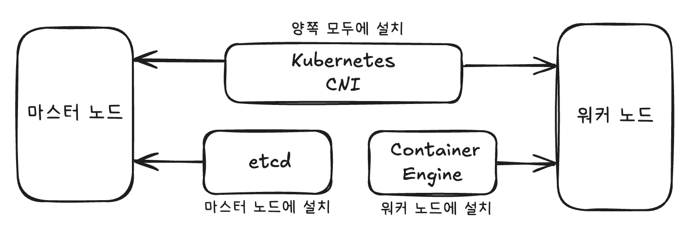
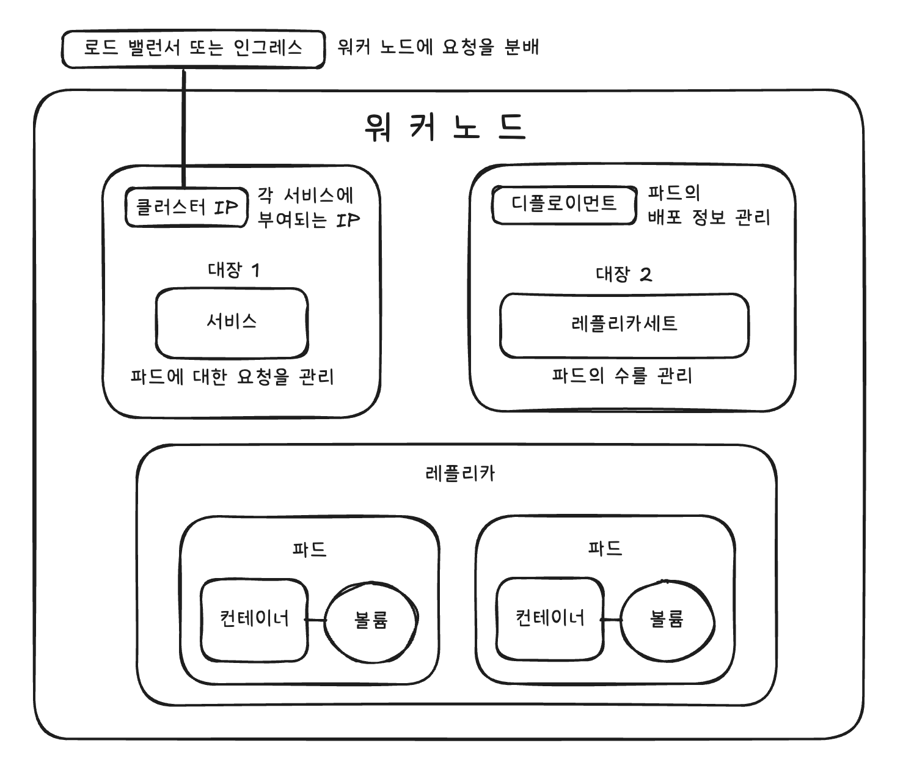

# 1. 쿠버네티스란?

## 쿠버네티스란?

- 쿠버네티스(Kubernetes, k8s)
    - 컨테이너 오케스트레이션 도구의 일종
- 컨테이너 오케스트레이션
    - 시스템 전체를 통괄하고 여러 개의 컨테이너를 관리하는 일

### 쿠버네티스를 사용하는 경우

- 쿠버네티스
    - 여러 개의 컨테이너(=서버)를 관리하는 도구
    - 여러 개
        - 동일한 구성의 컨테이너의 여러 세트
    - 즉, 많은 수의 서버로 구성되는 대규모 시스템을 관리할 때 사용
- 쿠버네티스로 관리되는 시스템은 쿠버네티스로 어떤 일을 할 수 있는가를 전제로 개발해야 함

### 쿠버네티스로 어떤 일을 할 수 있는가

- 쿠버네티스는 여러 대의 물리 서버가 존재하는 것을 전재로 함
    - 물리 서버 한 대 마다 제각기 여러 대의 컨테이너를 실행
- 도커 컴포즈를 사용한다 하더라도 물리 서버가 여러 대면 반복 작업이 사라지지 않고, 각 물리 서버를 일일이 모니터링하며 장애 발생 시 컨테이너를 업데이트 하는 것은 매우 번거로움
- 도커 컴포즈에서 사용되는 컴포즈 파일과 비슷한 정의 파일(매니페스트 파일)만 작성하면, 이 정의에 따라 모든 물리적 서버에 컨테이너를 생성하고, 생성한 컨테이너를 관리해 줄 수 있다

# 2. 마스터 노드와 워커 노드

## 클러스터의 구성

### 마스터 노드

- 전체적인 제어를 담당
- 컨테이너를 실행하지는 않으며 워커 노드에서 실행되는 컨테이너를 관리하는 역할
- 컨테이너 엔진도 설치되지 않음

### 워커 노드

- 실제 동작을 담당
- 컨테이너 엔진이 설치되어야 함

### 클러스터

- 마스터 노드와 워커 노드로 구성된 쿠버네티스 시스템
- 사람이 개입하지 않아도 마스터 노드에 설정된 내용에 따라 워커 노드가 관리되며 자율적으로 동작함

### 쿠버네티스에 필요한 소프트웨어

- 쿠버네티스는 도커 엔진 등 컨테이너 엔진과는 별개의 소프트웨어임
    - 추가적으로 쿠버네티스 소프트웨어, CNI(가상 네트워크 드라이버) 설치가 필요
        - CNI
            - Container Networking Interface
            - 대표적인 CNI 소프트웨어로 플란넬(flannel), 칼리코(Calico), AWS VPC CNI(AWS 전용) 등이 있음
        - 가상 네트워크
            - 오버레이 네트워크, 다른 물리적 컴퓨터를 같은 로컬 네트워크로 묶기 위해 사용
- 마스터 노드에는 컨테이너 상태를 관리하기 위해 etcd라는 데이터베이스 설치
- 워커 노드에는 도커 엔진과 같은 컨테이너 엔진이 필요
- 관리자의 컴퓨터에는 kubectl을 설치
    - 마스터 노드에 로그인해 초기 설정을 진행하거나 추후 조정을 하기 위함

### 컨트롤 플레인(제어판)과 kube-let

- 마스터 노드는 컨트롤 플레인을 통해 워커 노드를 관리
- 마스터 노드측 컨트롤 플레인의 구성
    
    
    | 항목 | 내용 |
    | --- | --- |
    | kube-apiserver | 외부와 통신하는 프로세스, kubectl로부터 명령을 전달 받아 실행 |
    | kube-controller-manager | 컨트롤러를 통합 관리, 실행 |
    | kube-scheduleer | 파드를 워커 노드에 할당 |
    | cloud-controller-manager | 클라우드 서비스와 연동해 서비스 생성 |
    | etcd | 클러스터 관련 정보 전반을 관리하는 데이터베이스 |
- 워커 노드의 구성
    
    
    | 항목 | 내용 |
    | --- | --- |
    | kube-let | 마스터 노드에 있는 kube-scheduler와 연동하며 워커 노드에 파드를 배치하고 실행
    또 실행중인 파드의 상태를 정기적으로 모니터링하며 kube-scheduler에 통지 |
    | kube-proxy | 네트워크 통신의 라우팅 메커니즘 |
    - kube-let
        - 마스터 노드의 kube-scheduler와 연동하여 워커 노드에 컨테이너 또는 볼륨을 배치하고 실행

### 쿠버네티스 동작 구조

- 마스터 노드
    - 컨트롤 플레인으로 워커 노드에 명령을 내림
- 워커 노드
    - kube-let을 통해 마스터 노드의 kube-scheduler과 연동하여 파드을 배치하고 실행
    - 실행 중인 파드의 상태를 정기적으로 모니터링 하여 kube-scheduler에 통지

## 쿠버네티스의 상태 유지

- 쿠버네티스
    - 자동으로 컨테이너를 생성하거나 삭제하면서 이 상태를 만들고 유지하는 것
- 도커 컴포즈와의 차이점
    - 도커 컴포즈
        - 옵션을 지정해 수동으로 컨테이너 수 변경 가능
        - 모니터링 기능이 없어서 컨테이너 생성 시점 이외에는 관여하지 않음
    - 쿠버네티스
        - 생성된 컨테이너, 볼륨들의 ‘상태를 유지하는 기능’이 있음
        - 또한 여러 대의 물리적 서버에 걸쳐 시스템을 구성할 수 있음

### 쿠버네티스를 사용하는 시스템에서 컨테이너 삭제

- 커테이너를 삭제하는 명령어를 입력하는 것이 아니라 파일에서 유지하고자 하는 상태를 수정해야 함
    - 도커 명령어를 이용해 직접 삭제하게 되면 쿠버네티스가 컨테이너가 하나 부족하다는 것을 탐지하고 컨테이너를 보충함

## [참고] 로드 밸런서와 클라우드 컴퓨팅

## [참고] etcd의 역할

# 3. 쿠버네티스의 구성과 관련 용어

## 쿠버네티스의 구성과 관련된 용어

### 파드 Pod

- 컨테이너를 관리하는 단위 (컨테이너 + 볼륨)
- 기본적으로 파드 하나가 컨테이너 하나이지만 컨테이너가 여러 개인 파드도 있을 수 있음
- 파드에 포함되는 볼륨은 기본적으로 함께 파드에 포함되는 컨테이너가 정보를 공유하기 위해 사용하는 것이므로, 파드에 볼륨이 없는 경우도 존재함

### 서비스 Service

- 파드를 모은 것
- 같은 종류의 파드를 하나의 서비스가 관리함
    - 서비스가 관리하는 파드는 기본적으로 동일한 구성을 가짐
    - 구성이 다른 파드는 별도의 서비스로 관리
- 여러 개의 워커 노드(물리적 서버)에 걸쳐 동작하더라도 이들을 모두 관리한다
- 서비스의 역할
    - 로드 밸런서(분산 부하 장치)
        - 요청을 배분하는 역할
    - 각 서비스는 자동적으로 고정된 IP 주소를 부여받으며(cluster IP), 이 주소로 들어오는 통신을 처리
    - 내부적으로는 여러 개의 파드가 있어도 하나의 IP 주소(cluster IP)만 볼 수 있으며, 이 주소로 접근하면 서비스가 통신을 적절히 분배해주는 구조
    - but 서비스가 분배하는 통신은 한 워커 노드 안으로 국한됨
        - 여러 워커 노드 간의 분배는 실제 로드밸런서나 인그레스(ingress)가 담당함

### 디플로이먼트와 레플리카세트

- 레플리카세트(ReplicaSet)
    - 파드의 수를 관리하는 역할
    - 장애 등의 이유로 파드가 종료되었을 떄, 모자라는 파드를 보충하거나 정의 파일에 정의된 파드의 수가 감소한 만큼 실제 파드의 수를 감소시킴
- 레플리카(replica)
    - 레플리카 세트가 관리하는 동일한 구성의 파드
    - 파드의 수를 조정한다 = 레플리카의 수를 조정한다
    - 레플리카 세트는 원하는 대로 다루기 어렵기 때문에 단독으로 쓰이는 경우가 드물고 주로 디플로이먼트와 함께 쓰임
- 디플로이먼트(depolyment)
    - 파드의 디플로이(배포)를 관리하는 요소
    - 파드가 사용하는 이미지 등 파드에 대한 정보를 갖고 있음

## 그 밖의 쿠버네티스 리소스

- 파드, 서비스, 디플로이먼트, 레플리카 세트 … 등을 모두 리소스(resource)라고 함
- 주요 쿠버네티스 리소스
    
    
    | 리소스 이름 | 내용 |
    | --- | --- |
    | 파드(pods) | 컨테이너와 볼륨을 합친 것 |
    | 파드템플릿(podtemplates) | 배포 시 파드의 형틀 역할 |
    | 레플리케이션컨트롤러(replicationcontrollers) | 레플리케이션을 제어 |
    | 리소스쿼터(resourcequotas) | 쿠버네티스 리소스의 사용량 제한을 설정 |
    | 비밀값(secrets) | 키 정보를 관리 |
    | 서비스어카운트(serviceaccounts) | 리소스를 다루는 사용자를 관리 |
    | 서비스(services) | 파드에 요청을 배분 |
    | 데몬세트(daemonsets) | 워커노드마다 하나의 파드를 생성 |
    | 디플로이먼트(deployments) | 파드의 배포를 관리 |
    | 레플리카세트(replicasets) | 파드의 수를 관리 |
    | 스테이트풀세트(statefulsets) | 파드의 배포를 상태를 유지하며 관리 |
    | 크론잡(cronjobs) | 지정된 스케줄대로 파드를 실행 |
    | 잡(jobs) | 파드를 한 번 실행 |

### 쿠버네티스 용어 정리

## [참고] 오브젝트와 인스턴스

# 4. 쿠버네티스 설치 및 사용법

## 쿠버네티스 종류

- 쿠버네티스는 클라우드 네이티브 컴퓨팅 재단(CNCF)에서 제정한 표준임
- CNCF에서 만든 쿠버네티스가 존재하나, 이 규격을 따른 서드파티 소프트웨어도 여럿 존재
- 소프트웨어들은 서로 호환되는데, 호환성이 검증된 소프트웨어나 서비스에는 Certified Kubernetes 인증이 부여됨

## 쿠버네티스 선택 기준

### 원조 쿠버네티스와 클라우드 버전

- 원조 쿠버네티스를 직접 구축해 사용하는 경우는 드물다
    - 원조 쿠버네티스를 채택하는 것과 직접 구축하는 것은 별개의 문제(대부분 외주로 구축을 맡김)
    - why?
        - 서비스마다 부여되는 클러스터 IP에 로드 밸런싱을 적용하려면 이를 지원하는 하드웨어를 갖춰야 하며, 드라이버에도 상성 문제가 있기 때문에 인프라 전문 업체에 맡기는 것이 향후 유지보수에 있어서도 좋음
- 일반적으로 AWS같은 클라우드 컴퓨팅 서비스를 사용해 구축
    - AWS에서는 EC2나 Fargate를 워커 노드로 사용하고 EKS(마스터노드 역할)를 사용해 관리

### 도커 데스크톱과 Minikube

- 도커 데스크톱에 쿠버네티스가 포함되어 있다!
    - but 학습용으로만 익혀두자
- 쿠버네티스는 대규모 시스템이 전제이기 때문에 마스터 노드와 워커 노드를 별도의 물리적 컴퓨터로 설정
- but 도커 데스크톱이나 Minikube에서는 컴퓨터 한 대에 마스터 노드와 워커 노드를 모두 구축